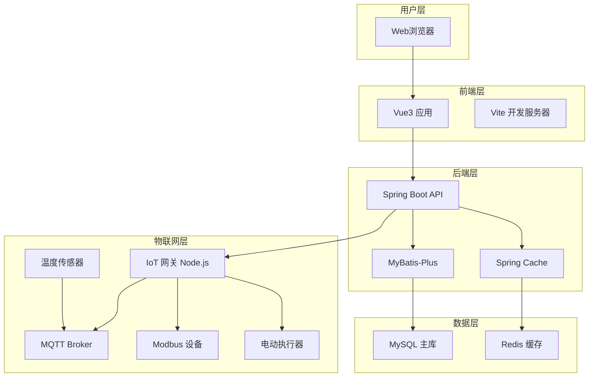
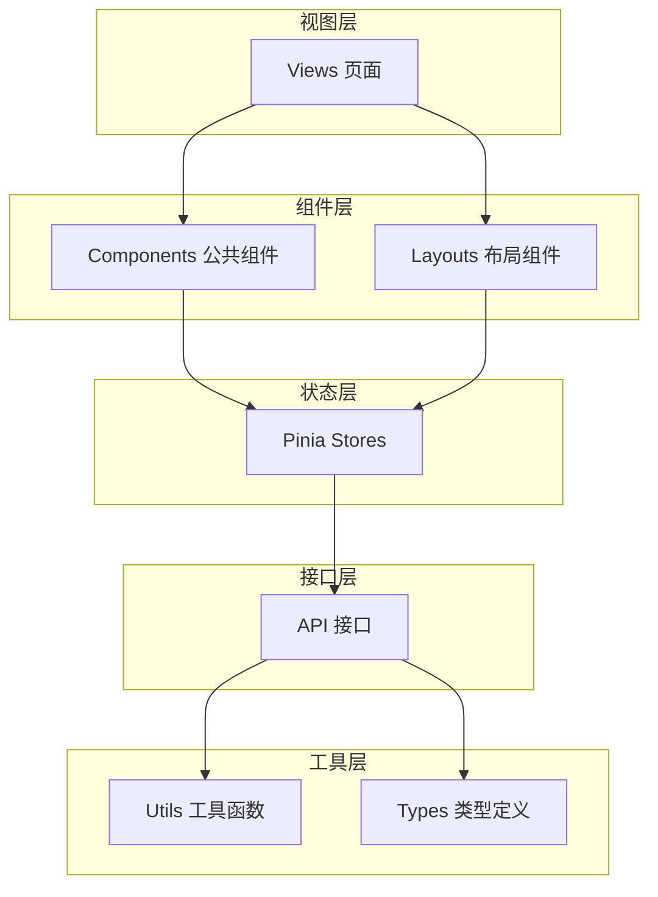
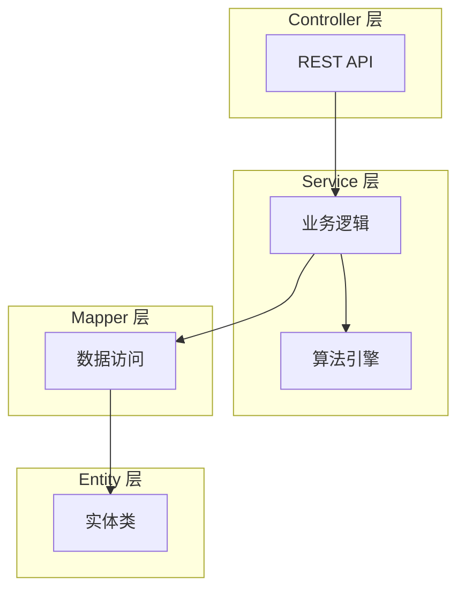
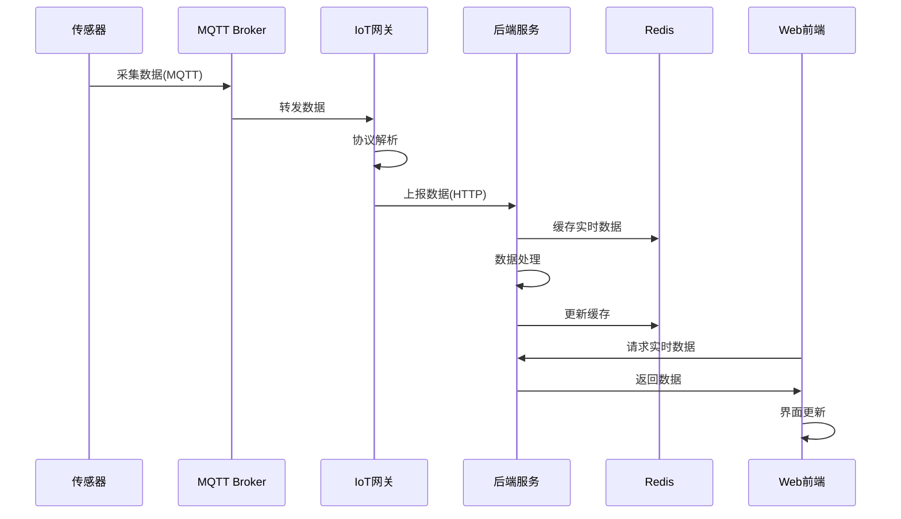
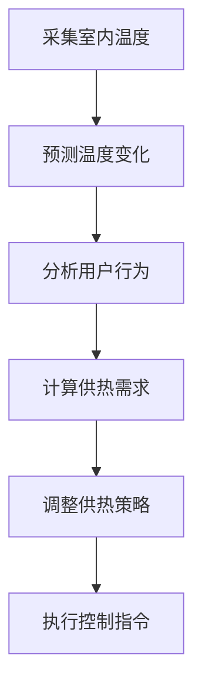
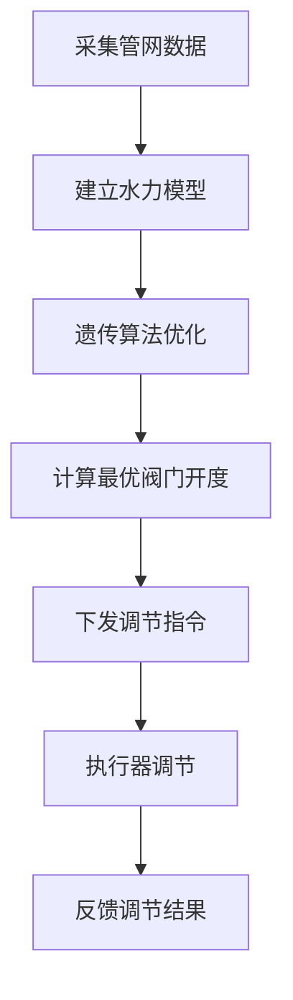
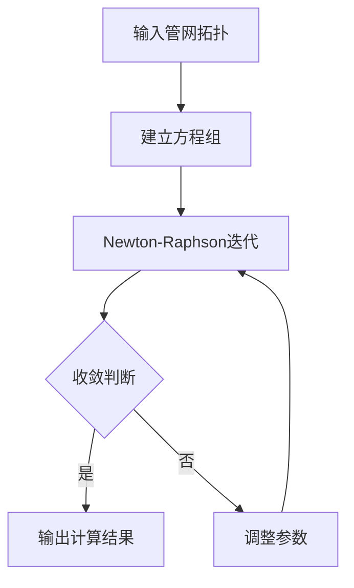

# 架构设计

## 系统概述

锅炉集中供热智慧管理系统采用前后端分离架构，整体分为前端展示层、后端服务层、物联网采集层三个层次。系统以微服务架构思想进行模块化设计，各功能模块独立部署，通过API进行数据交互。物联网设备通过 MQTT 协议与系统通信，实现实时数据采集和远程控制。

## 技术栈

### 前端技术
- Vue 3.4+：渐进式前端框架
- TypeScript 5.0+：类型安全的 JavaScript 超集
- Vite 5.0+：下一代前端构建工具
- Element Plus：Vue 3 组件库
- ECharts 5.0+：数据可视化图表库
- Pinia：Vue 3 状态管理
- Vue Router 4：路由管理

### 后端技术
- Java 17：LTS 版本
- Spring Boot 3.2：快速开发框架
- Spring Security：安全认证
- MyBatis-Plus 3.5：持久层框架
- MySQL 8.0：关系型数据库
- Redis 7.0：内存数据库
- Spring Cache：缓存抽象

### 物联网技术
- Node.js 20+：异步事件驱动框架
- MQTT.js：MQTT 客户端
- Modbus-serial：Modbus 通信
- Express：HTTP 服务

## 项目结构

```
boiler-smart-system/
├── frontend/                    # 前端项目
│   ├── src/
│   │   ├── api/                 # API 接口定义
│   │   ├── assets/              # 静态资源
│   │   ├── components/           # 公共组件
│   │   ├── composables/         # 组合式 API
│   │   ├── layouts/             # 布局组件
│   │   ├── router/              # 路由配置
│   │   ├── stores/              # Pinia 状态管理
│   │   ├── styles/              # 全局样式
│   │   ├── types/               # TypeScript 类型
│   │   ├── utils/               # 工具函数
│   │   └── views/               # 页面视图
│   │       ├── dashboard/       # 监控大屏
│   │       ├── heat-user/        # 热用户管理
│   │       ├── balance/         # 二网平衡
│   │       ├── station/         # 换热站控制
│   │       ├── primary-network/  # 一网控制
│   │       ├── heat-source/     # 热源调控
│   │       ├── simulation/       # 水力仿真
│   │       └── control/          # 智能调节
│   ├── vite.config.ts           # Vite 配置
│   └── package.json
│
├── backend/                     # 后端项目
│   ├── src/main/java/com/boiler/
│   │   ├── common/               # 公共模块
│   │   │   ├── annotation/       # 自定义注解
│   │   │   ├── config/           # 配置类
│   │   │   ├── constant/         # 常量定义
│   │   │   ├── enums/            # 枚举类
│   │   │   ├── exception/        # 异常处理
│   │   │   └── utils/            # 工具类
│   │   ├── controller/           # 控制器层
│   │   ├── service/              # 业务逻辑层
│   │   ├── mapper/               # 数据访问层
│   │   ├── entity/               # 实体类
│   │   ├── dto/                  # 数据传输对象
│   │   ├── vo/                   # 视图对象
│   │   └── config/               # 框架配置
│   ├── src/main/resources/
│   │   ├── mapper/               # MyBatis XML 映射
│   │   ├── static/               # 静态资源
│   │   └── application.yml       # 应用配置
│   └── pom.xml
│
├── iot-gateway/                 # 物联网网关
│   ├── src/
│   │   ├── config/               # 配置
│   │   ├── devices/              # 设备驱动
│   │   │   ├── modbus/           # Modbus 设备
│   │   │   └── mqtt/             # MQTT 设备
│   │   ├── protocol/            # 协议解析
│   │   ├── collector/            # 数据采集
│   │   └── gateway/             # 网关服务
│   ├── package.json
│   └── ecosystem.config.js      # PM2 配置
│
└── docs/                        # 项目文档
```

## 核心模块

### 前端模块

| 模块 | 职责 | 主要组件 |
|------|------|----------|
| 监控大屏 | 展示全网运行状态 | HeatMap、ECharts 图表 |
| 热用户管理 | 室内温度监测与分析 | TemperatureChart、UserTable |
| 二网平衡 | 水力平衡计算与展示 | ValveControl、OptimizationChart |
| 换热站控制 | 换热站监控与控制 | StationMonitor、ControlPanel |
| 一网调度 | 一次网调度策略 | NetworkMap、ScheduleChart |
| 热源调控 | 锅炉群监控与优化 | BoilerStatus、OptimizationPanel |
| 水力仿真 | 管网水力计算 | NetworkGraph、SimulationResult |
| 智能调节 | 电动执行器控制 | FuzzyPIDControl、ActuatorPanel |

### 后端模块

| 模块 | 职责 | 核心类 |
|------|------|--------|
| 热用户服务 | 室内温度数据管理 | HeatUserService、TemperaturePredictor |
| 二网平衡服务 | 水力平衡优化计算 | BalanceOptimizer、GeneticAlgorithm |
| 换热站服务 | 换热站监控控制 | StationService、AutoController |
| 一网调度服务 | 一次网智能调度 | PrimaryNetworkScheduler |
| 热源服务 | 锅炉群优化控制 | HeatSourceOptimizer、NeuralNetwork |
| 仿真服务 | 水力仿真计算 | HydraulicSimulator、NewtonRaphson |
| 调节服务 | 模糊PID控制 | FuzzyPIDController |

### 物联网模块

| 模块 | 职责 | 功能 |
|------|------|------|
| 设备驱动 | 设备通信 | Modbus RTU/TCP、MQTT 协议支持 |
| 数据采集 | 实时数据采集 | 定时采集、设备心跳 |
| 协议解析 | 数据解析转换 | 字节流解析、JSON 转换 |
| 远程控制 | 指令下发 | 控制命令执行、状态反馈 |

## 架构图

### 系统架构图



### 前端架构图



### 后端分层架构



### 物联网数据流



## 关键流程

### 热用户按需供热流程



### 二网平衡优化流程



### 水力仿真计算流程



## 设计决策

### 前端架构决策

| 决策项 | 选择 | 理由 |
|--------|------|------|
| 状态管理 | Pinia | Vue3 官方推荐，API 简洁 |
| 路由管理 | Vue Router | Vue 生态官方方案 |
| UI框架 | Element Plus | Vue3 原生支持，组件丰富 |
| 图表库 | ECharts | 功能强大，社区活跃 |
| 构建工具 | Vite | 开发体验好，热更新快 |

### 后端架构决策

| 决策项 | 选择 | 理由 |
|--------|------|------|
| 框架 | Spring Boot | 生态完善，企业级标准 |
| ORM | MyBatis-Plus | 简化开发，国产活跃 |
| 缓存 | Redis | 性能高，支持数据结构 |
| 安全 | Spring Security | 官方安全框架 |
| 日志 | SLF4J + Logback | 标准日志方案 |

### 物联网架构决策

| 决策项 | 选择 | 理由 |
|--------|------|------|
| 网关运行时 | Node.js | 异步I/O，适合IoT |
| 消息队列 | MQTT | 轻量级，低功耗 |
| 工业协议 | Modbus | 工业标准，设备广泛支持 |
| 进程管理 | PM2 | Node.js 生产级进程管理 |

### 算法选型

| 功能模块 | 算法 | 理由 |
|----------|------|------|
| 温度预测 | LSTM 神经网络 | 时序数据预测效果好 |
| 二网平衡 | 遗传算法/粒子群 | 全局优化能力强 |
| 控制调节 | 模糊PID | 适应非线性系统 |
| 水力计算 | Newton-Raphson | 收敛速度快 |
