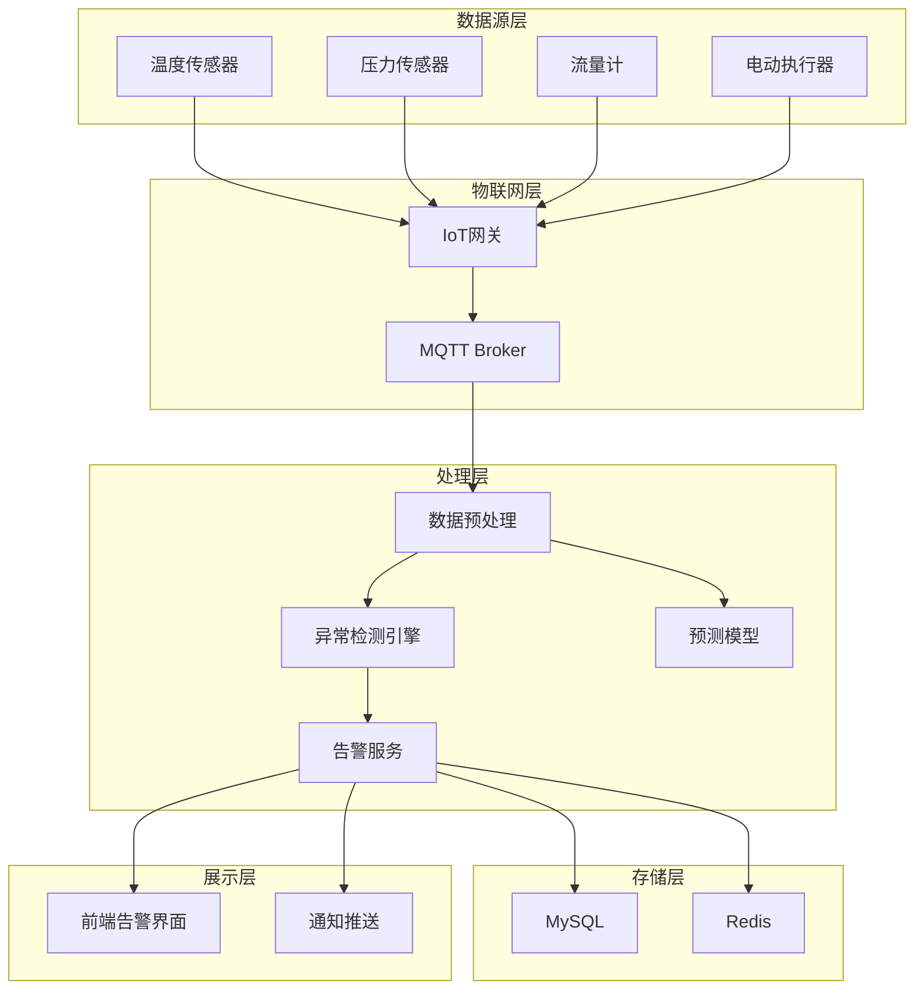
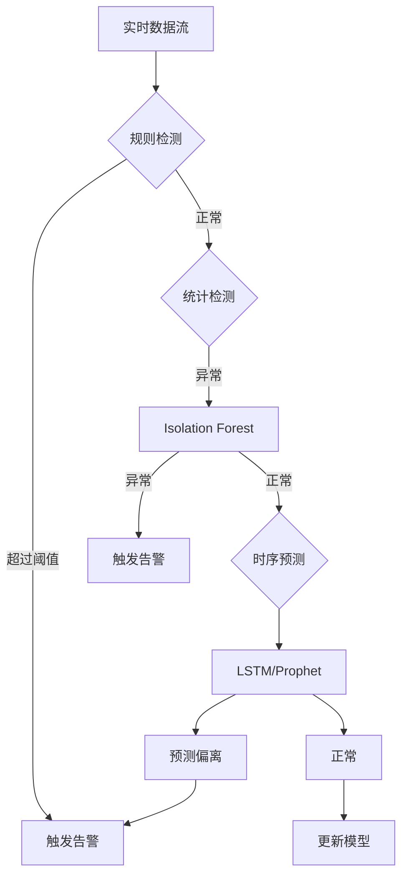

# 异常状态预测技术方案

需求名称：2026-03-16-anomaly-prediction
更新日期：2026-03-16

## 1. 概述

本功能旨在基于监测数据和机器学习算法，对锅炉集中供热系统的运行状态进行实时分析，识别潜在的异常模式，并提前发出警报，以便运维人员及时采取措施进行修复或调整。

## 2. 架构设计

### 2.1 系统架构



### 2.2 核心模块

| 模块 | 职责 | 技术选型 |
|------|------|----------|
| 数据采集服务 | 从IoT网关获取实时监测数据 | Spring Boot + MQTT |
| 数据预处理服务 | 数据清洗、标准化、特征提取 | Python / Java |
| 异常检测引擎 | 基于统计和ML的异常检测 | Isolation Forest / LSTM |
| 预测模型服务 | 时序预测，提前预警 | Prophet / ARIMA |
| 告警服务 | 告警生成、通知推送 | Spring Boot |
| 前端展示 | 告警列表、趋势图表 | Vue3 + ECharts |

## 3. 组件与接口

### 3.1 核心类设计

```
后端模块:
- AnomalyDetectionController    # REST API控制器
- AnomalyDetectionService        # 异常检测业务逻辑
- DataPreprocessor              # 数据预处理
- IsolationForestDetector       # 统计异常检测
- LstmPredictor                  # 时序预测模型
- AlertService                  # 告警服务
- AlertNotifier                 # 通知推送

数据模型:
- MonitorData                   # 监测数据实体
- AnomalyRecord                 # 异常记录实体
- AlertConfig                   # 告警配置实体
- AlertRecord                   # 告警记录实体
```

### 3.2 核心接口

| 接口 | 方法 | 说明 |
|------|------|------|
| /api/anomaly/detect | POST | 触发异常检测 |
| /api/anomaly/history | GET | 获取异常历史记录 |
| /api/anomaly/stats | GET | 获取异常统计信息 |
| /api/alert/config | GET/POST | 告警配置管理 |
| /api/alert/list | GET | 告警列表查询 |
| /api/alert/acknowledge | POST | 告警确认 |
| /api/prediction/forecast | GET | 获取预测结果 |

## 4. 数据模型

### 4.1 监测数据表 (monitor_data)

| 字段 | 类型 | 说明 |
|------|------|------|
| id | BIGINT | 主键 |
| device_id | VARCHAR | 设备ID |
| device_type | VARCHAR | 设备类型 |
| metric_type | VARCHAR | 指标类型(温度/压力/流量) |
| metric_value | DECIMAL | 指标值 |
| timestamp | DATETIME | 采集时间 |
| created_at | DATETIME | 创建时间 |

### 4.2 异常记录表 (anomaly_record)

| 字段 | 类型 | 说明 |
|------|------|------|
| id | BIGINT | 主键 |
| device_id | VARCHAR | 设备ID |
| metric_type | VARCHAR | 指标类型 |
| metric_value | DECIMAL | 异常值 |
| threshold | DECIMAL | 阈值 |
| anomaly_score | DECIMAL | 异常分数 |
| anomaly_type | VARCHAR | 异常类型 |
| detection_method | VARCHAR | 检测方法 |
| detected_at | DATETIME | 检测时间 |
| status | VARCHAR | 状态(PENDING/HANDLED) |

### 4.3 告警记录表 (alert_record)

| 字段 | 类型 | 说明 |
|------|------|------|
| id | BIGINT | 主键 |
| anomaly_id | BIGINT | 关联异常ID |
| alert_level | VARCHAR | 告警级别(INFO/WARN/CRITICAL) |
| alert_message | VARCHAR | 告警消息 |
| alert_time | DATETIME | 告警时间 |
| acknowledged | BOOLEAN | 是否已确认 |
| acknowledged_by | VARCHAR | 确认人 |
| acknowledged_at | DATETIME | 确认时间 |

## 5. 异常检测算法

### 5.1 多层检测策略



### 5.2 算法选型

| 场景 | 算法 | 说明 |
|------|------|------|
| 阈值检测 | 简单阈值/动态阈值 | 快速检测明显异常 |
| 统计异常 | Isolation Forest | 适合多维数据异常检测 |
| 时序预测 | LSTM / Prophet | 预测未来趋势，提前预警 |
| 趋势异常 | 滑动窗口 + 差分 | 检测突变和趋势异常 |

## 6. 功能配置

### 6.1 监测范围配置

支持通过配置文件或管理界面对监测设备范围进行灵活配置：

- 设备类型配置：温度传感器、压力传感器、流量计、电动执行器、阀门状态等
- 设备分组：可按换热站、楼宇、区域进行分组管理
- 监控指标：支持按指标类型启用/禁用检测

### 6.2 检测频率

分钟级检测策略：
- 数据采集频率：每分钟采集一次实时数据
- 异常检测周期：每分钟执行一次异常检测任务
- 模型预测更新：每5分钟更新一次预测模型
- 统计特征计算：滑动窗口5分钟/15分钟/30分钟

### 6.3 通知方式

| 通知方式 | 说明 | 配置项 |
|----------|------|--------|
| 系统内通知 | 前端实时弹窗、告警列表 | enabled: true |
| 微信通知 | 企业微信消息推送 | enabled: true, webhook配置 |

### 6.4 告警级别定义

| 级别 | 说明 | 触发条件 |
|------|------|----------|
| INFO | 信息 | 设备离线、数据缺失 |
| WARN | 警告 | 指标接近阈值、趋势异常 |
| CRITICAL | 严重 | 指标超过阈值、预测异常 |

## 7. 正确性属性

- **数据完整性**: 所有监测数据必须持久化存储，支持数据补采
- **检测准确性**: 异常检测准确率目标 > 85%，误报率 < 10%
- **实时性**: 从数据采集到告警生成延迟 < 30秒
- **可追溯性**: 每条异常记录关联完整的数据链路
- **高可用**: 核心服务支持集群部署，故障自动切换

## 8. 错误处理

| 场景 | 处理策略 |
|------|----------|
| 数据采集失败 | 记录日志，重试机制，标记数据缺失 |
| 模型推理失败 | 降级到规则检测，告警模型异常 |
| 告警推送失败 | 持久化告警，定时重试 |
| 数据库连接失败 | 使用Redis缓存，连接恢复后同步 |

## 9. 测试策略

- 单元测试: 异常检测算法、告警逻辑
- 集成测试: 数据流端到端、API接口
- 性能测试: 并发检测能力、响应时间
- 告警测试: 阈值触发、通知推送

## 10. 部署与运维

### 10.1 服务部署

- 后端服务：Spring Boot 应用，部署在 Kubernetes 或 Docker 集群
- ML模型服务：Python Flask/FastAPI 服务，独立部署
- 定时任务：使用 XXL-Job 或 Spring Task 进行分钟级检测调度

### 10.2 监控指标

- 检测任务执行时间
- 异常检测数量/准确率
- 告警推送成功率
- 系统响应延迟
