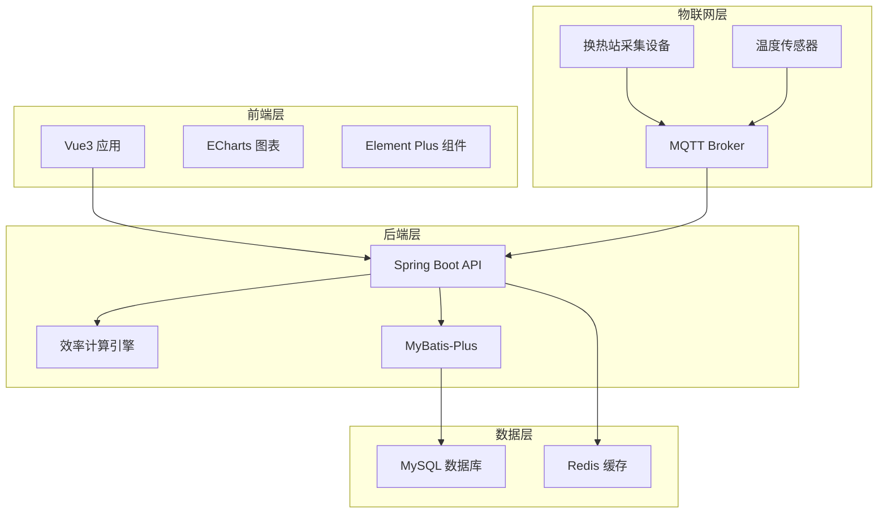
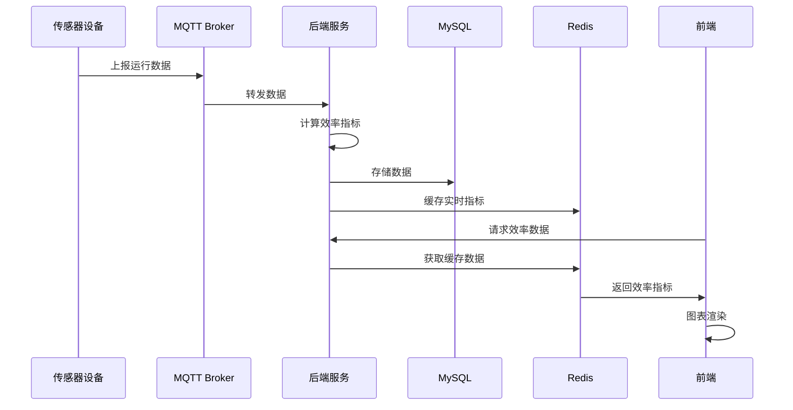

# 冷热效率分析 - 技术方案

需求名称：efficiency-analysis
更新日期：2026-03-16

## 概述

本功能用于评估建筑物或系统的冷热能源利用效率，通过对冷热能源输入和输出进行分析，计算相关的效率指标，帮助用户了解能源利用的效率水平，并寻找提高能效的潜在机会。

## 架构

### 系统架构



### 数据流程



## 组件与接口

### 后端模块设计

| 模块 | 职责 | 核心类 |
|------|------|--------|
| EfficiencyAnalysisService | 效率分析主服务 | 计算能效指标、生成排行、分析趋势 |
| EfficiencyIndicatorCalculator | 指标计算器 | 计算COP、热损失率、供热均衡度等 |
| TemperatureDataService | 温度数据服务 | 管理住户温度数据（表计+人工） |
| HeatingCurveOptimizer | 供暖曲线优化 | 基于数据分析优化供暖曲线 |

### API 接口设计

#### 1. 效率概览接口

```
GET /api/efficiency/overview

Query Parameters:
- stationId: Long (可选) - 换热站ID，不传则返回全网数据
- date: String (可选) - 日期，格式yyyy-MM-dd，默认当天

Response:
{
  "cop": 3.2,                    // 能效比
  "heatLossRate": 12.5,          // 热损失率%
  "supplyBalance": 85.0,         // 供热均衡度%
  "avgIndoorTemp": 20.5,         // 平均室温
  "totalHeatInput": 12500,       // 总热量输入(GJ)
  "totalHeatOutput": 10937.5,    // 总热量输出(GJ)
  "targetTempCompliance": 92.3   // 目标温度达标率%
}
```

#### 2. 换热站效率排行接口

```
GET /api/efficiency/ranking

Query Parameters:
- startDate: String - 开始日期
- endDate: String - 结束日期
- metricType: String - 指标类型(cop/heatLoss/balance)
- limit: Integer - 返回数量，默认10

Response:
{
  "data": [
    {
      "rank": 1,
      "stationId": 1,
      "stationName": "换热站A",
      "cop": 3.5,
      "heatLossRate": 8.2,
      "supplyBalance": 95.0,
      "trend": "up"              // 趋势：up/down/stable
    },
    {
      "rank": 2,
      "stationId": 2,
      "stationName": "换热站B",
      "cop": 3.2,
      "heatLossRate": 12.0,
      "supplyBalance": 88.5,
      "trend": "stable"
    }
  ]
}
```

#### 3. 终点站监控接口

```
GET /api/efficiency/terminal-monitor

Query Parameters:
- stationId: Long - 换热站ID
- buildingId: Long (可选) - 建筑ID

Response:
{
  "data": [
    {
      "buildingId": 1,
      "buildingName": "1号楼",
      "avgIndoorTemp": 21.2,
      "targetTemp": 20.0,
      "deviation": 1.2,
      "sampleCount": 120,
      "abnormalCount": 3,
      "lastUpdate": "2026-03-16 10:30:00"
    }
  ]
}
```

#### 4. 实时/历史对比接口

```
GET /api/efficiency/comparison

Query Parameters:
- stationId: Long - 换热站ID
- type: String - 对比类型(realtime-history/daily/week/month)
- startDate: String - 开始日期
- endDate: String - 结束日期

Response:
{
  "realtime": {
    "cop": 3.2,
    "heatLossRate": 12.5,
    "supplyBalance": 85.0,
    "period": "2026-03-16"
  },
  "history": {
    "cop": 3.0,
    "heatLossRate": 15.0,
    "supplyBalance": 78.0,
    "period": "2025-03-16"
  },
  "comparison": {
    "copChange": "+6.7%",
    "heatLossChange": "-16.7%",
    "balanceChange": "+9.0%"
  }
}
```

#### 5. 住户温度数据接口

```
GET /api/efficiency/resident-temperatures

Query Parameters:
- buildingId: Long - 建筑ID
- startDate: String - 开始日期
- endDate: String - 结束日期
- dataSource: String (可选) - 数据来源(meter/manual)

Response:
{
  "data": [
    {
      "userId": 1001,
      "roomCode": "101",
      "temperature": 21.5,
      "dataSource": "meter",
      "collectTime": "2026-03-16 10:00:00"
    }
  ]
}
```

```
POST /api/efficiency/resident-temperatures/manual

Request Body:
{
  "buildingId": 1,
  "userId": 1001,
  "temperature": 22.0,
  "recordTime": "2026-03-16 10:00:00",
  "remark": "人工测温"
}

Response:
{
  "success": true,
  "id": 1001
}
```

#### 6. 供暖曲线优化接口

```
GET /api/efficiency/heating-curve

Query Parameters:
- stationId: Long - 换热站ID

Response:
{
  "currentCurve": [
    { "outdoorTemp": -15, "supplyTemp": 75, "returnTemp": 55 },
    { "outdoorTemp": -10, "supplyTemp": 65, "returnTemp": 48 },
    { "outdoorTemp": -5, " supplyTemp": 55, "returnTemp": 40 },
    { "outdoorTemp": 0, "supplyTemp": 45, "returnTemp": 33 },
    { "outdoorTemp": 5, "supplyTemp": 38, "returnTemp": 28 }
  ],
  "optimizedCurve": [
    { "outdoorTemp": -15, "supplyTemp": 72, "returnTemp": 52 },
    { "outdoorTemp": -10, "supplyTemp": 62, "returnTemp": 45 },
    { "outdoorTemp": -5, "supplyTemp": 52, "returnTemp": 38 },
    { "outdoorTemp": 0, "supplyTemp": 42, "returnTemp": 30 },
    { "outdoorTemp": 5, "supplyTemp": 35, "returnTemp": 26 }
  ],
  "estimatedSavings": 8.5,
  "analysis": "基于历史数据分析，建议降低供水温度2-3度，可降低热损失约8.5%"
}
```

```
POST /api/efficiency/heating-curve/apply

Request Body:
{
  "stationId": 1,
  "curve": [
    { "outdoorTemp": -15, "supplyTemp": 72, "returnTemp": 52 }
  ]
}

Response:
{
  "success": true,
  "effectiveTime": "2026-03-16 11:00:00"
}
```

#### 7. 效率趋势接口

```
GET /api/efficiency/trend

Query Parameters:
- stationId: Long - 换热站ID
- metricType: String - 指标类型
- period: String - 周期(day/week/month)

Response:
{
  "dates": ["2026-03-10", "2026-03-11", "2026-03-12", "2026-03-13", "2026-03-14", "2026-03-15", "2026-03-16"],
  "cop": [3.0, 3.1, 3.2, 3.1, 3.3, 3.2, 3.2],
  "heatLossRate": [15.0, 14.5, 13.8, 14.2, 13.0, 12.8, 12.5],
  "supplyBalance": [78.0, 80.0, 82.0, 81.0, 84.0, 85.0, 85.0]
}
```

## 数据模型

### 新增数据表

#### 1. 效率指标历史表 (efficiency_indicator_history)

| 字段名 | 类型 | 说明 |
|--------|------|------|
| id | BigInt | 主键 |
| station_id | BigInt | 换热站ID |
| cop | Decimal(5,2) | 能效比 |
| heat_loss_rate | Decimal(5,2) | 热损失率(%) |
| supply_balance | Decimal(5,2) | 供热均衡度(%) |
| avg_indoor_temp | Decimal(5,2) | 平均室温 |
| heat_input | Decimal(12,2) | 热量输入(MJ) |
| heat_output | Decimal(12,2) | 热量输出(MJ) |
| record_date | Date | 记录日期 |
| create_time | DateTime | 创建时间 |

#### 2. 住户温度记录表 (resident_temperature)

| 字段名 | 类型 | 说明 |
|--------|------|------|
| id | BigInt | 主键 |
| building_id | BigInt | 建筑ID |
| user_id | BigInt | 用户ID |
| room_code | Varchar(20) | 房间号 |
| temperature | Decimal(5,2) | 温度值 |
| data_source | Varchar(20) | 数据来源(meter/ manual) |
| collect_time | DateTime | 采集时间 |
| remark | Varchar(200) | 备注 |
| create_time | DateTime | 创建时间 |

#### 3. 供暖曲线配置表 (heating_curve_config)

| 字段名 | 类型 | 说明 |
|--------|------|------|
| id | BigInt | 主键 |
| station_id | BigInt | 换热站ID |
| curve_type | Varchar(20) | 曲线类型(current/optimized) |
| curve_data | Json | 曲线数据 |
| is_active | TinyInt | 是否生效 |
| effective_time | DateTime | 生效时间 |
| create_time | DateTime | 创建时间 |
| update_time | DateTime | 更新时间 |

### 实体类设计

```java
// EfficiencyIndicatorHistory.java
@Data
@TableName("efficiency_indicator_history")
public class EfficiencyIndicatorHistory {
    @TableId(type = IdType.AUTO)
    private Long id;
    private Long stationId;
    private BigDecimal cop;
    private BigDecimal heatLossRate;
    private BigDecimal supplyBalance;
    private BigDecimal avgIndoorTemp;
    private BigDecimal heatInput;
    private BigDecimal heatOutput;
    private LocalDate recordDate;
    private LocalDateTime createTime;
}

// ResidentTemperature.java
@Data
@TableName("resident_temperature")
public class ResidentTemperature {
    @TableId(type = IdType.AUTO)
    private Long id;
    private Long buildingId;
    private Long userId;
    private String roomCode;
    private BigDecimal temperature;
    private String dataSource;
    private LocalDateTime collectTime;
    private String remark;
    private LocalDateTime createTime;
}

// HeatingCurveConfig.java
@Data
@TableName("heating_curve_config")
public class HeatingCurveConfig {
    @TableId(type = IdType.AUTO)
    private Long id;
    private Long stationId;
    private String curveType;
    private String curveData;
    private Integer isActive;
    private LocalDateTime effectiveTime;
    private LocalDateTime createTime;
    private LocalDateTime updateTime;
}
```

## 正确性属性

### 功能正确性

1. **能效比计算准确性**
   - COP = 热量输出 / 热量输入
   - 热量计算考虑温度差和流量
   - 计算结果保留2位小数

2. **排行数据准确性**
   - 排行基于指定时间段的加权平均指标
   - 考虑换热站规模进行标准化
   - 支持多维度排序

3. **历史对比准确性**
   - 同期对比使用相同的计算公式
   - 支持多种时间粒度对比
   - 正确计算变化百分比

### 数据一致性

1. **实时数据与存储一致性**
   - MQTT上报数据立即写入缓存，定时持久化
   - 异常情况下保证数据不丢失

2. **住户温度数据来源一致性**
   - 区分表计采集和人工录入
   - 人工录入数据可覆盖表计数据

## 错误处理

### 异常类型

| 异常类型 | 错误码 | 说明 |
|----------|--------|------|
| StationNotFoundException | E001 | 换热站不存在 |
| BuildingNotFoundException | E002 | 建筑不存在 |
| InvalidDateRangeException | E003 | 日期范围无效 |
| DataNotAvailableException | E004 | 数据不可用 |
| CurveApplyException | E005 | 曲线应用失败 |

### 响应格式

```json
{
  "success": false,
  "errorCode": "E001",
  "message": "换热站不存在",
  "data": null
}
```

### 前端错误展示

- 使用 Element Plus 的 `ElMessage` 或 `ElMessageBox` 组件提示错误
- 关键操作失败弹出确认对话框
- 网络异常显示重试提示

## 测试策略

### 单元测试

| 测试类 | 测试内容 |
|--------|----------|
| EfficiencyIndicatorCalculatorTest | 能效指标计算逻辑测试 |
| TemperatureDataServiceTest | 温度数据CRUD测试 |
| HeatingCurveOptimizerTest | 曲线优化算法测试 |

### 集成测试

| 测试场景 | 测试内容 |
|----------|----------|
| API接口测试 | 各接口请求响应测试 |
| 数据流转测试 | MQTT采集到前端展示全流程 |
| 缓存测试 | Redis缓存读写一致性 |

### 前端测试

| 测试内容 | 测试方式 |
|----------|----------|
| 组件渲染 | Vitest + Vue Test Utils |
| 图表渲染 | ECharts 图表数据绑定测试 |
| 交互功能 | Playwright E2E测试 |

### 测试数据

- 使用模拟的换热站数据
- 包含正常、异常边界数据
- 覆盖各种时间周期

## 前端页面设计

### 页面路由

```typescript
{
  path: '/efficiency-analysis',
  name: 'EfficiencyAnalysis',
  component: () => import('@/views/efficiency-analysis/index.vue'),
  meta: { title: '冷热效率分析' }
}
```

### 页面布局

```
+----------------------------------------------------------+
|  冷热效率分析                                    [换热站选择] |
+----------------------------------------------------------+
|  [能效概览卡片]  [热损失率卡片]  [均衡度卡片]  [达标率卡片]   |
+----------------------------------------------------------+
|  [换热站效率排行]                                         |
|  +-----------------------------------------------------+ |
|  | 排名 | 换热站名称 | COP | 热损失率 | 均衡度 | 趋势   | |
|  |  1   | 换热站A   | 3.5 |  8.2%   | 95.0% | ↑     | |
|  |  2   | 换热站B   | 3.2 |  12.0%  | 88.5% | -     | |
|  +-----------------------------------------------------+ |
+----------------------------------------------------------+
|  [实时/历史对比]                    |  [效率趋势图]       |
|  +--------------------------------+ | +----------------+ |
|  | 指标    | 实时  | 同期  | 变化 | | | ECharts 折线图 | |
|  | COP     | 3.2   | 3.0   | +6.7%| | |                | |
|  +--------------------------------+ | +----------------+ |
+----------------------------------------------------------+
|  [终点站监控]                                            |
|  +-----------------------------------------------------+ |
|  | 建筑   | 平均温度 | 目标温度 | 偏差 | 样本数 | 异常 | |
|  | 1号楼  | 21.2    | 20.0    | +1.2 |  120   |  3   | |
|  +-----------------------------------------------------+ |
+----------------------------------------------------------+
|  [住户温度管理]  [供暖曲线优化]                           |
+----------------------------------------------------------+
```

### 关键组件

| 组件 | 描述 |
|------|------|
| EfficiencyOverviewCards | 效率概览指标卡片 |
| StationRankingTable | 换热站排行表格 |
| ComparisonPanel | 实时/历史对比面板 |
| TrendChart | 效率趋势图表 |
| TerminalMonitorTable | 终点站监控表格 |
| ResidentTempDialog | 住户温度录入对话框 |
| HeatingCurveEditor | 供暖曲线编辑器 |

## 实施任务

1. 创建数据表实体类
2. 开发效率计算服务
3. 实现API接口
4. 开发前端页面
5. 集成测试
6. 部署上线
