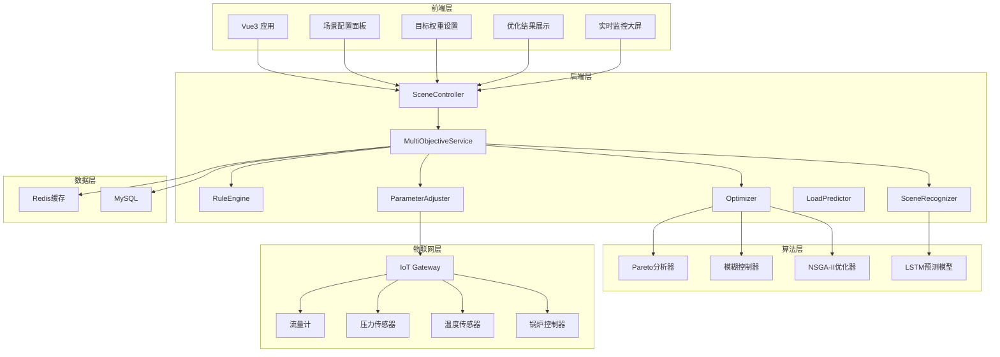
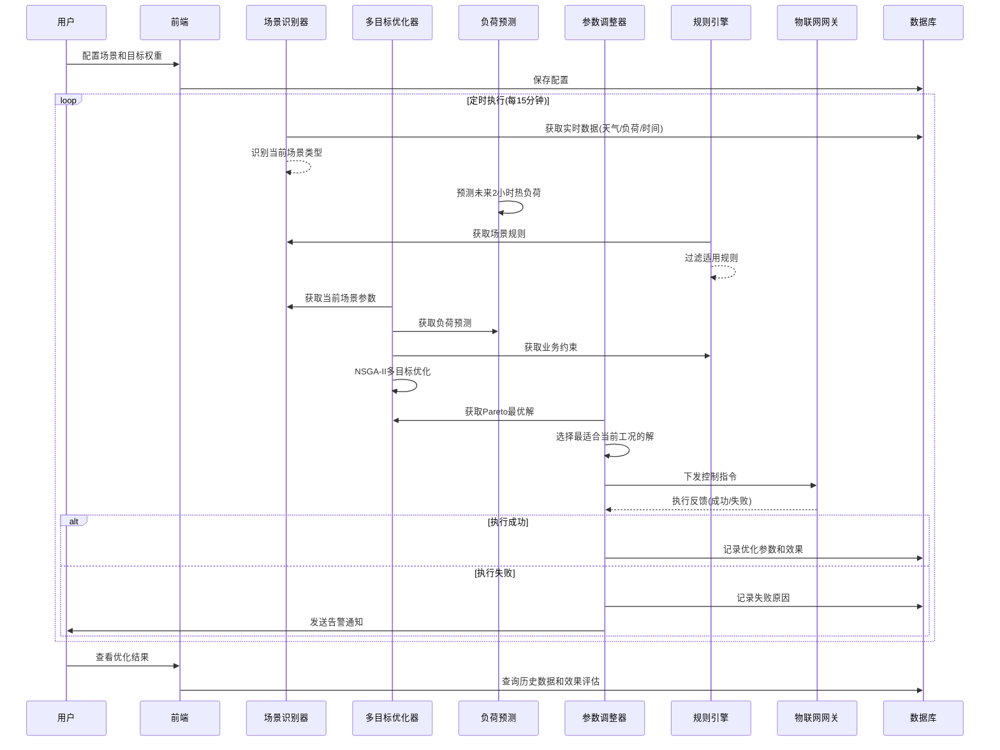
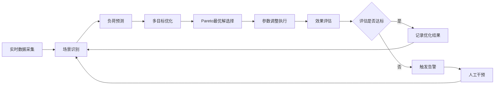

# 多场景多目标调整功能技术设计

Feature Name: 2026-03-16-multi-scene-multi-objective-adjustment
Updated: 2026-03-16

## 概述

本功能根据不同的场景（如供暖季、非供暖季、极端天气、节假日等）和目标（如能源高效利用、降低能耗成本、提高系统稳定性等），自动调整能源电站（锅炉房）的运行参数，实现智能化调度优化。

### 背景

传统的锅炉房运行主要依赖人工经验设定固定参数，无法适应天气变化、负荷波动等复杂情况。本功能通过多目标优化算法，实现基于场景自适应的参数动态调整，在保证供热质量的前提下最大化能源利用效率。

### 核心能力

- **多场景识别**：自动识别不同运行场景（季节、天气、负荷时段、节假日）
- **多目标优化**：支持能效、成本、稳定性等多目标协同优化，采用Pareto最优解集
- **参数自动调整**：自动调整锅炉运行参数（温度、压力、流量、燃料配比等）
- **动态适应**：根据实时数据动态调整优化策略，支持反馈闭环控制
- **可视化配置**：提供场景配置、目标权重设置、优化结果展示界面

### 技术选型理由

| 技术 | 选择理由 |
|------|----------|
| NSGA-II多目标优化 | 非支配排序遗传算法，适合多目标Pareto优化 |
| 模糊逻辑控制 | 处理不确定性和非线性特性专家知识融入 |
| 时序预测模型 | LSTM神经网络预测短期热负荷变化 |
| 规则引擎Drools | 支持复杂业务规则配置和动态更新 |
| Spring Boot Quatz | 定时任务调度，支持Cron表达式 |

## 架构

### 系统架构图



### 模块交互图



### 数据流图



## 组件与接口

### 核心组件

#### 1. SceneRecognitionService 场景识别服务

**职责**：根据时间、天气、负荷等数据自动识别当前运行场景

**核心方法**：
```java
public SceneType recognizeScene(SceneRecognitionRequest request)
public List<SceneType> getAllSceneTypes()
public SceneConfig getSceneConfig(SceneType sceneType)
```

#### 2. MultiObjectiveOptimizer 多目标优化器

**职责**：基于NSGA-II算法执行多目标优化计算

**核心方法**：
```java
public ParetoSolution optimize(MultiObjectiveRequest request)
public List<double[]> getParetoFront()
public Solution selectBestSolution(ParetoSolution solution, SceneType sceneType)
```

**优化目标**：
- 能源效率最大化（锅炉综合效率）
- 运行成本最小化（燃料消耗/电耗）
- 系统稳定性最大化（设备运行平稳度）

**约束条件**：
- 供水温度范围：50℃-95℃
- 回水温度范围：30℃-70℃
- 锅炉出力范围：30%-100%
- 设备启停次数限制：≤3次/天

#### 3. LoadPredictor 负荷预测服务

**职责**：基于LSTM模型预测短期热负荷

**核心方法**：
```java
public LoadPrediction predict(LongTerm forecastHours)
public double[] getPredictionCurve()
public ModelAccuracy getModelAccuracy()
```

#### 4. ParameterAdjuster 参数调整服务

**职责**：执行参数调整指令到物联网设备

**核心方法**：
```java
public AdjustmentResult adjustParameters(AdjustmentCommand command)
public List<AdjustmentRecord> getAdjustmentHistory(Long stationId)
public AdjustmentStatus getAdjustmentStatus(String taskId)
```

#### 5. RuleEngineService 规则引擎服务

**职责**：管理业务规则，支持动态更新

**核心方法**：
```java
public boolean evaluateRules(SceneContext context)
public List<Rule> getApplicableRules(SceneType sceneType)
public void updateRule(Rule rule)
```

### API接口

#### 场景管理

| 接口 | 方法 | 说明 |
|------|------|------|
| `/api/scene/types` | GET | 获取所有场景类型 |
| `/api/scene/config/{sceneType}` | GET | 获取场景配置 |
| `/api/scene/config` | POST | 保存场景配置 |
| `/api/scene/current` | GET | 获取当前场景 |

#### 目标权重

| 接口 | 方法 | 说明 |
|------|------|------|
| `/api/objective/weights` | GET | 获取目标权重 |
| `/api/objective/weights` | POST | 设置目标权重 |
| `/api/objective/presets` | GET | 获取预设权重方案 |

#### 优化控制

| 接口 | 方法 | 说明 |
|------|------|------|
| `/api/optimize/run` | POST | 执行单次优化 |
| `/api/optimize/history` | GET | 获取优化历史 |
| `/api/optimize/result/{taskId}` | GET | 获取优化结果 |
| `/api/optimize/status` | GET | 获取优化任务状态 |

#### 参数调整

| 接口 | 方法 | 说明 |
|------|------|------|
| `/api/adjust/execute` | POST | 执行参数调整 |
| `/api/adjust/history` | GET | 获取调整历史 |
| `/api/adjust/pending` | GET | 获取待执行调整任务 |

## 数据模型

### 实体类

#### SceneConfig 场景配置

```java
@Data
public class SceneConfig {
    private Long id;
    private String sceneType;          // 场景类型编码
    private String sceneName;          // 场景名称
    private String description;        // 场景描述
    private Double temperatureMin;      // 室外温度下限
    private Double temperatureMax;     // 室外温度上限
    private Integer timeRangeStart;    // 时间段开始(小时)
    private Integer timeRangeEnd;      // 时间段结束(小时)
    private Boolean isHoliday;         // 是否节假日
    private List<SceneParameter> parameters;  // 场景参数
    private Date createTime;
    private Date updateTime;
}
```

#### ObjectiveWeight 目标权重

```java
@Data
public class ObjectiveWeight {
    private Long id;
    private String name;               // 权重方案名称
    private Double efficiencyWeight;   // 能效权重(0-1)
    private Double costWeight;         // 成本权重(0-1)
    private Double stabilityWeight;    // 稳定性权重(0-1)
    private Boolean isDefault;        // 是否默认方案
    private Date createTime;
}
```

#### OptimizationResult 优化结果

```java
@Data
public class OptimizationResult {
    private Long id;
    private String taskId;             // 任务ID
    private SceneType sceneType;      // 当前场景
    private Double efficiencyValue;   // 优化后能效值
    private Double costValue;          // 优化后成本值
    private Double stabilityValue;    // 优化后稳定性值
    private String paretoSolutions;   // Pareto解集(JSON)
    private Double selectedEfficiency;
    private Double selectedCost;
    private Double selectedStability;
    private String adjustmentCommands; // 下发的调整指令
    private String status;            // 执行状态
    private Date optimizeTime;
}
```

#### AdjustmentRecord 调整记录

```java
@Data
public class AdjustmentRecord {
    private Long id;
    private Long stationId;            // 场站ID
    private String parameterName;     // 参数名称
    private Double oldValue;           // 调整前值
    private Double newValue;          // 调整后值
    private String commandId;         // 指令ID
    private String executeStatus;     // 执行状态
    private String errorMessage;       // 错误信息
    private Date executeTime;
}
```

### 数据库表

```sql
-- 场景配置表
CREATE TABLE scene_config (
    id BIGINT PRIMARY KEY AUTO_INCREMENT,
    scene_type VARCHAR(50) NOT NULL COMMENT '场景类型编码',
    scene_name VARCHAR(100) NOT NULL COMMENT '场景名称',
    description VARCHAR(500) COMMENT '场景描述',
    temperature_min DOUBLE COMMENT '室外温度下限',
    temperature_max DOUBLE COMMENT '室外温度上限',
    time_range_start INT COMMENT '时间段开始(小时)',
    time_range_end INT COMMENT '时间段结束(小时)',
    is_holiday TINYINT DEFAULT 0 COMMENT '是否节假日',
    parameters JSON COMMENT '场景参数JSON',
    create_time DATETIME DEFAULT CURRENT_TIMESTAMP,
    update_time DATETIME DEFAULT CURRENT_TIMESTAMP ON UPDATE CURRENT_TIMESTAMP,
    UNIQUE KEY uk_scene_type (scene_type)
);

-- 目标权重表
CREATE TABLE objective_weight (
    id BIGINT PRIMARY KEY AUTO_INCREMENT,
    name VARCHAR(100) NOT NULL COMMENT '权重方案名称',
    efficiency_weight DOUBLE NOT NULL DEFAULT 0.33 COMMENT '能效权重',
    cost_weight DOUBLE NOT NULL DEFAULT 0.33 COMMENT '成本权重',
    stability_weight DOUBLE NOT NULL DEFAULT 0.34 COMMENT '稳定性权重',
    is_default TINYINT DEFAULT 0 COMMENT '是否默认方案',
    create_time DATETIME DEFAULT CURRENT_TIMESTAMP
);

-- 优化结果表
CREATE TABLE optimization_result (
    id BIGINT PRIMARY KEY AUTO_INCREMENT,
    task_id VARCHAR(50) NOT NULL COMMENT '任务ID',
    scene_type VARCHAR(50) COMMENT '当前场景',
    efficiency_value DOUBLE COMMENT '优化后能效值',
    cost_value DOUBLE COMMENT '优化后成本值',
    stability_value DOUBLE COMMENT '优化后稳定性值',
    pareto_solutions JSON COMMENT 'Pareto解集',
    selected_efficiency DOUBLE COMMENT '选中解能效',
    selected_cost DOUBLE COMMENT '选中解成本',
    selected_stability DOUBLE COMMENT '选中解稳定性',
    adjustment_commands JSON COMMENT '调整指令',
    status VARCHAR(20) DEFAULT 'PENDING' COMMENT '执行状态',
    optimize_time DATETIME DEFAULT CURRENT_TIMESTAMP,
    INDEX idx_task_id (task_id),
    INDEX idx_optimize_time (optimize_time)
);

-- 参数调整记录表
CREATE TABLE adjustment_record (
    id BIGINT PRIMARY KEY AUTO_INCREMENT,
    station_id BIGINT NOT NULL COMMENT '场站ID',
    parameter_name VARCHAR(50) NOT NULL COMMENT '参数名称',
    old_value DOUBLE COMMENT '调整前值',
    new_value DOUBLE COMMENT '调整后值',
    command_id VARCHAR(50) COMMENT '指令ID',
    execute_status VARCHAR(20) DEFAULT 'PENDING' COMMENT '执行状态',
    error_message VARCHAR(500) COMMENT '错误信息',
    execute_time DATETIME DEFAULT CURRENT_TIMESTAMP,
    INDEX idx_station_id (station_id),
    INDEX idx_execute_time (execute_time)
);
```

## 正确性属性

### 功能正确性

1. **场景识别准确性**
   - 识别准确率≥95%
   - 场景切换延迟≤1分钟

2. **优化结果有效性**
   - 优化结果必须满足所有约束条件
   - Pareto前沿解集完整性验证

3. **参数调整一致性**
   - 下发参数与执行参数误差≤1%
   - 调整失败率≤2%

### 性能要求

| 指标 | 要求 |
|------|------|
| 场景识别响应时间 | ≤500ms |
| 单次优化计算时间 | ≤30s |
| 负荷预测响应时间 | ≤10s |
| 接口响应时间(P99) | ≤200ms |

### 安全性

- 参数调整需经过安全校验
- 关键参数设置上下限保护
- 异常情况自动回退机制

## 错误处理

### 错误分类

| 错误类型 | 处理策略 |
|----------|----------|
| 场景识别失败 | 使用默认场景配置 |
| 负荷预测失败 | 使用历史平均值替代 |
| 优化计算超时 | 返回上一次的优化结果 |
| 参数调整失败 | 触发告警，保持当前参数 |
| 设备通信失败 | 重试3次后标记为离线 |

### 异常场景处理

1. **数据异常**：缺失关键数据时，使用最近有效值或默认值
2. **优化无解**：扩大约束范围或降低优化目标后重试
3. **设备不响应**：自动切换到手动模式，通知运维人员
4. **极端天气**：临时切换到强制运行模式，优先保障供热

### 告警规则

```java
// 告警条件配置
- 连续3次优化失败
- 参数调整执行失败
- 能效指标下降超过15%
- 设备离线超过30分钟
```

## 测试策略

### 单元测试

- SceneRecognitionService场景识别逻辑测试
- NSGA-II优化器核心算法测试
- 参数边界值校验测试

### 集成测试

- 多目标优化流程端到端测试
- 场景切换功能测试
- 参数下发与执行一致性测试

### 性能测试

- 并发优化请求压力测试
- 大规模数据优化计算性能测试

### 仿真测试

- 基于历史数据的回测验证
- 极端场景模拟测试

## 实施计划

### 阶段一：基础功能

- 场景识别服务开发
- 基础参数配置界面
- 简单的规则引擎集成

### 阶段二：优化算法

- NSGA-II优化器开发
- 负荷预测模型集成
- 多目标权重配置

### 阶段三：闭环控制

- 参数自动调整功能
- 效果评估与反馈
- 告警与通知

### 阶段四：优化完善

- 模型持续优化
- 性能调优
- 用户体验优化
