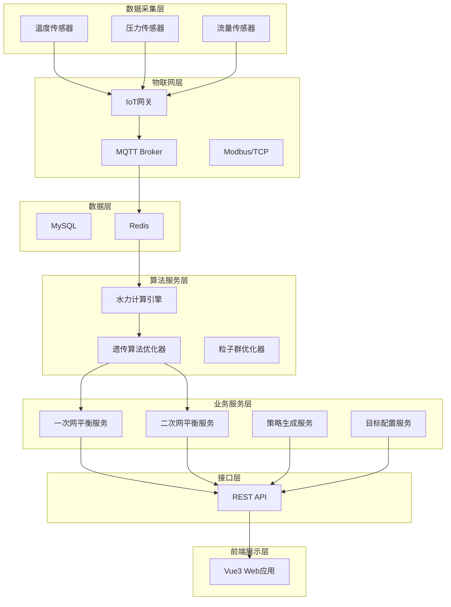
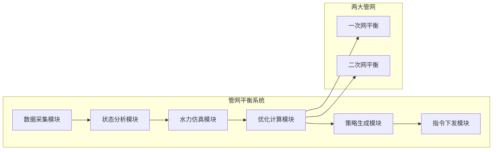
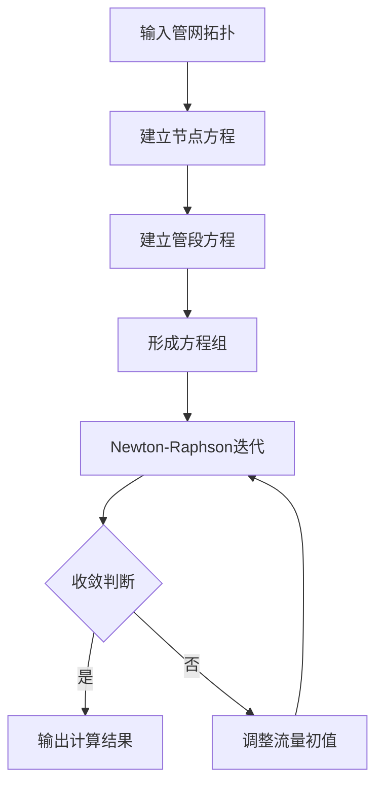

# 管网平衡自动化策略 - 技术设计方案

需求名称：pipe-network-balance-automation
更新日期：2026-03-16

## 概述

本方案针对孵化器园区能源站的供热管网系统，实现**一次网**和**二次网**的平衡自动化策略。通过分析管网运行状态、计算水力平衡、生成各阀门操作建议，支撑最优化调节，保障系统稳定运行。

## 设备清单

| 设备类型 | 数量 | 说明 |
|---------|------|------|
| 蒸汽锅炉 | 6台 | 一次热源 |
| 空气源热泵 | 10台 | 辅助热源 |
| 风冷机组循环泵 | 2台 | 制冷循环 |
| 空气源热泵循环泵 | 3台 | 热泵侧循环 |
| 补水泵 | N台 | 系统补水 |
| 补水箱 | N个 | 储水调节 |
| 热网循环泵 | N台 | 热水循环 |
| 分水器 | 1套 | 一次网分配 |
| 集水器 | 1套 | 一次网回收 |
| 一次供回水母管 | 1套 | 主管道 |
| 二次热网循环泵 | N台 | 二次网循环 |
| 冷网补水泵 | N台 | 冷水补充 |

## 需求分析

### 管网范围
- **一次网**：能源站内热源设备（锅炉、热泵）与分水器、集水器之间的管网
- **二次网**：分水器/集水器到各用能用户（入驻企业）之间的管网

### 监测点分布
- **一次网**：
  - 温度传感器：分布在各设备进出管路、一次供回水母管
  - 压力传感器：分布在一次网母管和各设备支路
  - 流量传感器：分布在各设备支路和关键管段
  
- **二次网**：
  - 温度传感器：分布在各用户支路供回水管、二次网供回水母管
  - 压力传感器：分布在二次网关键节点
  - 流量传感器：分布在各用户支路

### 控制目标（界面可配置）
- 一次网：各设备出口温度、一次供回水温度和压力
- 二次网供回水温度目标值（可设置）
- 用户室内温度目标值（可设置）

### 优化策略
1. **优先级1**：保证温度均衡（远近端用户温度一致）
2. **优先级2**：降低系统能耗

## 架构设计

### 系统架构图



### 功能模块设计



## 组件与接口

### 核心组件

| 组件名称 | 职责 | 技术选型 |
|---------|------|---------|
| DataCollector | 实时数据采集与缓存 | Spring Boot + Redis |
| HydraulicSimulator | 管网水力仿真计算 | Java算法实现 |
| BalanceOptimizer | 平衡优化算法引擎 | 遗传算法/粒子群 |
| StrategyGenerator | 阀门操作策略生成 | 规则引擎 |
| ConfigManager | 目标参数配置管理 | MySQL + Redis |
| DeviceController | 设备指令下发 | MQTT/Modbus |

### 核心接口

| 接口 | 方法 | 说明 |
|-----|------|------|
| /api/balance/status | GET | 获取管网平衡状态 |
| /api/balance/optimize | POST | 执行平衡优化计算 |
| /api/balance/strategy | GET | 获取阀门操作建议 |
| /api/balance/config | PUT | 更新控制目标配置 |
| /api/balance/history | GET | 获取历史平衡记录 |

### 数据模型

#### 管网节点
```java
class PipeNode {
    Long id;              // 节点ID
    String name;           // 节点名称
    String type;           // 节点类型（SOURCE, PIPE, VALVE, USER）
    Double temperature;   // 温度
    Double pressure;      // 压力
    Double flow;          // 流量
    Double elevation;     // 高程
}
```

#### 管网管段
```java
class PipeSegment {
    Long id;              // 管段ID
    String name;          // 管段名称
    Long startNodeId;     // 起始节点
    Long endNodeId;       // 终止节点
    Double length;        // 长度(m)
    Double diameter;      // 管径(mm)
    Double roughness;     // 粗糙度
}
```

#### 阀门设备
```java
class Valve {
    Long id;              // 阀门ID
    String name;          // 阀门名称
    Long nodeId;          // 所属节点
    Double openPercent;   // 开度(0-100%)
    Double kvValue;       // 阀门Kv值
    String status;        // 状态(OPEN/CLOSE/ADJUST)
}
```

#### 控制目标配置
```java
class BalanceConfig {
    Long id;
    String networkType;    // 管网类型(PRIMARY/SECONDARY)
    Double supplyTemp;    // 供水温度目标(°C)
    Double returnTemp;    // 回水温度目标(°C)
    Double indoorTemp;    // 室内温度目标(°C)
    Double pressure;      // 压力目标(MPa)
    Double flow;         // 流量目标(m³/h)
}
```

## 优化算法设计

### 水力计算模型

采用图论算法建立管网拓扑，结合Newton-Raphson迭代法进行水力计算：



### 平衡优化算法

采用遗传算法(GA)或粒子群优化算法(PSO)进行全局最优解搜索：

| 参数 | 说明 |
|-----|------|
| 种群规模 | 100-200 |
| 迭代次数 | 200-500 |
| 交叉概率 | 0.8 |
| 变异概率 | 0.1 |
| 适应度函数 | 温度偏差 + 能耗权重 |

### 目标函数

```
Minimize: F = w1 * Σ|Ti - Ttarget| + w2 * ΣQi * ΔPi

其中：
- Ti: 第i个用户实际温度
- Ttarget: 目标温度
- Qi: 第i支路流量
- ΔPi: 第i支路压降
- w1, w2: 权重系数(w1 > w2)
```

## 正确性属性

### 功能正确性
- 水力计算结果误差 < 2%
- 优化计算可在30秒内完成
- 阀门操作建议正确率 > 95%

### 性能要求
- 实时数据更新频率：≥1次/分钟
- 优化计算响应时间：≤60秒
- 系统可用性：≥99.9%

### 安全要求
- 阀门操作需二次确认
- 操作日志完整记录
- 异常情况自动告警

## 错误处理

| 异常场景 | 处理策略 |
|---------|---------|
| 数据采集失败 | 使用最近一次有效值，告警提示 |
| 优化计算不收敛 | 提示调整参数建议，使用启发式方法 |
| 通讯中断 | 缓存控制指令，恢复后自动下发 |
| 设备故障 | 隔离故障设备，生成应急策略 |

## 测试策略

### 单元测试
- 水力计算模块：节点/管段计算准确性
- 优化算法：基准函数验证

### 集成测试
- 数据采集与处理流程
- 优化计算与策略生成

### 仿真测试
- 基于历史数据的离线仿真
- 边界条件测试

## 实施计划

| 阶段 | 任务 | 预计周期 |
|-----|------|---------|
| 1 | 管网拓扑建模与数据接入 | 2周 |
| 2 | 水力仿真计算引擎开发 | 3周 |
| 3 | 平衡优化算法实现 | 3周 |
| 4 | 策略生成与指令下发 | 2周 |
| 5 | 前端界面开发 | 2周 |
| 6 | 系统集成与测试 | 2周 |

