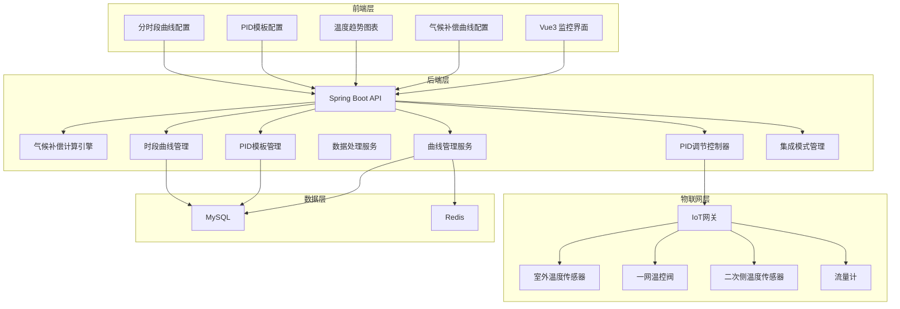
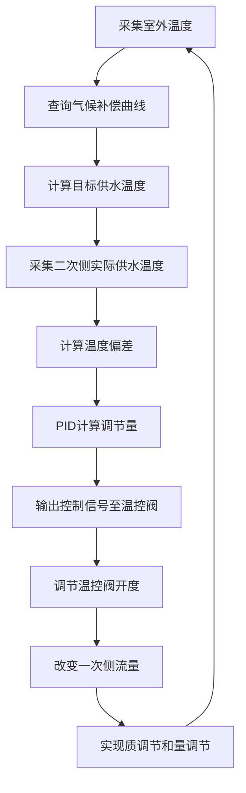
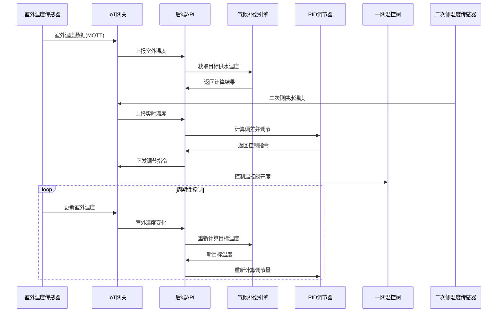
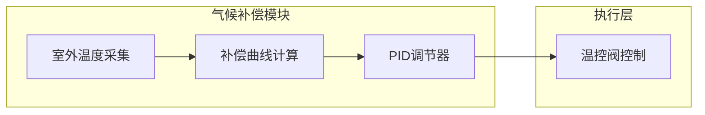
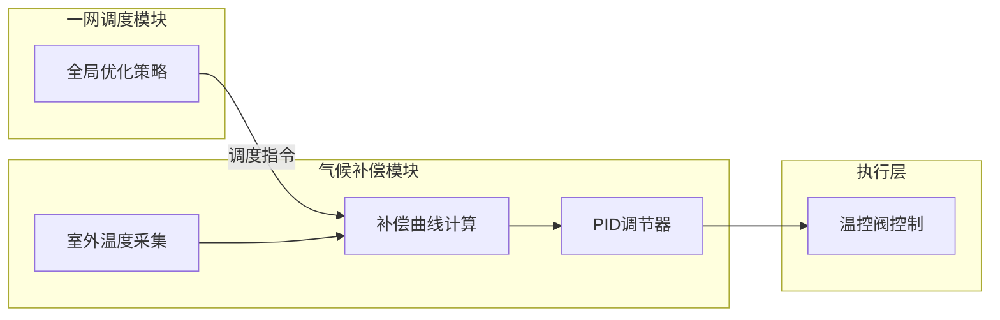
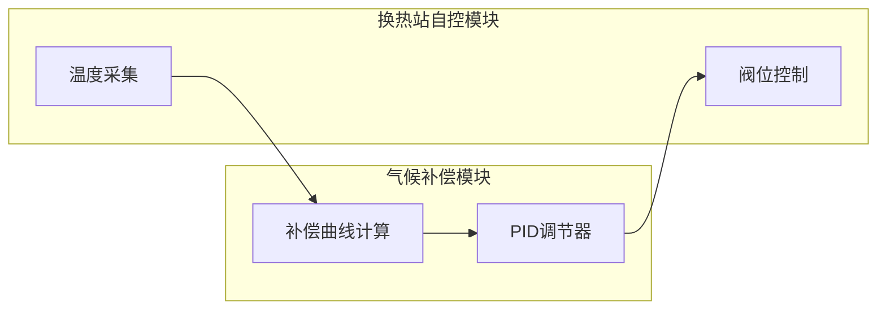
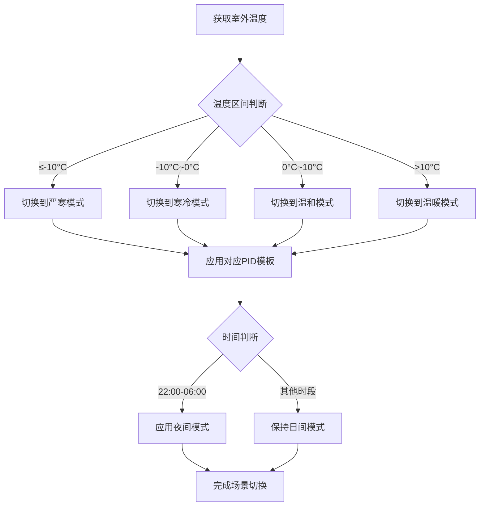

# 气候补偿模式技术设计文档

Feature Name: climate-compensation
Updated: 2026-03-16

## Description

气候补偿模式是锅炉集中供热智慧管理系统的核心功能模块，通过建立室外温度与二次侧供水温度之间的补偿曲线，实现根据气候变化自动调节供热量的节能控制策略。系统采集室外温度传感器数据，结合气候补偿曲线计算目标供水温度，通过PID调节器控制一网温控阀开度，实时改变一次侧流量，最终实现二次侧供水温度的质调节和一次侧流量的量调节，达到节能降耗的目的。

## Architecture

### 系统总体架构



### 核心控制流程



### 模块交互时序



## Components and Interfaces

### 前端组件

| 组件名称 | 职责 | 接口 |
|----------|------|------|
| ClimateCompensationPanel | 气候补偿主面板 | /api/climate/{stationId}/status |
| CurveConfig | 补偿曲线配置组件 | /api/climate/curve |
| TimeSegmentConfig | 分时段曲线配置组件 | /api/climate/curve/time-segment |
| TemperatureTrendChart | 温度趋势图表 | /api/climate/{stationId}/trend |
| ControlPanel | 温控阀控制面板 | /api/climate/{stationId}/control |
| PIDSettings | PID参数设置 | /api/climate/{stationId}/pid |
| PIDTemplateManager | PID模板管理 | /api/climate/pid-templates |
| SceneModeSelector | 场景模式选择器 | /api/climate/{stationId}/scene |
| IntegrationModeSelector | 集成模式选择器 | /api/climate/{stationId}/integration |
| StationClimateConfig | 换热站个性化配置 | /api/climate/{stationId}/station-config |

### 后端服务

| 服务名称 | 职责 | 核心类 |
|----------|------|--------|
| ClimateCompensationService | 气候补偿计算逻辑 | ClimateCompensationController, ClimateCompensationServiceImpl |
| CurveManagementService | 补偿曲线管理 | CurveRepository, CurveService |
| TimeSegmentCurveService | 分时段曲线管理 | TimeSegmentCurveController, TimeSegmentCurveServiceImpl |
| PIDControlService | PID调节控制 | PIDController, ControlExecutor |
| PIDTemplateService | PID参数模板管理 | PIDTemplateController, PIDTemplateServiceImpl |
| IntegrationModeService | 集成模式管理 | IntegrationModeController, IntegrationModeServiceImpl |
| StationClimateConfigService | 换热站个性化配置 | StationClimateConfigController, StationClimateConfigServiceImpl |
| TemperatureDataService | 温度数据处理 | TemperatureDataCollector, DataProcessor |

### 核心接口定义

#### 1. 获取气候补偿状态

```
GET /api/climate/{stationId}/status

Response:
{
  "stationId": "ST001",
  "outdoorTemp": 5.2,
  "targetSupplyTemp": 52.3,
  "actualSupplyTemp": 51.8,
  "temperatureDeviation": -0.5,
  "valveOpening": 65.0,
  "primaryFlowRate": 118.5,
  "compensationMode": "auto",
  "curveName": "标准补偿曲线",
  "status": "running"
}
```

#### 2. 配置气候补偿曲线

```
POST /api/climate/curve

Request:
{
  "curveName": "标准补偿曲线",
  "curvePoints": [
    {"outdoorTemp": -15, "supplyTemp": 65},
    {"outdoorTemp": -10, "supplyTemp": 60},
    {"outdoorTemp": -5, "supplyTemp": 55},
    {"outdoorTemp": 0, "supplyTemp": 50},
    {"outdoorTemp": 5, "supplyTemp": 45},
    {"outdoorTemp": 10, "supplyTemp": 40},
    {"outdoorTemp": 15, "supplyTemp": 35}
  ],
  "stationIds": ["ST001", "ST002", "ST003"]
}

Response:
{
  "success": true,
  "curveId": "CURVE001",
  "timestamp": "2026-03-16T10:30:00Z"
}
```

#### 3. 设置PID参数

```
POST /api/climate/{stationId}/pid

Request:
{
  "kp": 2.5,
  "ki": 0.8,
  "kd": 0.3,
  "setPoint": 52.0,
  "minOutput": 0,
  "maxOutput": 100,
  "sampleTime": 30
}

Response:
{
  "success": true,
  "timestamp": "2026-03-16T10:30:00Z"
}
```

#### 4. 手动控制温控阀

```
POST /api/climate/{stationId}/control

Request:
{
  "target": "valve",
  "action": "setOpening",
  "value": 70.0,
  "mode": "manual"
}

Response:
{
  "success": true,
  "timestamp": "2026-03-16T10:30:00Z"
}
```

#### 5. 获取温度趋势数据

```
GET /api/climate/{stationId}/trend?startTime=2026-03-16T00:00:00Z&endTime=2026-03-16T12:00:00Z

Response:
{
  "stationId": "ST001",
  "dataPoints": [
    {
      "timestamp": "2026-03-16T00:00:00Z",
      "outdoorTemp": -8.5,
      "targetSupplyTemp": 62.0,
      "actualSupplyTemp": 61.8,
      "valveOpening": 58.0
    }
  ]
}
```

#### 6. 获取PID参数模板列表

```
GET /api/climate/pid-templates

Response:
{
  "templates": [
    {
      "id": "TPL001",
      "name": "严寒模式",
      "sceneType": "extreme_cold",
      "description": "适用于室外温度低于-10°C的严寒天气",
      "kp": 3.0,
      "ki": 1.0,
      "kd": 0.5,
      "setPoint": 55.0,
      "sampleTime": 30,
      "isBuiltIn": true
    },
    {
      "id": "TPL002",
      "name": "温和模式",
      "sceneType": "mild",
      "description": "适用于室外温度0°C-10°C的温和天气",
      "kp": 2.0,
      "ki": 0.5,
      "kd": 0.2,
      "setPoint": 45.0,
      "sampleTime": 60,
      "isBuiltIn": true
    }
  ]
}
```

#### 7. 配置分时段曲线

```
POST /api/climate/curve/time-segment

Request:
{
  "curveId": "CURVE001",
  "segments": [
    {
      "segmentName": "白天",
      "startTime": "06:00",
      "endTime": "22:00",
      "dayOfWeekMask": 127,
      "points": [
        {"outdoorTemp": -15, "supplyTemp": 65},
        {"outdoorTemp": -5, "supplyTemp": 55},
        {"outdoorTemp": 10, "supplyTemp": 40}
      ]
    },
    {
      "segmentName": "夜间",
      "startTime": "22:00",
      "endTime": "06:00",
      "dayOfWeekMask": 127,
      "points": [
        {"outdoorTemp": -15, "supplyTemp": 60},
        {"outdoorTemp": -5, "supplyTemp": 50},
        {"outdoorTemp": 10, "supplyTemp": 35}
      ]
    }
  ]
}

Response:
{
  "success": true,
  "curveId": "CURVE001",
  "segmentCount": 2,
  "timestamp": "2026-03-16T10:30:00Z"
}
```

#### 8. 配置集成模式

```
POST /api/climate/{stationId}/integration

Request:
{
  "integrationMode": "independent",
  "enableClimateCompensation": true,
  "enablePrimaryNetworkCoordination": false,
  "priorityStrategy": "climate_first"
}

Response:
{
  "success": true,
  "stationId": "ST001",
  "integrationMode": "independent",
  "timestamp": "2026-03-16T10:30:00Z"
}
```

#### 9. 配置换热站个性化参数

```
POST /api/climate/{stationId}/station-config

Request:
{
  "curveId": "CURVE001",
  "pidTemplateId": "TPL001",
  "customSetPoint": 50.0,
  "minSupplyTemp": 35.0,
  "maxSupplyTemp": 70.0,
  "buildingHeatCoeff": 1.2,
  "responseFactor": 1.0,
  "enableTimeSegment": true
}

Response:
{
  "success": true,
  "stationId": "ST001",
  "timestamp": "2026-03-16T10:30:00Z"
}
```

#### 10. 切换场景模式

```
POST /api/climate/{stationId}/scene/switch

Request:
{
  "sceneType": "extreme_cold",
  "forceSwitch": false
}

Response:
{
  "success": true,
  "stationId": "ST001",
  "previousScene": "mild",
  "currentScene": "extreme_cold",
  "appliedTemplate": {
    "id": "TPL001",
    "name": "严寒模式",
    "kp": 3.0,
    "ki": 1.0,
    "kd": 0.5
  },
  "timestamp": "2026-03-16T10:30:00Z"
}
```

## Data Models

### 换热站个性化配置

```java
public class StationClimateConfig {
    private String id;
    private String stationId;
    private String curveId;         // 使用的补偿曲线ID
    private String pidTemplateId;   // 使用的PID模板ID
    private Double customSetPoint;  // 自定义设定值（覆盖模板）
    private Double minSupplyTemp;   // 最小供水温度限制
    private Double maxSupplyTemp;  // 最大供水温度限制
    private Double buildingHeatCoeff; // 建筑热特性系数
    private Double responseFactor;  // 系统响应因子
    private Boolean enableTimeSegment; // 启用分时段控制
    private List<TimeSegmentCurve> timeSegments;
    private LocalDateTime createTime;
    private LocalDateTime updateTime;
}
```

### 气候补偿曲线实体

```java
public class CompensationCurve {
    private String id;
    private String name;
    private String curveType;       // standard/custom
    private List<CurvePoint> points;
    private String stationIds;      // 适用的换热站ID列表，逗号分隔
    private Boolean isDefault;
    private LocalDateTime createTime;
    private LocalDateTime updateTime;
}

public class CurvePoint {
    private Double outdoorTemp;     // 室外温度 °C
    private Double supplyTemp;      // 供水温度 °C
    private Double slope;           // 斜率（用于插值计算）
}
```

### 温度数据实体

```java
public class TemperatureData {
    private String id;
    private String stationId;
    private String sensorType;     // outdoor/primary_supply/primary_return/secondary_supply/secondary_return
    private Double value;
    private LocalDateTime timestamp;
    private String quality;         // good/bad/uncertain
}
```

### PID控制参数实体

```java
public class PIDParameters {
    private Double kp;              // 比例系数
    private Double ki;              // 积分系数
    private Double kd;              // 微分系数
    private Double setPoint;        // 设定值
    private Double minOutput;       // 最小输出
    private Double maxOutput;       // 最大输出
    private Integer sampleTime;     // 采样周期(秒)
    private Integer outputDirection; // 正作用/反作用 1/-1
}
```

### PID参数模板

```java
public class PIDTemplate {
    private String id;
    private String name;
    private String sceneType;      // 场景类型：extreme_cold/mild/transition/night
    private String description;     // 模板描述
    private Double kp;
    private Double ki;
    private Double kd;
    private Double setPoint;       // 默认设定值
    private Double minOutput;
    private Double maxOutput;
    private Integer sampleTime;
    private Integer outputDirection;
    private Boolean isBuiltIn;     // 是否内置模板
    private LocalDateTime createTime;
}
```

### 场景类型定义

| 场景类型 | 名称 | 室外温度范围 | 适用时段 |
|----------|------|--------------|----------|
| extreme_cold | 严寒模式 | ≤-10°C | 极端天气 |
| cold | 寒冷模式 | -10°C ~ 0°C | 冬季日常 |
| mild | 温和模式 | 0°C ~ 10°C | 春秋季节 |
| warm | 温暖模式 | > 10°C | 初春末冬 |
| night | 夜间模式 | 不限 | 22:00-06:00 |

### 分时段曲线配置

```java
public class TimeSegmentCurve {
    private String id;
    private String curveId;
    private String segmentName;     // 时段名称
    private LocalTime startTime;    // 开始时间
    private LocalTime endTime;      // 结束时间
    private Integer dayOfWeekMask;  // 星期掩码（1-7，0表示全部）
    private List<CurvePoint> points;
}
```

### 集成模式配置

```java
public class IntegrationConfig {
    private String stationId;
    private String integrationMode; // independent/primary_network
    private Boolean enableClimateCompensation;
    private Boolean enablePrimaryNetworkCoordination;
    private String priorityStrategy; // climate_first/network_first
    private LocalDateTime updateTime;
}
```

### 换热站个性化配置

### 控制记录实体

```java
public class ControlRecord {
    private String id;
    private String stationId;
    private String controlTarget;   // valve/pump
    private Double targetValue;    // 目标值
    private Double actualValue;     // 实际值
    private Double deviation;       // 偏差
    private Double output;          // PID输出
    private LocalDateTime timestamp;
}
```

### 室外温度传感器配置

```java
public class OutdoorSensorConfig {
    private String id;
    private String stationId;
    private String sensorId;
    private String sensorModel;
    private String communicationType; // mqtt/modbus
    private Double minRange;         // 最小量程
    private Double maxRange;         // 最大量程
    private Integer pollingInterval; // 采集间隔(秒)
    private String location;         // 安装位置
    private Boolean enabled;
}
```

## Correctness Properties

### 控制精度要求

| 指标 | 精度要求 |
|------|----------|
| 二次侧供水温度控制精度 | ±1.5°C |
| 室外温度采集精度 | ±0.5°C |
| 温控阀调节响应时间 | ≤5秒 |
| 控制周期 | 30-300秒可配置 |
| 温度超调量 | ≤10% |

### 数据一致性

| 指标 | 要求 |
|------|------|
| 实时数据延迟 | ≤10秒 |
| 控制指令响应时间 | ≤2秒 |
| 曲线计算响应时间 | ≤100ms |
| 历史数据存储周期 | ≥3年 |

### 系统可用性

| 指标 | 要求 |
|------|------|
| 系统可用率 | ≥99.5% |
| 故障自恢复时间 | ≤30秒 |
| 传感器断线检测时间 | ≤60秒 |
| 备用控制策略切换时间 | ≤10秒 |

## Error Handling

### 传感器故障处理

| 场景 | 处理策略 |
|------|----------|
| 室外温度传感器故障 | 使用最近30分钟平均值替代，告警提示 |
| 二次侧供水温度传感器故障 | 切换到备用传感器，无备用则停机告警 |
| 多个温度传感器同时故障 | 切换到手动控制模式，生成紧急告警 |

### 控制异常处理

| 场景 | 处理策略 |
|------|----------|
| 温控阀通信故障 | 启用备用阀或切换到本地控制模式 |
| PID调节振荡 | 自动降低PID增益，启动自适应调整 |
| 温度超限 | 启动保护性调节，限制阀位变化速率 |
| 一次侧流量异常 | 启动保护性停机，告警提示 |

### 曲线计算异常处理

| 场景 | 处理策略 |
|------|----------|
| 室外温度超出曲线范围 | 外推到边界值，启动告警 |
| 曲线点不足 | 使用线性插值，至少需要2个点 |
| 曲线配置错误 | 验证曲线单调性，拒绝非法配置 |

### 通信故障处理

| 场景 | 处理策略 |
|------|----------|
| 与IoT网关通信中断 | 使用Redis缓存的最后状态，5分钟告警 |
| MQTT连接断开 | 自动重连，重连失败告警 |
| Modbus通信失败 | 切换到备用通信链路 |

## Test Strategy

### 单元测试

- 气候补偿曲线计算测试：验证不同室外温度下的目标温度计算
- PID控制算法测试：验证阶跃响应、扰动响应等场景
- 曲线配置验证测试：验证曲线单调性和边界处理

### 集成测试

- 温度传感器集成测试：验证数据采集和解析
- 温控阀集成测试：验证控制指令下发和执行
- PID闭环测试：验证实际控制效果

### 性能测试

- 并发控制测试：验证100个换热站同时调节
- 数据处理性能：验证秒级数据处理能力
- 控制响应测试：验证端到端控制延迟

### 现场测试

- 试运行测试：在实际换热站进行168小时连续运行
- 节能效果测试：对比气候补偿模式和常规模式能耗
- 极端天气测试：在极寒和极热天气下验证系统稳定性

## Integration Design

### 集成模式选择

系统支持两种集成模式，可根据实际情况由用户选择：

#### 模式一：独立模块模式

气候补偿作为独立模块运行，不与一网调度策略深度集成。适用于换热站独立控制场景。



#### 模式二：深度集成模式

气候补偿与一网调度策略深度集成，由一网统一协调各换热站的供热分配。适用于全网优化调度场景。



### 模式切换接口

```java
public class IntegrationModeSwitchRequest {
    private String stationId;
    private String targetMode;    // independent/primary_network
    private Boolean immediateSwitch;
    private String reason;
}
```

### 与换热站自控模块集成



### 数据交互规范

| 字段 | 类型 | 说明 |
|------|------|------|
| stationId | String | 换热站唯一标识 |
| outdoorTemp | Double | 室外温度°C |
| targetSupplyTemp | Double | 目标供水温度°C |
| actualSupplyTemp | Double | 实际供水温度°C |
| valveOpening | Double | 温控阀开度% |
| controlMode | String | auto/manual |

### 场景自动切换逻辑

系统支持根据室外温度和时间自动切换PID参数模板：



#### 场景切换规则

| 条件 | 触发动作 |
|------|----------|
| 室外温度持续30分钟低于-10°C | 自动切换到严寒模式 |
| 室外温度持续30分钟在-10°C~0°C | 自动切换到寒冷模式 |
| 室外温度持续30分钟在0°C~10°C | 自动切换到温和模式 |
| 室外温度持续30分钟高于10°C | 自动切换到温暖模式 |
| 系统时间进入22:00-06:00 | 自动切换到夜间模式 |
| 手动切换场景 | 立即切换到指定模式 |

### 换热站个性化适配

#### 个性化参数说明

| 参数 | 说明 | 建议范围 |
|------|------|----------|
| buildingHeatCoeff | 建筑热特性系数 | 0.8-1.5 |
| responseFactor | 系统响应因子 | 0.5-2.0 |
| minSupplyTemp | 最小供水温度限制 | 30-45°C |
| maxSupplyTemp | 最大供水温度限制 | 60-80°C |
| customSetPoint | 自定义设定值 | 40-60°C |

#### 系数自适应调整

系统支持根据实际控制效果自动调整个性化系数：

```java
public class AdaptiveAdjustmentService {
    
    public void adjustBuildingHeatCoeff(String stationId) {
        Double currentCoeff = getCurrentCoeff(stationId);
        Double controlError = calculateAverageError(stationId, 24);
        
        if (controlError > 1.5) {
            Double newCoeff = currentCoeff * 1.1;
            updateCoeff(stationId, newCoeff);
        } else if (controlError < 0.5) {
            Double newCoeff = currentCoeff * 0.95;
            updateCoeff(stationId, newCoeff);
        }
    }
    
    public void adjustResponseFactor(String stationId) {
        Double currentFactor = getCurrentFactor(stationId);
        Double overshootRate = calculateOvershootRate(stationId);
        
        if (overshootRate > 0.15) {
            Double newFactor = currentFactor * 0.8;
            updateFactor(stationId, newFactor);
        } else if (overshootRate < 0.03) {
            Double newFactor = currentFactor * 1.1;
            updateFactor(stationId, newFactor);
        }
    }
}
```

## References

[^1]: Vue3官方文档 - https://vuejs.org/
[^2]: Element Plus组件库 - https://element-plus.org/
[^3]: Spring Boot 3.2文档 - https://spring.io/projects/spring-boot
[^4]: PID控制理论 - 工业控制经典算法
[^5]: 气候补偿供热技术 - 供热节能技术手册
