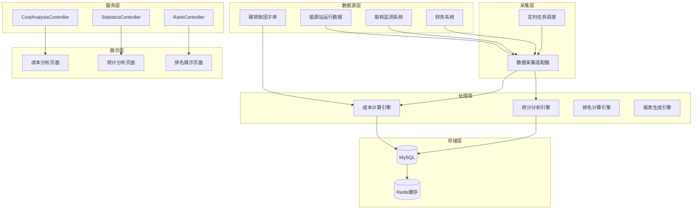
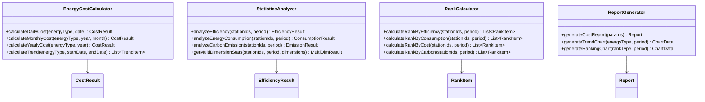

# 成本分析技术方案

需求名称：cost-analysis  
更新日期：2026-03-16

## 概述

成本分析模块旨在通过收集和分析与能源使用相关的数据，计算能源成本，并提供用于冷热电站能源成本管理和优化的分析结果。同时支持对所辖所有能源站、能源中心按照效率、能耗等多维度进行集中统计分析排名。

### 核心目标

- 实现多能源类型（天然气、电力等）的成本计算
- 支持日/月/年多时间粒度的成本分析
- 提供多维度排名统计（效率、能耗、成本、碳排放）
- 为能源成本优化提供数据支撑

### 功能范围

| 功能 | 说明 |
|------|------|
| 能源成本计算 | 根据能耗数据和能源单价计算各能源类型成本 |
| 多维度统计 | 按效率、能耗、成本、碳排放等维度统计 |
| 排名分析 | 对能源站/能源中心按指标排名 |
| 报表生成 | 生成成本分析报表和趋势图 |

---

## 架构

### 整体架构



### 模块设计



---

## 组件与接口

### 后端接口设计

#### 1. 成本分析接口

| 接口 | 方法 | 路径 | 说明 |
|------|------|------|------|
| 日成本 | GET | /api/cost/daily | 获取日成本数据 |
| 月成本 | GET | /api/cost/monthly | 获取月成本数据 |
| 年成本 | GET | /api/cost/yearly | 获取年成本数据 |
| 成本趋势 | GET | /api/cost/trend | 获取成本趋势 |
| 多能源汇总 | GET | /api/cost/summary | 获取多能源成本汇总 |

#### 2. 统计分析接口

| 接口 | 方法 | 路径 | 说明 |
|------|------|------|------|
| 效率统计 | GET | /api/stats/efficiency | 获取效率统计数据 |
| 能耗统计 | GET | /api/stats/consumption | 获取能耗统计数据 |
| 碳排放统计 | GET | /api/stats/carbon | 获取碳排放统计 |
| 多维统计 | GET | /api/stats/multi-dimension | 获取多维度统计 |

#### 3. 排名接口

| 接口 | 方法 | 路径 | 说明 |
|------|------|------|------|
| 效率排名 | GET | /api/rank/efficiency | 按效率排名 |
| 能耗排名 | GET | /api/rank/consumption | 按能耗排名 |
| 成本排名 | GET | /api/rank/cost | 按成本排名 |
| 碳排放排名 | GET | /api/rank/carbon | 按碳排放排名 |

### 数据结构设计

#### 能源成本数据模型

```java
// 能源类型枚举
public enum EnergyType {
    NATURAL_GAS,  // 天然气
    ELECTRICITY,  // 电力
    COAL,         // 煤炭
    BIOMASS       // 生物质
}

// 成本计算请求
public class CostQueryRequest {
    private EnergyType energyType;    // 能源类型
    private LocalDate startDate;       // 开始日期
    private LocalDate endDate;         // 结束日期
    private List<Long> stationIds;    // 能源站ID列表
    private String timeGranularity;   // 时间粒度：DAY/MONTH/YEAR
}

// 成本结果
public class CostResult {
    private Long stationId;
    private String stationName;
    private EnergyType energyType;
    private BigDecimal consumption;    // 消耗量
    private BigDecimal unitPrice;     // 单价
    private BigDecimal totalCost;     // 总成本
    private LocalDateTime dataTime;   // 数据时间
}
```

#### 排名数据模型

```java
// 排名请求
public class RankQueryRequest {
    private String rankType;           // 排名类型：EFFICIENCY/CONSUMPTION/COST/CARBON
    private LocalDate period;          // 统计周期
    private List<Long> stationIds;     // 能源站ID列表
    private Integer topN;              // 返回前N名
}

// 排名项
public class RankItem {
    private Integer rank;              // 排名
    private Long stationId;
    private String stationName;
    private BigDecimal value;          // 指标值
    private BigDecimal trend;          // 环比变化
}
```

---

## 数据模型

### 数据库表设计

#### 能源消耗记录表

```sql
CREATE TABLE energy_consumption (
    id BIGINT PRIMARY KEY AUTO_INCREMENT,
    station_id BIGINT NOT NULL COMMENT '能源站ID',
    energy_type VARCHAR(20) NOT NULL COMMENT '能源类型',
    consumption DECIMAL(16,4) NOT NULL COMMENT '消耗量',
    unit VARCHAR(20) COMMENT '计量单位',
    record_date DATE NOT NULL COMMENT '记录日期',
    record_hour TINYINT COMMENT '记录小时',
    created_at TIMESTAMP DEFAULT CURRENT_TIMESTAMP,
    updated_at TIMESTAMP DEFAULT CURRENT_TIMESTAMP ON UPDATE CURRENT_TIMESTAMP,
    INDEX idx_station_date (station_id, record_date),
    INDEX idx_energy_date (energy_type, record_date)
) COMMENT '能源消耗记录';
```

#### 能源单价表

```sql
CREATE TABLE energy_price (
    id BIGINT PRIMARY KEY AUTO_INCREMENT,
    energy_type VARCHAR(20) NOT NULL COMMENT '能源类型',
    unit_price DECIMAL(10,4) NOT NULL COMMENT '单价',
    unit VARCHAR(20) COMMENT '计量单位',
    effective_date DATE NOT NULL COMMENT '生效日期',
    expired_date DATE COMMENT '失效日期',
    created_at TIMESTAMP DEFAULT CURRENT_TIMESTAMP,
    INDEX idx_type_date (energy_type, effective_date)
) COMMENT '能源单价';
```

#### 碳排放因子表

```sql
CREATE TABLE carbon_factor (
    id BIGINT PRIMARY KEY AUTO_INCREMENT,
    energy_type VARCHAR(20) NOT NULL COMMENT '能源类型',
    factor_value DECIMAL(10,6) NOT NULL COMMENT '碳排放因子',
    factor_unit VARCHAR(20) COMMENT '因子单位',
    source VARCHAR(100) COMMENT '数据来源',
    effective_date DATE NOT NULL COMMENT '生效日期',
    created_at TIMESTAMP DEFAULT CURRENT_TIMESTAMP,
    INDEX idx_type_date (energy_type, effective_date)
) COMMENT '碳排放因子';
```

#### 成本汇总表

```sql
CREATE TABLE cost_summary (
    id BIGINT PRIMARY KEY AUTO_INCREMENT,
    station_id BIGINT NOT NULL COMMENT '能源站ID',
    energy_type VARCHAR(20) NOT NULL COMMENT '能源类型',
    cost_type VARCHAR(20) NOT NULL COMMENT '成本类型：DAILY/MONTHLY/YEARLY',
    consumption DECIMAL(16,4) COMMENT '消耗量',
    unit_price DECIMAL(10,4) COMMENT '单价',
    total_cost DECIMAL(16,4) COMMENT '总成本',
    carbon_emission DECIMAL(16,4) COMMENT '碳排放量',
    stat_date DATE NOT NULL COMMENT '统计日期',
    created_at TIMESTAMP DEFAULT CURRENT_TIMESTAMP,
    UNIQUE KEY uk_station_type_date (station_id, energy_type, cost_type, stat_date),
    INDEX idx_date (stat_date)
) COMMENT '成本汇总表';
```

#### 效率指标表

```sql
CREATE TABLE efficiency_metrics (
    id BIGINT PRIMARY KEY AUTO_INCREMENT,
    station_id BIGINT NOT NULL COMMENT '能源站ID',
    efficiency_value DECIMAL(8,4) COMMENT '效率值',
    energy_consumption DECIMAL(16,4) COMMENT '能耗',
    cost_per_unit DECIMAL(10,4) COMMENT '单位成本',
    carbon_per_unit DECIMAL(10,4) COMMENT '单位碳排放',
    stat_date DATE NOT NULL COMMENT '统计日期',
    created_at TIMESTAMP DEFAULT CURRENT_TIMESTAMP,
    INDEX idx_station_date (station_id, stat_date)
) COMMENT '效率指标表';
```

---

## 正确性属性

### 数据正确性

| 属性 | 说明 |
|------|------|
| 消耗量一致性 | 能源消耗数据与能耗监测系统数据保持一致 |
| 单价时效性 | 成本计算使用对应生效周期的有效单价 |
| 计算精度 | 金额计算保留4位小数，避免浮点误差 |
| 汇总一致性 | 日/月/年成本数据可通过汇总验证 |

### 排名正确性

| 属性 | 说明 |
|------|------|
| 排名唯一性 | 相同指标值应具有相同排名，后续排名应跳过 |
| 排名稳定性 | 相同查询条件返回结果稳定 |
| 时间有效性 | 排名基于对应统计周期的数据 |

### 系统正确性

| 属性 | 说明 |
|------|------|
| 数据完整性 | 计算所需的能耗数据缺失时应有明确提示 |
| 边界处理 | 跨周期的成本计算应正确处理边界 |
| 并发安全 | 多用户并发查询不影响数据准确性 |

---

## 错误处理

### 错误码设计

| 错误码 | 说明 |
|--------|------|
| COST_001 | 能源类型不支持 |
| COST_002 | 时间范围超出允许范围 |
| COST_003 | 能源站不存在 |
| COST_004 | 缺少必要的能耗数据 |
| COST_005 | 单价数据不存在 |
| STAT_001 | 统计维度不支持 |
| RANK_001 | 排名类型不支持 |

### 异常处理策略

| 场景 | 处理方式 |
|------|----------|
| 能耗数据缺失 | 返回已获取数据并标注缺失项 |
| 单价数据缺失 | 使用最近可用单价并标注 |
| 能源站ID无效 | 跳过该站点继续处理 |
| 计算溢出 | 返回最大值并标注溢出状态 |

---

## 测试策略

### 单元测试

| 测试类 | 测试内容 |
|--------|----------|
| EnergyCostCalculatorTest | 成本计算逻辑 |
| StatisticsAnalyzerTest | 统计分析逻辑 |
| RankCalculatorTest | 排名计算逻辑 |
| CarbonEmissionCalculatorTest | 碳排放计算 |

### 集成测试

| 测试场景 | 验证点 |
|----------|--------|
| 日成本计算 | 与能耗数据一致性 |
| 月成本汇总 | 日数据汇总一致性 |
| 年度趋势 | 12个月数据趋势正确性 |
| 排名稳定性 | 相同数据排名结果一致 |

### 测试数据

| 数据类型 | 来源 |
|----------|------|
| 能耗数据 | 模拟能源站运行数据 |
| 单价数据 | 财务系统历史数据 |
| 碳排放因子 | 国家标准因子库 |

---

## 设计决策

### 1. 成本计算粒度设计

**决策**：支持日/月/年三种粒度，分别存储汇总数据

**理由**：
- 日粒度用于实时监控和短期分析
- 月粒度用于月度报表和成本考核
- 年粒度用于年度预算和长期趋势分析

### 2. 排名计算策略

**决策**：采用效率优先排名，支持多维度并列排名

**理由**：
- 效率是综合指标，反映能源站整体性能
- 并列排名更公平，避免因微小差异导致的不合理排名

### 3. 碳排放计算

**决策**：采用国家标准的碳排放因子

**理由**：
- 确保计算结果具有权威性
- 便于与国家碳排放核算体系对接
- 支持未来碳交易相关功能扩展

### 4. 缓存策略

**决策**：使用Redis缓存日统计结果，缓存有效期24小时

**理由**：
- 成本统计数据变化频率低
- 缓存可大幅降低数据库压力
- 24小时缓存期兼顾数据时效性和性能

---

## 后续工作

1. 与能耗监测系统对接，确认数据接口格式
2. 确认财务系统单价数据获取方式
3. 制定碳排放因子库的更新机制
4. 设计前端展示页面布局和图表
