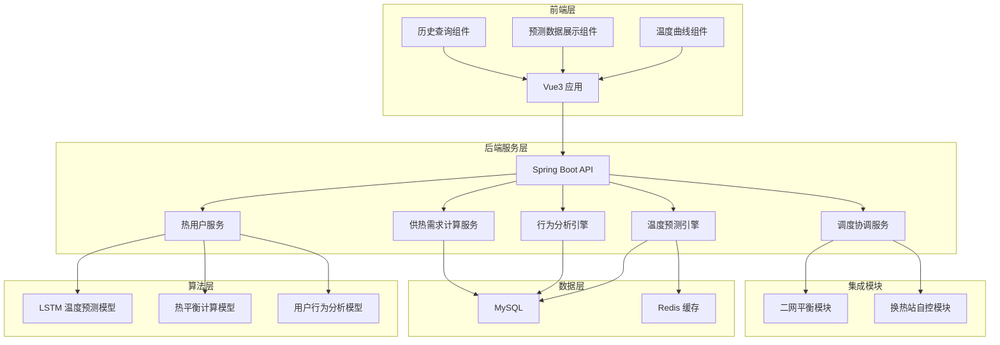
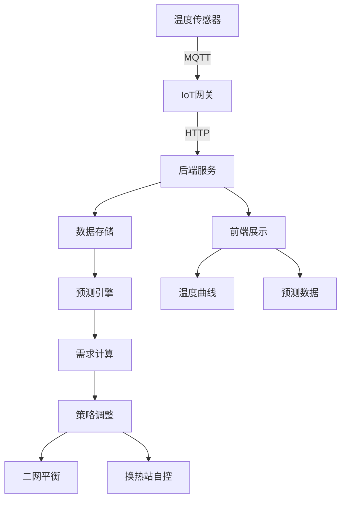
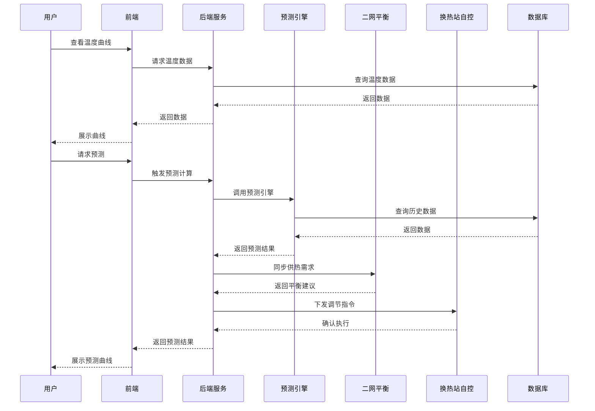

# 热用户按需供热模块技术设计

Feature Name: demand-based-heating
Updated: 2026-03-14

## 描述

热用户按需供热模块基于室内温度预测和用户行为分析实现按需供热。模块通过机器学习算法预测室内温度变化，结合用户行为模式、室外温度、建筑物热特性计算供热需求，动态调整供热策略。模块与二网平衡模块和换热站自控模块集成，实现全网协同优化供热。

## 架构

### 系统架构图



### 数据流图



### 模块交互时序图



## 组件和接口

### 前端组件

| 组件名 | 职责 | 接口 |
|--------|------|------|
| TemperatureChart | 展示温度曲线和预测数据 | getTemperatureData, getPrediction |
| PredictionPanel | 展示供热需求预测 | getHeatDemand, exportData |
| BuildingManager | 建筑物信息管理 | CRUD 接口 |
| AlarmPanel | 告警信息展示 | getAlarms, acknowledgeAlarm |
| HistoryQuery | 历史数据查询 | queryHistory, exportExcel |

### 后端服务接口

| 服务名 | 职责 | 主要方法 |
|--------|------|----------|
| HeatUserService | 热用户数据管理 | getUserTemp, saveTemp, queryUsers |
| TemperaturePredictor | 温度预测计算 | predict, trainModel, getModelInfo |
| BehaviorAnalyzer | 用户行为分析 | analyzeBehavior, getBehaviorProfile |
| HeatDemandCalculator | 供热需求计算 | calculateDemand, aggregateDemand |
| CoordinationService | 调度协调 | adjustStrategy, syncWithBalance |

### API 接口定义

#### 温度数据接口

```
GET /api/heat-user/temperature/{userId}
Query: startTime, endTime, page, size
Response: { data: [...], total: number }

POST /api/heat-user/temperature/batch
Body: [{ userId, temperature, timestamp }]
Response: { success: number, failed: number }
```

#### 建筑信息接口

```
GET /api/heat-user/building/{id}
Response: BuildingVO

POST /api/heat-user/building
Body: BuildingDTO
Response: { id }

PUT /api/heat-user/building/{id}
Body: BuildingDTO
Response: { success }

DELETE /api/heat-user/building/{id}
Response: { success }
```

#### 预测接口

```
GET /api/heat-user/predict/{userId}
Query: hours (2,4,6)
Response: { prediction: [...], confidence: [...], modelInfo }

POST /api/heat-user/predict/batch
Body: [{ userId, hours }]
Response: { results: [...] }

GET /api/heat-user/behavior/{userId}
Response: { profile: {...}, patterns: [...] }
```

#### 供热需求接口

```
GET /api/heat-user/demand
Query: startTime, endTime, groupBy (station/building/unit)
Response: { demands: [...], total: number }

POST /api/heat-user/demand/adjust
Body: { userId, targetTemp, override: boolean }
Response: { strategy: {...}, adjustment: number }
```

#### 集成接口

```
GET /api/heat-user/integration/balance/status
Response: { connected: boolean, lastSync: timestamp }

GET /api/heat-user/integration/station/status
Response: { connected: boolean, stations: [...] }
```

## 数据模型

### 数据库表设计

```sql
-- 建筑物信息表
CREATE TABLE building (
    id BIGINT PRIMARY KEY AUTO_INCREMENT,
    building_code VARCHAR(50) NOT NULL UNIQUE,
    building_name VARCHAR(100) NOT NULL,
    address VARCHAR(200),
    area_total DECIMAL(10,2),           -- 建筑面积(㎡)
    area_heated DECIMAL(10,2),          -- 供热面积(㎡)
    build_year INT,                     -- 建造年份
    building_type VARCHAR(20),          -- 建筑类型
    insulation_material VARCHAR(50),    -- 保温材料
    window_area DECIMAL(8,2),           -- 窗户面积(㎡)
    floor_height DECIMAL(5,2),         -- 层高(m)
    heat_transfer_coefficient DECIMAL(6,4), -- 传热系数K
    heat_capacity DECIMAL(10,2),       -- 热容(kJ/℃)
    station_id BIGINT,                  -- 关联换热站ID
    status TINYINT DEFAULT 1,           -- 状态: 0-禁用 1-正常
    create_time DATETIME,
    update_time DATETIME
);

-- 热用户表
CREATE TABLE heat_user (
    id BIGINT PRIMARY KEY AUTO_INCREMENT,
    user_code VARCHAR(50) NOT NULL UNIQUE,
    user_name VARCHAR(100),
    building_id BIGINT NOT NULL,
    unit_no VARCHAR(20),                -- 单元号
    room_no VARCHAR(20),                 -- 房间号
    area DECIMAL(10,2),                 -- 供热面积
    target_temp DECIMAL(5,2) DEFAULT 20.00, -- 目标温度
    status TINYINT DEFAULT 1,
    create_time DATETIME,
    update_time DATETIME,
    FOREIGN KEY (building_id) REFERENCES building(id)
);

-- 室内温度数据表
CREATE TABLE indoor_temperature (
    id BIGINT PRIMARY KEY AUTO_INCREMENT,
    user_id BIGINT NOT NULL,
    temperature DECIMAL(5,2) NOT NULL,  -- 温度值(℃)
    is_abnormal TINYINT DEFAULT 0,      -- 是否异常
    data_source VARCHAR(20),             -- 数据来源: sensor/manual
    collect_time DATETIME NOT NULL,
    create_time DATETIME,
    FOREIGN KEY (user_id) REFERENCES heat_user(id),
    INDEX idx_user_time (user_id, collect_time)
);

-- 室外温度数据表
CREATE TABLE outdoor_temperature (
    id BIGINT PRIMARY KEY AUTO_INCREMENT,
    predict_time DATETIME NOT NULL,     -- 预测时间点
    temperature DECIMAL(5,2) NOT NULL,  -- 温度值(℃)
    data_source VARCHAR(20),            -- 数据来源
    is_actual TINYINT DEFAULT 0,       -- 是否实际值
    create_time DATETIME,
    INDEX idx_predict_time (predict_time)
);

-- 供热需求数据表
CREATE TABLE heat_demand (
    id BIGINT PRIMARY KEY AUTO_INCREMENT,
    user_id BIGINT NOT NULL,
    demand_value DECIMAL(10,2) NOT NULL, -- 需求值(kW)
    predicted_value DECIMAL(10,2),      -- 预测值
    outdoor_temp DECIMAL(5,2),          -- 室外温度
    calculate_time DATETIME NOT NULL,
    create_time DATETIME,
    FOREIGN KEY (user_id) REFERENCES heat_user(id),
    INDEX idx_user_time (user_id, calculate_time)
);

-- 用户行为画像表
CREATE TABLE user_behavior_profile (
    id BIGINT PRIMARY KEY AUTO_INCREMENT,
    user_id BIGINT NOT NULL UNIQUE,
    preference_temp_min DECIMAL(5,2),   -- 偏好温度下限
    preference_temp_max DECIMAL(5,2),   -- 偏好温度上限
    typical_home_start TIME,            -- 通常在家开始时间
    typical_home_end TIME,              -- 通常在家结束时间
    away_pattern_count INT DEFAULT 0,   -- 离家模式次数
    comfort_weight DECIMAL(3,2) DEFAULT 0.5, -- 舒适度权重
    energy_weight DECIMAL(3,2) DEFAULT 0.5,  -- 能耗权重
    last_analyze_time DATETIME,
    create_time DATETIME,
    update_time DATETIME,
    FOREIGN KEY (user_id) REFERENCES heat_user(id)
);

-- 预测模型版本表
CREATE TABLE prediction_model (
    id BIGINT PRIMARY KEY AUTO_INCREMENT,
    model_type VARCHAR(20) NOT NULL,     -- 模型类型: lstm/simple
    model_version VARCHAR(50) NOT NULL,
    model_path VARCHAR(200),            -- 模型文件路径
    train_start_time DATETIME,
    train_end_time DATETIME,
    accuracy DECIMAL(5,4),              -- 准确率
    mse DECIMAL(10,6),                  -- 均方误差
    status TINYINT DEFAULT 1,           -- 0-禁用 1-当前
    create_time DATETIME
);

-- 告警记录表
CREATE TABLE alarm_record (
    id BIGINT PRIMARY KEY AUTO_INCREMENT,
    alarm_type VARCHAR(20) NOT NULL,    -- alarm_type: low_temp/high_temp/predict_error
    user_id BIGINT,
    building_id BIGINT,
    alarm_level TINYINT,                 -- 1-Info 2-Warning 3-Critical
    alarm_message VARCHAR(500),
    alarm_value DECIMAL(10,2),
    threshold_value DECIMAL(10,2),
    start_time DATETIME,
    end_time DATETIME,
    acknowledged TINYINT DEFAULT 0,
    ack_time DATETIME,
    create_time DATETIME
);
```

### Redis 缓存设计

| Key 格式 | 类型 | 说明 |
|----------|------|------|
| heat:user:{id}:temp:latest | String | 用户最新温度 |
| heat:station:{id}:demand | Hash | 换热站实时需求 |
| heat:prediction:{id}:{timestamp} | String | 预测结果缓存 |
| heat:model:latest | String | 当前模型版本 |
| heat:alarm:queue | List | 告警队列 |

### 实体类设计

```java
// 建筑物实体
@Data
@EqualsAndHashCode(callSuper = true)
public class Building extends BaseEntity {
    private String buildingCode;
    private String buildingName;
    private String address;
    private BigDecimal areaTotal;
    private BigDecimal areaHeated;
    private Integer buildYear;
    private String buildingType;
    private String insulationMaterial;
    private BigDecimal windowArea;
    private BigDecimal floorHeight;
    private BigDecimal heatTransferCoefficient;
    private BigDecimal heatCapacity;
    private Long stationId;
}

// 热用户实体
@Data
@EqualsAndHashCode(callSuper = true)
public class HeatUser extends BaseEntity {
    private String userCode;
    private String userName;
    private Long buildingId;
    private String unitNo;
    private String roomNo;
    private BigDecimal area;
    private BigDecimal targetTemp;
}

// 温度预测结果
@Data
public class TemperaturePrediction {
    private Long userId;
    private LocalDateTime predictTime;
    private BigDecimal predictedTemp;
    private BigDecimal confidenceLower;
    private BigDecimal confidenceUpper;
    private BigDecimal confidenceLevel;
}

// 供热需求
@Data
public class HeatDemand {
    private Long userId;
    private BigDecimal demandValue;
    private BigDecimal predictedValue;
    private BigDecimal outdoorTemp;
    private LocalDateTime calculateTime;
}
```

## 正确性属性

### 数据一致性

1. 室内温度数据的采集时间必须递增
2. 供热需求计算时，室外温度必须对应预测时间点
3. 建筑物的传热系数必须大于 0
4. 目标温度设定必须在 16°C 至 28°C 之间

### 预测精度要求

1. 2小时预测误差不超过 1.5°C
2. 4小时预测误差不超过 2.5°C
3. 6小时预测误差不超过 3.5°C
4. 预测模型每周重新评估精度

### 系统可用性

1. 温度数据采集延迟不超过 10 秒
2. 预测计算响应时间不超过 30 秒
3. 前端图表刷新间隔为 5 秒
4. 与集成模块通信超时时间为 5 秒

### 并发控制

1. 同一用户的温度数据采集使用乐观锁
2. 供热策略调整使用分布式锁
3. 模型训练与预测服务隔离

## 错误处理

### 异常场景处理

| 场景 | 处理策略 |
|------|----------|
| 温度数据接收失败 | 记录日志，发送告警，使用最近一次有效值 |
| 预测模型不可用 | 回退到简化热平衡模型，发送预警 |
| 气象数据获取失败 | 使用缓存的最近数据，标记数据过期 |
| 二网平衡模块不可用 | 使用单环调节策略，生成告警 |
| 换热站自控不可用 | 生成告警，暂停自动调节 |
| 数据库连接失败 | 切换到 Redis 缓存，批量写入重试 |
| 模型训练失败 | 使用上一版本模型，记录失败原因 |

### 降级策略

```java
@Service
public class PredictionFallback implements TemperaturePredictor {
    
    @Override
    public TemperaturePrediction predict(Long userId, Integer hours) {
        // 使用简化热平衡模型
        Building building = buildingService.getByUserId(userId);
        BigDecimal outdoorTemp = outdoorTempService.getLatest();
        BigDecimal currentTemp = temperatureService.getLatest(userId);
        
        // 简化计算: Q = K * A * (T_indoor - T_outdoor)
        BigDecimal heatLoss = building.getHeatTransferCoefficient()
            .multiply(building.getAreaHeated())
            .multiply(currentTemp.subtract(outdoorTemp));
        
        // 返回简化预测结果
        return buildSimplifiedPrediction(heatLoss, hours);
    }
}
```

## 测试策略

### 单元测试

| 测试类 | 覆盖内容 |
|--------|----------|
| TemperaturePredictorTest | LSTM 模型推理、热平衡计算 |
| BehaviorAnalyzerTest | 行为模式识别、画像生成 |
| HeatDemandCalculatorTest | 需求计算、汇总逻辑 |
| CoordinationServiceTest | 策略调整、集成调用 |

### 集成测试

| 测试场景 | 验证点 |
|----------|--------|
| 温度数据采集 | MQTT 接收 → 存储 → 查询完整链路 |
| 预测计算流程 | 输入 → 预测 → 结果展示 |
| 二网平衡集成 | 需求同步 → 建议接收 → 策略调整 |
| 换热站自控集成 | 指令下发 → 执行确认 → 状态反馈 |

### 性能测试

| 指标 | 目标值 |
|------|--------|
| 1000 用户温度预测 | < 10 秒 |
| 24 小时数据查询 | < 3 秒 |
| 并发预测请求 (100) | < 30 秒 |
| 实时曲线数据推送 | < 1 秒延迟 |

### 测试数据

- 使用 100 个模拟用户
- 生成 30 天的历史温度数据
- 模拟 3 种建筑类型
- 模拟 4 个换热站

## 集成设计

### 与二网平衡模块集成

```java
@Service
public class BalanceIntegrationService {
    
    public void syncHeatDemand(HeatDemand demand) {
        // 1. 转换数据格式
        BalanceDemandDTO dto = convertToBalanceFormat(demand);
        
        // 2. 调用二网平衡模块接口
        String result = httpClient.post(
            balanceServiceUrl + "/api/demand/sync",
            dto
        );
        
        // 3. 处理响应
        if (!result.success) {
            log.warn("Balance sync failed: {}", result.message);
            triggerAlarm(AlarmType.BALANCE_SYNC_FAILED);
        }
    }
    
    public BalanceSuggestion getAdjustmentSuggestion(Long stationId) {
        // 获取二网平衡建议
        String url = balanceServiceUrl + "/api/suggestion/" + stationId;
        return httpClient.get(url, BalanceSuggestion.class);
    }
}
```

### 与换热站自控模块集成

```java
@Service
public class StationControlIntegrationService {
    
    public void sendTemperatureSetpoint(Long stationId, BigDecimal setpoint) {
        StationControlDTO dto = StationControlDTO.builder()
            .stationId(stationId)
            .setpointType("supply_temp")
            .setpointValue(setpoint)
            .build();
        
        String result = httpClient.post(
            stationServiceUrl + "/api/control/setpoint",
            dto
        );
        
        if (!result.success) {
            throw new StationControlException("Failed to set temperature");
        }
    }
    
    public StationStatus getStationStatus(Long stationId) {
        String url = stationServiceUrl + "/api/status/" + stationId;
        return httpClient.get(url, StationStatus.class);
    }
}
```

### 集成接口清单

| 模块 | 接口地址 | 接口方法 | 说明 |
|------|----------|----------|------|
| 二网平衡 | /api/demand/sync | POST | 同步供热需求 |
| 二网平衡 | /api/suggestion/{stationId} | GET | 获取调节建议 |
| 换热站自控 | /api/control/setpoint | POST | 下发设定值 |
| 换热站自控 | /api/status/{stationId} | GET | 获取运行状态 |
| 换热站自控 | /api/batch/setpoint | POST | 批量下发设定值 |

## 参考资料

[^1]: (Vue3 文档) - Vue 3 组合式 API https://vuejs.org/
[^2]: (Element Plus) - Element Plus 组件库 https://element-plus.org/
[^3]: (ECharts) - ECharts 数据可视化 https://echarts.apache.org/
[^4]: (Spring Boot) - Spring Boot 3.2 文档 https://spring.io/projects/spring-boot
[^5]: (MyBatis-Plus) - MyBatis-Plus 文档 https://baomidou.com/
