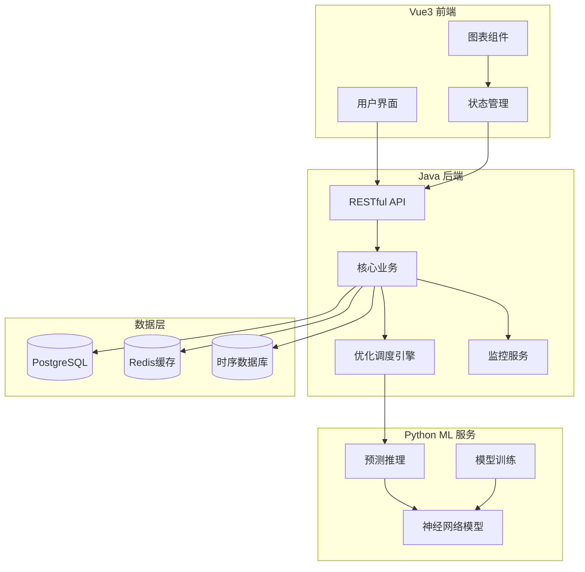

# Heat Source Control System

Feature Name: heat-source-control
Updated: 2026-03-14

## Description

热源调控系统是基于人工智能的锅炉房智能控制平台，通过神经网络预测全网热负荷，优化锅炉运行策略，实现供热量与需求精准匹配。系统采用前后端分离架构，Vue3前端负责数据可视化展示，Java后端提供RESTful API和业务逻辑处理，Python服务负责深度学习模型的训练和推理。

## Architecture



## Components and Interfaces

### Frontend Components

| 组件名称 | 职责 | 关键接口 |
|---------|------|---------|
| DashboardView | 系统总览仪表板 | getOverviewData() |
| BoilerMonitor | 锅炉运行状态监控 | getBoilerStatus() / subscribeStatus() |
| LoadPrediction | 热负荷预测曲线展示 | getPredictionData(range) |
| EfficiencyCurve | 锅炉效率曲线展示 | getEfficiencyData(boilerId, dateRange) |
| OptimizationPanel | 优化调度建议展示 | getOptimizationSuggestions() |
| ModelManagement | 预测模型管理 | getModelInfo() / triggerRetrain() |
| ConfigSettings | 系统配置管理 | getConfig() / updateConfig() |

### Backend Services

| 服务名称 | 职责 | 关键接口 |
|---------|------|---------|
| BoilerController | 锅炉相关API | GET /api/boilers, GET /api/boilers/{id}/status |
| PredictionController | 预测相关API | GET /api/prediction/load, POST /api/prediction/retrain |
| OptimizationController | 优化调度API | GET /api/optimization/suggestions |
| ModelController | 模型管理API | GET /api/models, POST /api/models/update |
| ConfigController | 配置管理API | GET /api/config, PUT /api/config |
| PredictionService | 预测业务逻辑 | predictLoad(hours) / retrainModel() |
| OptimizationService | 优化调度逻辑 | generateStrategy(currentLoad, boilers) |
| DataCollectionService | 数据采集服务 | collectBoilerData() / storeMetrics() |

### ML Service Interfaces

| 接口名称 | 描述 | 请求格式 |
|---------|------|---------|
| /predict | 热负荷预测 | {features: [...], hours: int} |
| /train | 模型训练 | {dataSource: string, params: {...}} |
| /model/info | 模型信息 | {} |
| /model/validate | 模型验证 | {testData: [...]} |

## Data Models

### Boiler Entity

```java
public class Boiler {
    private Long id;
    private String code;           // 锅炉编号
    private String model;          // 锅炉型号
    private Double ratedPower;     // 额定功率(MW)
    private Double ratedEfficiency; // 额定效率(%)
    private BoilerStatus status;   // 运行状态
    private Double currentLoad;   // 当前负荷
    private Double waterTempIn;    // 进水温度
    private Double waterTempOut;   // 出水温度
    private LocalDateTime lastMaintenance; // 上次维护时间
}
```

### LoadPrediction Entity

```java
public class LoadPrediction {
    private Long id;
    private LocalDateTime predictTime;  // 预测时间点
    private Double predictedLoad;      // 预测热负荷(MW)
    private Double confidence;         // 置信度
    private LocalDateTime createdAt;   // 创建时间
}
```

### OptimizationResult Entity

```java
public class OptimizationResult {
    private Long id;
    private Double totalLoad;              // 总热负荷需求
    private List<BoilerAllocation> allocations;  // 锅炉分配方案
    private Double estimatedEfficiency;    // 预计系统效率
    private Double estimatedCost;          // 预计运行成本
    private LocalDateTime generatedAt;     // 生成时间
}
```

### BoilerAllocation

```java
public class BoilerAllocation {
    private Long boilerId;
    private Double assignedLoad;   // 分配负荷
    private Double targetPower;    // 目标功率
    private Boolean shouldRun;     // 是否应该运行
}
```

## Correctness Properties

### Invariants

1. 所有锅炉分配负荷的总和必须等于总热负荷需求
2. 单台锅炉分配负荷不能超过其额定功率
3. 运行中的锅炉数量必须大于等于1（当有热负荷需求时）
4. 预测时间点必须在当前时间之后
5. 锅炉效率值必须在0-100%范围内

### Constraints

1. 优化计算必须在30秒内完成
2. 模型预测误差阈值：MAE <= 15%
3. 告警响应延迟 <= 1秒
4. 数据采集周期：5秒
5. 历史数据保留周期：3年

## Error Handling

### Error Scenarios

| 场景 | 处理策略 |
|------|---------|
| 预测模型不可用 | 使用基于温度-负荷关系的历史统计模型作为备选 |
| 锅炉数据采集失败 | 显示最后已知状态，标记数据为"可能过期" |
| 优化计算超时 | 返回当前最優解的近似解，附带警告信息 |
| 数据库连接失败 | 使用缓存数据，标记数据为"缓存" |
| Python服务不可用 | Java后端使用内置简化算法进行预测 |
| 模型训练失败 | 保留原模型，发送告警通知管理员 |

### Error Response Format

```json
{
  "code": "ERROR_CODE",
  "message": "错误描述",
  "data": null,
  "timestamp": "2026-03-14T10:00:00Z"
}
```

## Test Strategy

### Unit Tests

- PredictionService: 测试各种输入场景的预测结果
- OptimizationService: 测试单锅炉、多锅炉场景的优化结果
- BoilerController: 测试CRUD操作和状态更新

### Integration Tests

- API集成测试: 验证前后端数据交互正确性
- ML服务集成测试: 验证预测接口的正确性和性能
- 数据库集成测试: 验证数据持久化和查询性能

### Performance Tests

- 预测接口响应时间测试: 目标 < 30秒
- 图表数据加载测试: 目标 < 1秒
- 并发请求测试: 目标支持100并发

### Test Data

- 使用历史真实数据构建测试数据集
- 模拟各种异常情况进行错误处理测试

## Technology Stack

| 层级 | 技术选型 | 版本 |
|------|---------|------|
| 前端框架 | Vue3 | 3.4+ |
| UI组件库 | Element Plus | 2.5+ |
| 图表库 | ECharts | 5.4+ |
| 状态管理 | Pinia | 2.1+ |
| 后端框架 | Spring Boot | 3.2+ |
| 数据库 | PostgreSQL | 15+ |
| 缓存 | Redis | 7+ |
| 时序数据库 | InfluxDB | 2.7+ |
| ML框架 | TensorFlow/PyTorch | 2.14+/2.1+ |
| 深度学习库 | Keras | 2.14+ |

## Implementation Notes

### 神经网络模型设计

- 输入特征: 外部温度、时间（小时/星期）、历史热负荷（过去24小时）、节假日标识
- 模型架构: LSTM + Dense层，2层LSTM，每层128个单元
- 训练策略: 使用过去30天数据训练，每周自动重新训练
- 推理优化: 使用TensorFlow Serving进行模型部署

### 优化调度算法

- 目标函数: 最小化总运行成本
- 约束条件: 满足热负荷需求、锅炉运行约束
- 求解方法: 遗传算法 + 局部搜索混合策略
- 更新频率: 当热负荷变化超过10%时重新计算

### 多锅炉协调策略

- 负荷分配原则: 按锅炉效率加权分配
- 轮换机制: 每24小时轮换主锅炉
- 故障处理: 故障锅炉自动退出，其他锅炉接管负荷
- 节能模式: 低负荷时减少运行锅炉数量
