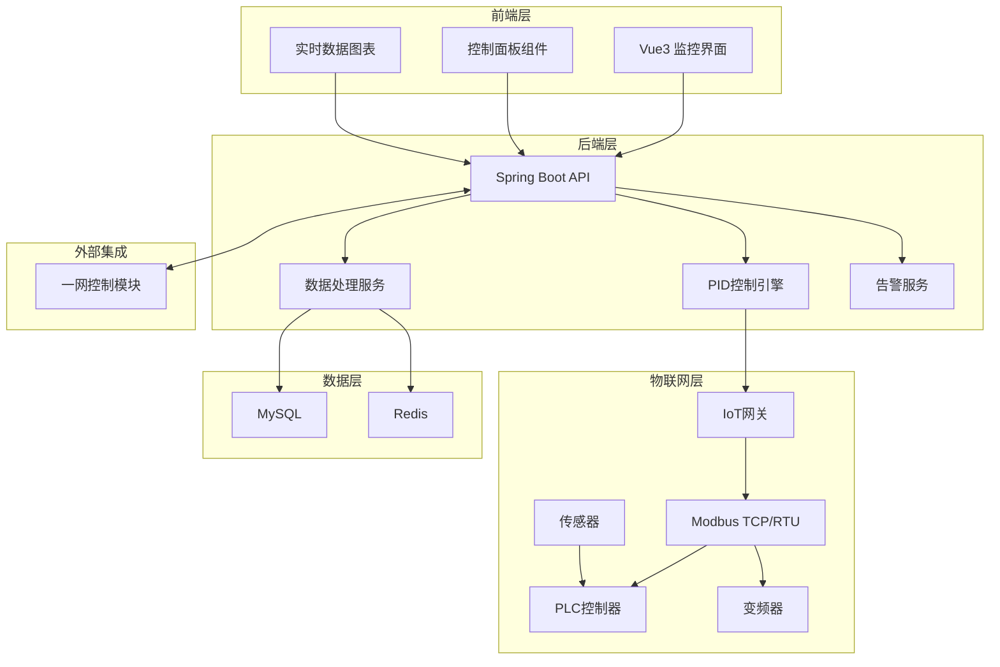
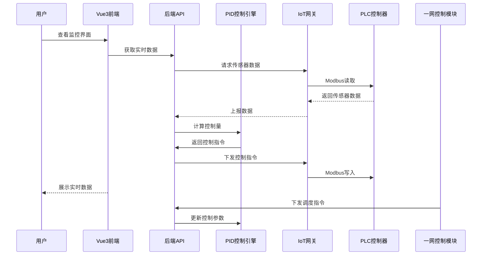
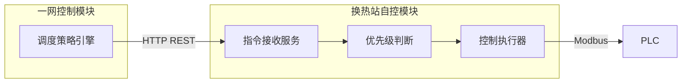

# 换热站自控系统技术设计文档

Feature Name: heat-station-autocontrol
Updated: 2026-03-14

## Description

换热站自动控制系统是锅炉集中供热智慧管理系统的核心模块，负责实现换热站的全面自动化控制。系统通过Vue3前端展示实时监控界面和控制面板，Java后端实现PID自适应控制算法，支持Modbus TCP/RTU协议与PLC通信，并与一网控制策略模块进行集成，实现全网协调控制。

## Architecture

### 系统总体架构



### 模块交互架构



## Components and Interfaces

### 前端组件

| 组件名称 | 职责 | 接口 |
|----------|------|------|
| StationMonitor | 换热站监控主页面 | /api/station/{id}/status |
| ControlPanel | 控制面板组件 | /api/station/{id}/control |
| RealtimeChart | 实时数据图表 | /api/station/{id}/realtime |
| TrendChart | 历史趋势图表 | /api/station/{id}/history |
| AlarmPanel | 告警信息面板 | /api/station/{id}/alarms |
| ParameterSettings | 参数设置面板 | /api/station/{id}/parameters |

### 后端服务

| 服务名称 | 职责 | 核心类 |
|----------|------|--------|
| StationService | 换热站数据管理 | StationController, StationServiceImpl |
| ControlService | 控制逻辑处理 | AutoController, PIDController |
| ModbusService | Modbus通信 | ModbusClient, ModbusGateway |
| AlarmService | 告警管理 | AlarmService, AlarmPublisher |
| IntegrationService | 一网集成 | PrimaryNetworkClient |

### 核心接口定义

#### 1. 获取换热站实时状态

```
GET /api/station/{stationId}/status

Response:
{
  "stationId": "ST001",
  "stationName": "换热站1",
  "primarySide": {
    "supplyTemp": 75.5,
    "returnTemp": 45.2,
    "supplyPressure": 0.65,
    "returnPressure": 0.48,
    "flowRate": 120.5
  },
  "secondarySide": {
    "supplyTemp": 55.3,
    "returnTemp": 42.1,
    "supplyPressure": 0.42,
    "returnPressure": 0.25,
    "flowRate": 150.8
  },
  "circulationPump": {
    "speed": 45,
    "frequency": 35.2,
    "status": "running"
  },
  "makeupPump": {
    "status": "stopped",
    "runtime": 0
  },
  "controlMode": "auto",
  "alarms": []
}
```

#### 2. 下发控制指令

```
POST /api/station/{stationId}/control

Request:
{
  "target": "valve",
  "action": "setPoint",
  "value": 75.0,
  "mode": "auto"
}

Response:
{
  "success": true,
  "timestamp": "2026-03-14T10:30:00Z"
}
```

#### 3. 一网控制指令接收

```
POST /api/station/{stationId}/dispatch

Request:
{
  "commandId": "CMD001",
  "commandType": "temperature_setpoint",
  "value": 78.0,
  "priority": 3,
  "source": "primary_network"
}
```

## Data Models

### 换热站实体

```java
public class HeatStation {
    private String id;
    private String name;
    private String code;
    private String address;
    private Double latitude;
    private Double longitude;
    private Integer capacity;        // 供热能力 MW
    private String controlMode;      // auto/manual/remote
    private String status;          // running/stopped/fault
    private LocalDateTime createTime;
    private LocalDateTime updateTime;
}
```

### 实时数据实体

```java
public class StationRealtimeData {
    private String stationId;
    private LocalDateTime timestamp;
    
    // 一次侧数据
    private Double primarySupplyTemp;
    private Double primaryReturnTemp;
    private Double primarySupplyPressure;
    private Double primaryReturnPressure;
    private Double primaryFlowRate;
    
    // 二次侧数据
    private Double secondarySupplyTemp;
    private Double secondaryReturnTemp;
    private Double secondarySupplyPressure;
    private Double secondaryReturnPressure;
    private Double secondaryFlowRate;
    
    // 设备数据
    private Integer pumpSpeed;
    private Double pumpFrequency;
    private String pumpStatus;
    private Integer makeupPumpRuntime;
}
```

### PID控制参数

```java
public class PIDParameters {
    private Double kp;          // 比例系数
    private Double ki;          // 积分系数
    private Double kd;          // 微分系数
    private Double setPoint;    // 设定值
    private Double minOutput;   // 最小输出
    private Double maxOutput;   // 最大输出
    private Integer sampleTime; // 采样周期(秒)
}
```

### 告警记录

```java
public class AlarmRecord {
    private String id;
    private String stationId;
    private String alarmType;   // temperature/pressure/frequency/communication
    private String alarmLevel;  // info/warning/critical
    private String message;
    private Double value;
    private Double threshold;
    private LocalDateTime occurTime;
    private LocalDateTime clearTime;
    private String status;     // active/cleared
}
```

## Correctness Properties

### 控制正确性

- 一次侧温度控制精度：±1℃
- 二次侧供温控制精度：±2℃
- 压力控制精度：±0.02MPa
- 压差控制精度：±0.01MPa

### 数据一致性

- 实时数据延迟不超过10秒
- 控制指令响应时间不超过2秒
- 告警触发延迟不超过5秒

### 系统安全

- 温度超限立即触发紧急停机
- 通信中断自动切换到本地控制
- 手动模式具有最高优先级

## Error Handling

### 通信故障处理

| 场景 | 处理策略 |
|------|----------|
| Modbus连接失败 | 每30秒重试，连续3次失败告警 |
| PLC无响应 | 切换到备用PLC或本地控制 |
| 变频器通信故障 | 切换到工频运行模式 |
| 后端服务异常 | 使用Redis缓存数据，前端展示最后状态 |

### 控制异常处理

| 场景 | 处理策略 |
|------|----------|
| 温度超过上限 | 关闭调节阀，启动告警 |
| 压力异常 | 启动/停止补水泵 |
| 设备故障 | 切换到备用设备 |
| 控制振荡 | 自动调整PID参数 |

### 数据异常处理

| 场景 | 处理策略 |
|------|----------|
| 传感器数据突变 | 过滤异常值，使用历史数据替代 |
| 数据采集丢失 | 使用上次数据进行插值 |
| 数据库连接失败 | 写入内存缓存，稍后同步 |

## Test Strategy

### 单元测试

- PID控制算法测试：验证不同场景下的控制效果
- 数据处理服务测试：验证数据转换和存储逻辑
- 告警服务测试：验证告警触发和清除逻辑

### 集成测试

- Modbus通信测试：验证与PLC的读写交互
- 一网集成测试：验证调度指令的接收和执行
- 前端集成测试：验证界面的数据展示和交互

### 性能测试

- 数据采集性能：验证5000点位数据采集延迟
- 并发访问性能：验证100用户同时访问响应时间
- 控制响应性能：验证控制指令端到端延迟

### 现场测试

- 试运行测试：在实际换热站进行72小时连续运行测试
- 故障模拟测试：模拟各种故障场景验证系统响应
- 节能效果测试：对比自动控制和人工控制能耗差异

## Integration Design

### 一网控制模块集成



### 数据交互规范

| 字段 | 类型 | 说明 |
|------|------|------|
| commandId | String | 指令唯一标识 |
| commandType | String | 指令类型：temperature_setpoint/pressure_setpoint |
| value | Double | 目标设定值 |
| priority | Integer | 优先级：1-5，1最高 |
| source | String | 来源：primary_network |
| timestamp | DateTime | 指令下发时间 |
| expires | DateTime | 指令过期时间 |

## References

[^1]: Vue3官方文档 - https://vuejs.org/
[^2]: Element Plus组件库 - https://element-plus.org/
[^3]: Spring Boot 3.2文档 - https://spring.io/projects/spring-boot
[^4]: Modbus协议规范 - https://modbus.org/
[^5]: PID控制算法详解 - 工业控制经典算法
