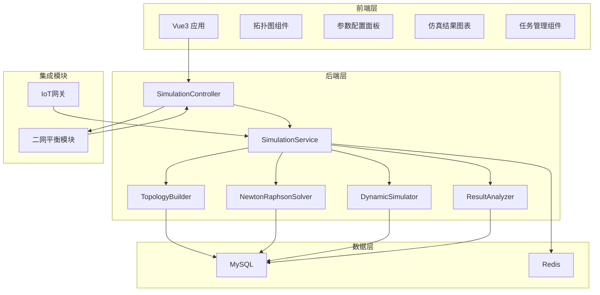
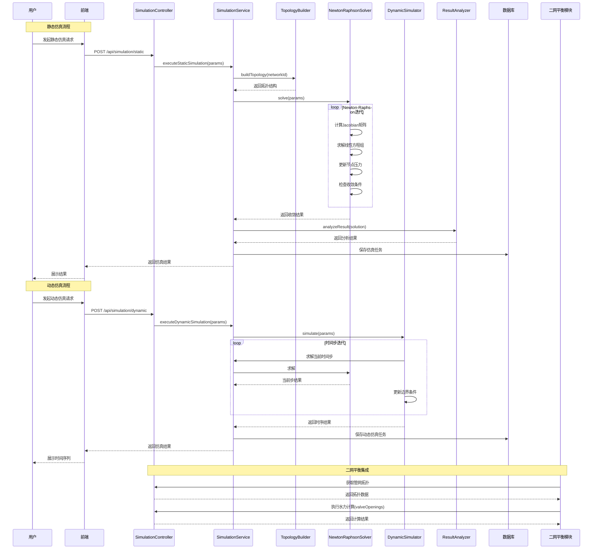

# 水力仿真功能模块技术设计

Feature Name: hydraulic-simulation
Updated: 2026-03-14

## Description

水力仿真功能模块是锅炉集中供热智慧管理系统的核心计算引擎，基于图论算法建立管网拓扑模型，采用Newton-Raphson迭代方法求解非线性水力方程组，实现管网水力工况的精确计算。模块为二网平衡、阀门调节等下游模块提供数据支撑，是智慧供热系统的关键技术组件。

### 核心能力

- 管网拓扑建模：基于图论算法构建管网节点-管段拓扑结构
- Newton-Raphson求解：高效求解非线性水力方程组
- 静态仿真：单工况点水力计算，返回压力分布和流量分配
- 动态仿真：时变工况仿真，生成水力工况时间序列
- 结果可视化：拓扑图热力图展示，支持动态仿真回放
- 二网平衡集成：为优化算法提供管网参数和仿真计算服务

### 技术选型理由

| 技术 | 选择理由 |
|------|----------|
| Newton-Raphson迭代 | 收敛速度快，适合求解非线性方程组 |
| 图论算法 | 管网拓扑建模成熟方法，支持环路识别和流向分析 |
| Vue3+ECharts | 前端组件化开发，可视化能力强 |
| Spring Boot | 与现有系统技术栈一致，支持异步计算 |
| 稀疏矩阵运算 | 管网方程组维度高但稀疏，提升计算效率 |

## Architecture

### 系统架构图



### 模块交互图



## Components and Interfaces

### 前端组件

| 组件名 | 职责 | 位置 |
|--------|------|------|
| NetworkTopologyGraph | 管网拓扑图绘制、节点/管段交互、热力图展示 | frontend/src/views/simulation/ |
| SimulationConfigPanel | 仿真参数配置、边界条件设置 | frontend/src/views/simulation/ |
| PressureHeatmap | 节点压力热力图可视化组件 | frontend/src/components/simulation/ |
| FlowDistributionChart | 管段流量分布图表组件 | frontend/src/components/simulation/ |
| ConvergenceCurve | 迭代收敛曲线展示组件 | frontend/src/components/simulation/ |
| TimelinePlayer | 动态仿真时间轴播放控件 | frontend/src/components/simulation/ |
| TaskManagementTable | 仿真任务列表和详情组件 | frontend/src/views/simulation/ |
| DiagnosticReport | 仿真诊断报告展示组件 | frontend/src/components/simulation/ |

### 后端服务类

| 类名 | 职责 | 主要方法 |
|------|------|----------|
| SimulationController | REST API入口 | executeStatic, executeDynamic, getTopology, getResult, exportResult |
| SimulationService | 业务逻辑编排 | executeStaticSimulation, executeDynamicSimulation, saveTask, getTaskList |
| TopologyBuilder | 管网拓扑构建 | buildTopology, validateTopology, getAdjacencyMatrix |
| NewtonRaphsonSolver | Newton-Raphson迭代求解 | initialize, computeJacobian, solveLinear, checkConvergence, iterate |
| DynamicSimulator | 动态仿真控制 | initialize, simulateTimeStep, updateBoundary, getTimeSeries |
| ResultAnalyzer | 结果分析诊断 | analyzePressure, analyzeFlow, generateDiagnosticReport |
| SimulationTaskMapper | 仿真任务数据访问 | insert, selectById, selectByNetworkId, selectByTimeRange |
| NetworkNodeMapper | 管网节点数据访问 | insert, selectByNetworkId, update |
| NetworkEdgeMapper | 管网边数据访问 | insert, selectByNetworkId, update |

### 数据接口

#### 内部服务接口

```java
// 二网平衡模块调用接口
public interface HydraulicSimulationProvider {
    NetworkTopology getTopology(String networkId);
    Map<String, Double> getResistanceCoefficients(String networkId);
    Map<String, Double> getNodeDesignDemands(String networkId);
    SimulationResult calculateWithValvePositions(String networkId, Map<String, Double> valveOpenings);
}

// 物联网网关数据接口
public interface RealTimeDataClient {
    Map<String, Double> getRealTimePressures(String networkId);
    Map<String, Double> getRealTimeFlows(String networkId);
    Map<String, Double> getValvePositions(String networkId);
}
```

#### 对外REST接口

| 接口路径 | 方法 | 说明 |
|----------|------|------|
| /api/simulation/topology/{networkId} | GET | 获取管网拓扑数据 |
| /api/simulation/topology/nodes | POST | 新增管网节点 |
| /api/simulation/topology/edges | POST | 新增管网边 |
| /api/simulation/static | POST | 执行静态仿真 |
| /api/simulation/static/result/{taskId} | GET | 获取静态仿真结果 |
| /api/simulation/dynamic | POST | 执行动态仿真 |
| /api/simulation/dynamic/result/{taskId} | GET | 获取动态仿真结果 |
| /api/simulation/config | GET/PUT | 获取/保存仿真参数配置 |
| /api/simulation/export | POST | 导出仿真结果 |
| /api/simulation/tasks | GET | 查询仿真任务列表 |
| /api/simulation/tasks/{taskId} | GET | 获取任务详情 |
| /api/simulation/diagnostic/{taskId} | GET | 生成诊断报告 |
| /api/simulation/balance/topology | GET | 二网平衡模块获取拓扑（内部接口） |
| /api/simulation/balance/calculate | POST | 二网平衡模块调用计算（内部接口） |

## Data Models

### 实体类

```java
// 管网节点
public class NetworkNode {
    private String nodeId;
    private String networkId;
    private String nodeName;
    private NodeType type; // HEAT_SOURCE, STATION, VALVE, USER
    private Double positionX;
    private Double positionY;
    private Double designPressure;
    private Double designFlow;
    private Double currentPressure;
    private Integer sortOrder;
}

// 管网边（管段）
public class NetworkEdge {
    private String edgeId;
    private String networkId;
    private String sourceNodeId;
    private String targetNodeId;
    private Double length;
    private Double diameter;
    private Double roughness;
    private Double resistanceCoeff;
    private Double currentFlow;
    private Double designFlow;
    private Double velocity;
    private Double pressureLoss;
}

// 管网拓扑
public class NetworkTopology {
    private String networkId;
    private String networkName;
    private List<NetworkNode> nodes;
    private List<NetworkEdge> edges;
    private Map<String, List<String>> adjacencyList;
    private BoundaryCondition boundaryCondition;
}

// 仿真任务
public class SimulationTask {
    private String taskId;
    private String networkId;
    private SimulationType type; // STATIC, DYNAMIC
    private TaskStatus status; // PENDING, RUNNING, COMPLETED, FAILED
    private SimulationParams params;
    private Integer iterations;
    private Double finalResidual;
    private Date startTime;
    private Date endTime;
    private SimulationResult result;
}

// 仿真参数
public class SimulationParams {
    private Integer maxIterations;
    private Double convergenceTolerance;
    private ResidualType residualType; // MAX, L2, L1
    private Double fluidDensity;
    private Double viscosity;
    private Double gravityAcceleration;
    private Map<String, Double> nodeBoundaries;
    private Map<String, Double> valveOpenings;
    private DynamicConfig dynamicConfig;
}

// 动态仿真配置
public class DynamicConfig {
    private Date startTime;
    private Date endTime;
    private Integer timeStep; // 秒
    private List<TimeVaryingBoundary> timeVaryingBoundaries;
}

// 仿真结果
public class SimulationResult {
    private Map<String, Double> nodePressures;
    private Map<String, Double> edgeFlows;
    private Map<String, Double> edgeVelocities;
    private Map<String, Double> edgePressureLosses;
    private Double totalResidual;
    private Integer iterations;
    private Boolean isConverged;
    private List<TimeSeriesResult> timeSeriesResults;
}

// 时序结果
public class TimeSeriesResult {
    private Date timestamp;
    private Map<String, Double> nodePressures;
    private Map<String, Double> edgeFlows;
}
```

### DTO

```java
// 静态仿真请求DTO
public class StaticSimulationRequestDTO {
    private String networkId;
    private BoundaryConditionDTO boundaryCondition;
    private SimulationParamsDTO params;
}

// 边界条件DTO
public class BoundaryConditionDTO {
    private BoundaryType heatSourceType; // PRESSURE, FLOW
    private Double heatSourceValue;
    private Map<String, Double> userDemands;
    private Map<String, Double> valveOpenings;
}

// 动态仿真请求DTO
public class DynamicSimulationRequestDTO {
    private String networkId;
    private BoundaryConditionDTO initialBoundary;
    private DynamicConfigDTO dynamicConfig;
    private SimulationParamsDTO params;
}

// 仿真结果DTO
public class SimulationResultDTO {
    private String taskId;
    private Boolean isConverged;
    private Integer iterations;
    private Double finalResidual;
    private List<NodePressureDTO> nodePressures;
    private List<EdgeFlowDTO> edgeFlows;
    private List<TimeSeriesPointDTO> timeSeries;
}

// 节点压力DTO
public class NodePressureDTO {
    private String nodeId;
    private String nodeName;
    private Double pressure;
    private Double designPressure;
    private Boolean isAbnormal;
    private String abnormalReason;
}

// 管段流量DTO
public class EdgeFlowDTO {
    private String edgeId;
    private String sourceNodeName;
    private String targetNodeName;
    private Double flow;
    private Double designFlow;
    private Double velocity;
    private FlowStatus status; // NORMAL, OVERLOAD, UNDERLOAD
}

// 导出请求DTO
public class ExportRequestDTO {
    private String taskId;
    private ExportFormat format; // EXCEL, CSV, JSON
    private ExportScope scope; // ALL, NODES, EDGES, TIME_SERIES
    private Date startTime;
    private Date endTime;
}
```

### 数据库表设计

```sql
-- 管网节点表
CREATE TABLE network_node (
    id BIGINT PRIMARY KEY AUTO_INCREMENT,
    node_id VARCHAR(64) NOT NULL UNIQUE,
    network_id VARCHAR(64) NOT NULL,
    node_name VARCHAR(128) NOT NULL,
    node_type VARCHAR(32) NOT NULL,
    position_x DOUBLE,
    position_y DOUBLE,
    design_pressure DOUBLE,
    design_flow DOUBLE,
    sort_order INT DEFAULT 0,
    created_at TIMESTAMP DEFAULT CURRENT_TIMESTAMP,
    updated_at TIMESTAMP DEFAULT CURRENT_TIMESTAMP ON UPDATE CURRENT_TIMESTAMP,
    INDEX idx_network (network_id)
);

-- 管网边表
CREATE TABLE network_edge (
    id BIGINT PRIMARY KEY AUTO_INCREMENT,
    edge_id VARCHAR(64) NOT NULL UNIQUE,
    network_id VARCHAR(64) NOT NULL,
    source_node_id VARCHAR(64) NOT NULL,
    target_node_id VARCHAR(64) NOT NULL,
    length DOUBLE NOT NULL,
    diameter DOUBLE NOT NULL,
    roughness DOUBLE,
    resistance_coeff DOUBLE,
    design_flow DOUBLE,
    created_at TIMESTAMP DEFAULT CURRENT_TIMESTAMP,
    updated_at TIMESTAMP DEFAULT CURRENT_TIMESTAMP ON UPDATE CURRENT_TIMESTAMP,
    INDEX idx_network (network_id),
    FOREIGN KEY (source_node_id) REFERENCES network_node(node_id),
    FOREIGN KEY (target_node_id) REFERENCES network_node(node_id)
);

-- 仿真任务表
CREATE TABLE simulation_task (
    id BIGINT PRIMARY KEY AUTO_INCREMENT,
    task_id VARCHAR(64) NOT NULL UNIQUE,
    network_id VARCHAR(64) NOT NULL,
    simulation_type VARCHAR(32) NOT NULL,
    task_status VARCHAR(32) NOT NULL,
    params JSON,
    iterations INT,
    final_residual DOUBLE,
    result JSON,
    start_time TIMESTAMP,
    end_time TIMESTAMP,
    created_at TIMESTAMP DEFAULT CURRENT_TIMESTAMP,
    INDEX idx_network (network_id),
    INDEX idx_status (task_status),
    INDEX idx_created (created_at)
);

-- 仿真参数配置表
CREATE TABLE simulation_config (
    id BIGINT PRIMARY KEY AUTO_INCREMENT,
    network_id VARCHAR(64) NOT NULL,
    max_iterations INT DEFAULT 100,
    convergence_tolerance DOUBLE DEFAULT 1e-6,
    residual_type VARCHAR(16) DEFAULT 'L2',
    fluid_density DOUBLE DEFAULT 998.0,
    viscosity DOUBLE DEFAULT 1.005e-6,
    gravity_acceleration DOUBLE DEFAULT 9.81,
    updated_at TIMESTAMP DEFAULT CURRENT_TIMESTAMP ON UPDATE CURRENT_TIMESTAMP,
    UNIQUE KEY uk_network (network_id)
);
```

## Correctness Properties

### 不变式

1. **节点压力约束**: 任意节点压力必须满足 `0 <= pressure <= 设计压力 * 1.2`
2. **管段流量约束**: 任意管段流量必须满足 `flow >= 0`
3. **质量守恒**: 任意节点（除热源外）的流入流量等于流出流量
4. **能量守恒**: 任意闭环管段的压力降代数和为零
5. **收敛判断**: Newton-Raphson迭代收敛条件为残差小于精度阈值 `residual < tolerance`
6. **时间步约束**: 动态仿真时间步长必须满足 `timeStep > 0`

### 约束条件

1. **拓扑连通性**: 管网拓扑必须为连通图，任一节点必须可从热源到达
2. **参数合法性**:
   - 迭代次数: [1, 500]
   - 收敛精度: [1e-10, 1e-3]
   - 管段长度: (0, +∞)
   - 管段口径: (0, +∞)
   - 粗糙度: [0, +∞)
3. **边界条件有效性**: 热源边界条件必须设定，且用户需求总和不能超过热源能力
4. **时间范围**: 动态仿真时间范围结束时间必须大于开始时间

### 质量属性

- **性能**: 静态仿真单次计算不超过30秒，动态仿真每秒至少完成10个时间步
- **精度**: 收敛后残差应小于设定精度阈值
- **可用性**: 仿真任务支持中断和恢复
- **可维护性**: 算法模块化设计，支持自定义阻力系数计算公式

## Error Handling

### 异常类型

| 异常类 | 触发条件 | 处理策略 |
|--------|----------|----------|
| NetworkNotFoundException | 管网ID不存在 | 返回404错误，提示检查管网ID |
| TopologyNotConnectedException | 管网拓扑不连通 | 返回错误，标注孤立节点 |
| InvalidParameterException | 仿真参数超出合法范围 | 返回错误，提示具体参数问题 |
| CalculationNonConvergenceException | Newton-Raphson不收敛 | 返回部分结果和诊断信息，建议调整参数 |
| NegativePressureException | 计算出现负压 | 警告并标注异常节点位置 |
| BoundaryConflictException | 边界条件冲突 | 返回错误，提供冲突分析和建议 |
| ExportException | 结果导出失败 | 返回错误，提示重试 |

### 错误响应格式

```json
{
  "code": 500,
  "message": "水力计算未收敛，请检查管网参数",
  "data": {
    "errorType": "NON_CONVERGENCE",
    "taskId": "sim_20260314_001",
    "currentIteration": 100,
    "currentResidual": 0.0015,
    "convergenceTolerance": 1e-6,
    "lastNodePressures": {
      "node_1": 0.85,
      "node_2": 0.42,
      "node_3": -0.05
    },
    "diagnosticInfo": {
      "negativePressureNodes": ["node_3"],
      "suggestions": [
        "检查node_3的用户需求是否超过设计值",
        "尝试增加热源出口压力",
        "检查管段阻力系数设置是否正确"
      ]
    }
  },
  "timestamp": 1704067200000
}
```

### 告警规则

| 告警级别 | 触发条件 |
|----------|----------|
| INFO | 节点压力偏离设计值10%-20% |
| WARNING | 节点压力偏离设计值20%-30%或迭代接近最大次数 |
| ERROR | 节点压力为负或迭代不收敛 |

## Test Strategy

### 单元测试

- Newton-Raphson迭代核心方法测试：Jacobian矩阵计算、线性方程求解、收敛判断
- 图论算法测试：拓扑构建、邻接矩阵生成、环路识别
- 动态仿真测试：时间步推进、边界条件更新

### 集成测试

- 与二网平衡模块集成测试：拓扑获取、参数传递、计算调用
- 数据库读写测试：拓扑数据存取、任务状态管理
- API接口功能测试：各接口请求响应验证

### 性能测试

- 收敛速度测试：不同规模管网下的迭代次数
- 计算效率测试：100节点以内管网计算时间
- 动态仿真性能测试：时间步推进速度

### 效果验证测试

- 已知解验证测试：使用解析解已知的简单管网验证算法准确性
- 与商业软件对比测试：与开源水力计算软件结果对比
- 历史数据回测：使用实测数据验证仿真精度

## References

[^1]: (Document) - 锅炉集中供热智慧管理系统架构设计
[^2]: (Document) - 二网平衡模块技术设计
[^3]: (Document) - 接口定义规范
