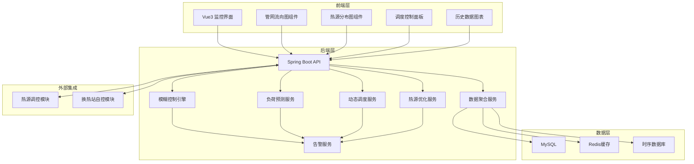
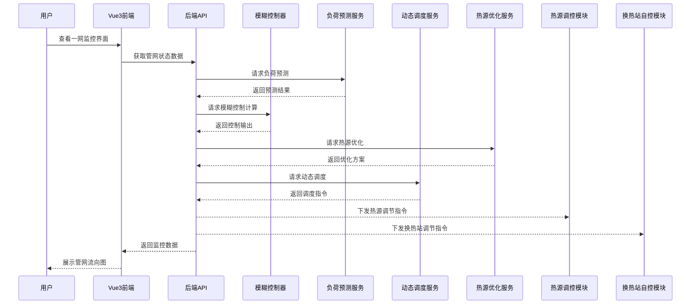
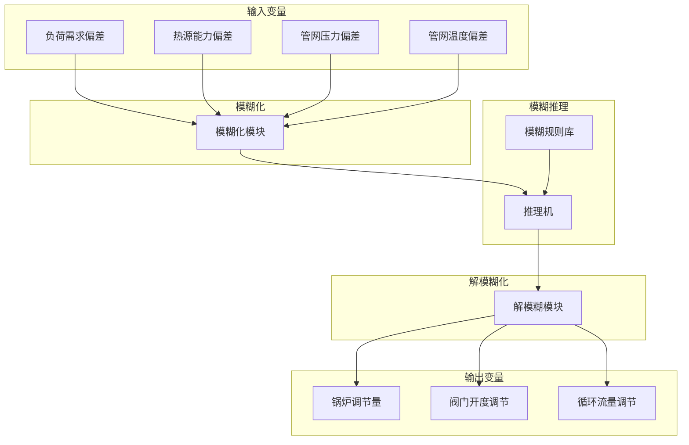
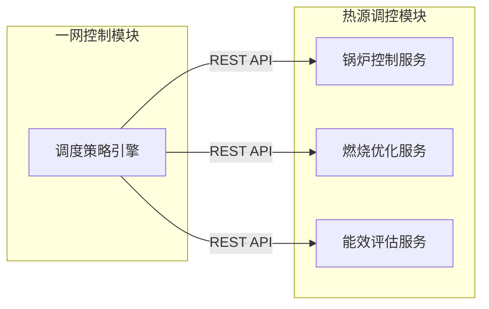
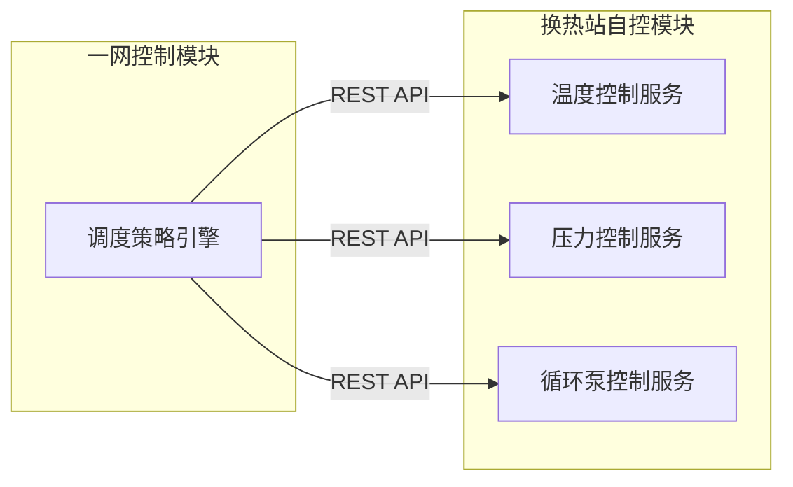

# 一网控制策略技术设计文档

Feature Name: primary-network-control
Updated: 2026-03-14

## Description

一网控制策略模块是锅炉集中供热智慧管理系统的核心功能模块，负责实现一次管网的智能调度与优化控制。该模块采用Vue3前端展示一次管网流向和热源分布，Java后端实现模糊控制算法进行热源分配优化。系统与热源调控模块和换热站自控模块紧密集成，支持负荷预测和动态调度功能，最终实现全网供热均衡和节能的目标。

## Architecture

### 系统总体架构



### 模块交互架构



### 模糊控制系统架构



## Components and Interfaces

### 前端组件

| 组件名称 | 职责 | 接口 |
|----------|------|------|
| NetworkTopology | 管网拓扑图主组件 | /api/primary-network/topology |
| FlowDirectionMap | 管网流向可视化 | /api/primary-network/flow-data |
| HeatSourcePanel | 热源分布展示面板 | /api/primary-network/heat-sources |
| DispatchControlPanel | 调度控制面板 | /api/primary-network/dispatch |
| LoadPredictionChart | 负荷预测图表 | /api/primary-network/load-prediction |
| DispatchHistory | 调度历史记录 | /api/primary-network/dispatch-history |
| OptimizationReport | 优化效果报告 | /api/primary-network/optimization-report |

### 后端服务

| 服务名称 | 职责 | 核心类 |
|----------|------|--------|
| PrimaryNetworkService | 一网数据管理 | PrimaryNetworkController, PrimaryNetworkServiceImpl |
| FuzzyControlService | 模糊控制算法 | FuzzyController, FuzzyRule, MembershipFunction |
| LoadPredictionService | 负荷预测 | LoadPredictor, TimeSeriesAnalyzer |
| DynamicDispatchService | 动态调度 | DispatchScheduler, LoadBalancer |
| HeatSourceIntegrationService | 热源集成 | HeatSourceClient, HeatSourceAdapter |
| StationIntegrationService | 换热站集成 | StationClient, StationAdapter |
| OptimizationService | 优化计算 | OptimizerEngine, ObjectiveFunction |

### 核心接口定义

#### 1. 获取管网拓扑数据

```
GET /api/primary-network/topology

Response:
{
  "networkId": "PN001",
  "heatSources": [
    {
      "id": "HS001",
      "name": "锅炉房1",
      "type": "gas_boiler",
      "capacity": 50.0,
      "currentOutput": 35.0,
      "status": "running",
      "location": {"x": 100, "y": 50}
    }
  ],
  "pipes": [
    {
      "id": "PIPE001",
      "sourceId": "HS001",
      "targetId": "ST001",
      "length": 500,
      "diameter": 0.325,
      "currentFlow": 120.5,
      "currentTemp": 75.0
    }
  ],
  "stations": [
    {
      "id": "ST001",
      "name": "换热站1",
      "demand": 15.0,
      "actualSupply": 14.8,
      "status": "running",
      "location": {"x": 300, "y": 150}
    }
  ]
}
```

#### 2. 获取管网流向数据

```
GET /api/primary-network/flow-data

Response:
{
  "timestamp": "2026-03-14T10:30:00Z",
  "pipes": [
    {
      "pipeId": "PIPE001",
      "flowRate": 120.5,
      "flowDirection": "out",
      "supplyTemp": 75.0,
      "returnTemp": 45.2,
      "pressure": 0.65
    }
  ],
  "totalFlow": 850.0,
  "totalHeat": 25000.0
}
```

#### 3. 获取热源分布数据

```
GET /api/primary-network/heat-sources

Response:
{
  "timestamp": "2026-03-14T10:30:00Z",
  "heatSources": [
    {
      "id": "HS001",
      "name": "锅炉房1",
      "type": "gas_boiler",
      "capacity": 50.0,
      "currentOutput": 35.0,
      "efficiency": 92.5,
      "status": "running",
      "fuelConsumption": 3500.0,
      "operatingCost": 2800.0
    }
  ],
  "totalCapacity": 120.0,
  "totalOutput": 85.0,
  "utilizationRate": 70.8
}
```

#### 4. 下发调度指令

```
POST /api/primary-network/dispatch

Request:
{
  "dispatchType": "optimize",
  "targetHeatSources": [
    {
      "heatSourceId": "HS001",
      "targetOutput": 40.0
    }
  ],
  "targetStations": [
    {
      "stationId": "ST001",
      "targetSupplyTemp": 75.0
    }
  ],
  "priority": "normal",
  "executeTime": "2026-03-14T10:30:00Z"
}

Response:
{
  "dispatchId": "DISP001",
  "status": "executed",
  "timestamp": "2026-03-14T10:30:00Z",
  "result": {
    "heatSources": [...],
    "stations": [...]
  }
}
```

#### 5. 获取负荷预测数据

```
GET /api/primary-network/load-prediction

Request:
query params: hours=2

Response:
{
  "predictionTime": "2026-03-14T10:30:00Z",
  "predictionHours": 2,
  "predictions": [
    {
      "timestamp": "2026-03-14T11:00:00Z",
      "totalLoad": 26000.0,
      "confidence": 0.85,
      "stations": [
        {
          "stationId": "ST001",
          "predictedLoad": 16000.0
        }
      ]
    }
  ]
}
```

#### 6. 获取调度历史

```
GET /api/primary-network/dispatch-history

Request:
query params: startTime=2026-03-13T00:00:00Z&endTime=2026-03-14T00:00:00Z&page=1&size=20

Response:
{
  "total": 100,
  "page": 1,
  "size": 20,
  "records": [
    {
      "dispatchId": "DISP001",
      "dispatchTime": "2026-03-14T10:30:00Z",
      "dispatchType": "optimize",
      "status": "completed",
      "heatSources": [...],
      "stations": [...],
      "duration": 120
    }
  ]
}
```

#### 7. 获取优化效果报告

```
GET /api/primary-network/optimization-report

Request:
query params: startTime=2026-03-13T00:00:00Z&endTime=2026-03-14T00:00:00Z

Response:
{
  "reportTime": "2026-03-14T10:30:00Z",
  "period": "2026-03-13 ~ 2026-03-14",
  "balanceIndex": 0.92,
  "energyEfficiency": 0.88,
  "totalEnergyConsumption": 1200000.0,
  "predictedConsumption": 1250000.0,
  "savings": 50000.0,
  "savingsRate": 4.0,
  "alarms": [
    {
      "type": "balance_warning",
      "count": 3,
      "details": "换热站ST003出现轻微不平衡"
    }
  ]
}
```

## Data Models

### 管网拓扑实体

```java
public class NetworkTopology {
    private String id;
    private String name;
    private List<HeatSource> heatSources;
    private List<HeatStation> stations;
    private List<PipeSegment> pipes;
    private LocalDateTime createTime;
    private LocalDateTime updateTime;
}
```

### 热源实体

```java
public class HeatSource {
    private String id;
    private String name;
    private String type;           // gas_boiler/coal_boiler/heat_pump
    private Double capacity;       // MW
    private Double currentOutput;  // MW
    private Double efficiency;     // %
    private String status;         // running/stopped/maintenance
    private Double fuelConsumption;
    private Double operatingCost;
    private Location location;
}
```

### 管道实体

```java
public class PipeSegment {
    private String id;
    private String sourceId;
    private String targetId;
    private Double length;         // 米
    private Double diameter;       // 米
    private Double currentFlow;     // m³/h
    private Double supplyTemp;     // ℃
    private Double returnTemp;     // ℃
    private Double pressure;       // MPa
    private String flowDirection;  // in/out
}
```

### 模糊控制器输入

```java
public class FuzzyInput {
    private Double loadDemandDeviation;    // 负荷需求偏差
    private Double heatSourceDeviation;   // 热源能力偏差
    private Double pressureDeviation;     // 管网压力偏差
    private Double temperatureDeviation;   // 管网温度偏差
}
```

### 模糊控制器输出

```java
public class FuzzyOutput {
    private Double boilerAdjustment;      // 锅炉调节量
    private Double valveOpeningAdjustment; // 阀门开度调节
    private Double flowRateAdjustment;     // 循环流量调节
    private Double confidence;             // 置信度
}
```

### 模糊规则

```java
public class FuzzyRule {
    private String id;
    private String name;
    private List<FuzzyCondition> conditions;
    private List<FuzzyConclusion> conclusions;
    private Double weight;
    private Boolean enabled;
}
```

### 调度指令

```java
public class DispatchInstruction {
    private String id;
    private String dispatchType;  // optimize/manual/prediction
    private List<HeatSourceInstruction> heatSources;
    private List<StationInstruction> stations;
    private String priority;      // emergency/high/normal/low
    private LocalDateTime executeTime;
    private LocalDateTime createTime;
    private String status;         // pending/executing/completed/failed
}
```

### 负荷预测结果

```java
public class LoadPrediction {
    private String id;
    private LocalDateTime predictTime;
    private Integer predictHours;
    private List<LoadPoint> predictions;
    private Double modelAccuracy;
    private String modelVersion;
    private LocalDateTime createTime;
}
```

### 调度历史记录

```java
public class DispatchHistory {
    private String id;
    private String dispatchId;
    private LocalDateTime dispatchTime;
    private String dispatchType;
    private String status;
    private Integer duration;      // 毫秒
    private List<HeatSourceResult> heatSources;
    private List<StationResult> stations;
    private LocalDateTime createTime;
}
```

## Algorithm Design

### 模糊控制算法

#### 模糊化模块

系统采用三角形和梯形隶属度函数对输入变量进行模糊化处理：

```java
public class FuzzificationModule {
    
    public Map<String, Double> fuzzify(FuzzyInput input) {
        Map<String, Double> fuzzyValues = new HashMap<>();
        
        // 负荷需求偏差模糊化
        fuzzyValues.put("load_NB", loadNegativeBig(input.getLoadDemandDeviation()));
        fuzzyValues.put("load_NS", loadNegativeSmall(input.getLoadDemandDeviation()));
        fuzzyValues.put("load_Z", loadZero(input.getLoadDemandDeviation()));
        fuzzyValues.put("load_PS", loadPositiveSmall(input.getLoadDemandDeviation()));
        fuzzyValues.put("load_PB", loadPositiveBig(input.getLoadDemandDeviation()));
        
        // 热源能力偏差模糊化
        fuzzyValues.put("source_NB", sourceNegativeBig(input.getHeatSourceDeviation()));
        fuzzyValues.put("source_NS", sourceNegativeSmall(input.getHeatSourceDeviation()));
        fuzzyValues.put("source_Z", sourceZero(input.getHeatSourceDeviation()));
        fuzzyValues.put("source_PS", sourcePositiveSmall(input.getHeatSourceDeviation()));
        fuzzyValues.put("source_PB", sourcePositiveBig(input.getHeatSourceDeviation()));
        
        // 压力偏差模糊化
        fuzzyValues.put("pressure_NB", pressureNegativeBig(input.getPressureDeviation()));
        fuzzyValues.put("pressure_NS", pressureNegativeSmall(input.getPressureDeviation()));
        fuzzyValues.put("pressure_Z", pressureZero(input.getPressureDeviation()));
        fuzzyValues.put("pressure_PS", pressurePositiveSmall(input.getPressureDeviation()));
        fuzzyValues.put("pressure_PB", pressurePositiveBig(input.getPressureDeviation()));
        
        return fuzzyValues;
    }
    
    private Double triangleMembership(Double x, Double a, Double b, Double c) {
        if (x <= a || x >= c) return 0.0;
        if (x == b) return 1.0;
        if (x < b) return (x - a) / (b - a);
        return (c - x) / (c - b);
    }
}
```

#### 模糊规则库

系统内置模糊控制规则库，包含以下典型规则：

| 规则编号 | 负荷偏差 | 热源偏差 | 压力偏差 | 锅炉调节 | 阀门调节 |
|----------|----------|----------|----------|----------|----------|
| 1 | NB | NB | NB | PB | NB |
| 2 | NB | NB | NS | PB | NS |
| 3 | NB | NS | Z | PB | Z |
| 4 | NS | Z | PS | PS | PS |
| 5 | Z | Z | Z | Z | Z |
| 6 | PS | Z | NS | NS | PS |
| 7 | PB | PB | PB | NB | PB |

#### 推理机

```java
public class InferenceEngine {
    
    public List<FuzzyOutput> infer(Map<String, Double> fuzzyValues, List<FuzzyRule> rules) {
        List<FuzzyOutput> outputs = new ArrayList<>();
        
        for (FuzzyRule rule : rules) {
            Double ruleStrength = calculateRuleStrength(fuzzyValues, rule);
            if (ruleStrength > 0) {
                FuzzyOutput output = applyRule(rule, ruleStrength);
                outputs.add(output);
            }
        }
        
        return outputs;
    }
    
    private Double calculateRuleStrength(Map<String, Double> fuzzyValues, FuzzyRule rule) {
        Double minStrength = 1.0;
        for (FuzzyCondition condition : rule.getConditions()) {
            Double value = fuzzyValues.get(condition.getVariable());
            if (value != null) {
                minStrength = Math.min(minStrength, value * condition.getWeight());
            }
        }
        return minStrength;
    }
}
```

#### 解模糊化模块

```java
public class DefuzzificationModule {
    
    public FuzzyOutput defuzzify(List<FuzzyOutput> outputs) {
        Double totalWeight = 0.0;
        Double boilerSum = 0.0;
        Double valveSum = 0.0;
        Double flowSum = 0.0;
        
        for (FuzzyOutput output : outputs) {
            Double weight = output.getWeight();
            totalWeight += weight;
            boilerSum += output.getBoilerAdjustment() * weight;
            valveSum += output.getValveOpeningAdjustment() * weight;
            flowSum += output.getFlowRateAdjustment() * weight;
        }
        
        FuzzyOutput result = new FuzzyOutput();
        if (totalWeight > 0) {
            result.setBoilerAdjustment(boilerSum / totalWeight);
            result.setValveOpeningAdjustment(valveSum / totalWeight);
            result.setFlowRateAdjustment(flowSum / totalWeight);
        }
        result.setConfidence(totalWeight);
        
        return result;
    }
}
```

### 负荷预测算法

系统采用指数平滑法进行短期负荷预测：

```java
public class LoadPredictor {
    
    public List<LoadPoint> predict(List<HistoricalLoad> historicalData, int hours) {
        List<LoadPoint> predictions = new ArrayList<>();
        
        // 计算平滑系数
        Double alpha = calculateOptimalAlpha(historicalData);
        
        // 初始化
        Double level = historicalData.get(0).getLoad();
        Double trend = historicalData.get(1).getLoad() - historicalData.get(0).getLoad();
        
        // 预测
        LocalDateTime currentTime = LocalDateTime.now();
        for (int i = 0; i < hours * 2; i++) {
            Double forecast = level + trend * (i + 1);
            Double seasonalFactor = getSeasonalFactor(currentTime.plusHours(i + 1));
            forecast *= seasonalFactor;
            
            LoadPoint point = new LoadPoint();
            point.setTimestamp(currentTime.plusHours(i + 1));
            point.setPredictedLoad(forecast);
            point.setConfidence(calculateConfidence(i));
            predictions.add(point);
            
            // 更新平滑值
            Double actual = historicalData.size() > i ? historicalData.get(i).getLoad() : forecast;
            Double newLevel = alpha * actual + (1 - alpha) * (level + trend);
            Double newTrend = 0.3 * (newLevel - level) + 0.7 * trend;
            level = newLevel;
            trend = newTrend;
        }
        
        return predictions;
    }
    
    private Double calculateOptimalAlpha(List<HistoricalLoad> data) {
        Double minError = Double.MAX_VALUE;
        Double optimalAlpha = 0.3;
        
        for (Double alpha : Arrays.asList(0.1, 0.2, 0.3, 0.4, 0.5)) {
            Double error = calculatePredictionError(data, alpha);
            if (error < minError) {
                minError = error;
                optimalAlpha = alpha;
            }
        }
        
        return optimalAlpha;
    }
}
```

### 动态调度策略

```java
public class DynamicScheduler {
    
    public DispatchInstruction schedule(LoadPrediction prediction, 
                                         List<HeatSource> heatSources,
                                         NetworkTopology network) {
        
        DispatchInstruction instruction = new DispatchInstruction();
        instruction.setDispatchType("optimize");
        
        // 步骤1：计算总需求
        Double totalDemand = prediction.getPredictions().stream()
            .mapToDouble(LoadPoint::getTotalLoad)
            .sum();
        
        // 步骤2：计算热源分配
        List<HeatSourceInstruction> heatSourceInstructions = 
            allocateHeatSources(totalDemand, heatSources);
        
        // 步骤3：计算换热站调节
        List<StationInstruction> stationInstructions = 
            calculateStationAdjustments(prediction, network);
        
        // 步骤4：应用模糊控制
        FuzzyOutput fuzzyOutput = applyFuzzyControl(
            prediction.getPredictions().get(0), 
            heatSources, 
            network
        );
        
        // 步骤5：生成最终指令
        instruction.setHeatSources(heatSourceInstructions);
        instruction.setStations(stationInstructions);
        instruction.setStatus("pending");
        
        return instruction;
    }
    
    private List<HeatSourceInstruction> allocateHeatSources(Double totalDemand,
                                                            List<HeatSource> sources) {
        List<HeatSourceInstruction> instructions = new ArrayList<>();
        
        // 按效率排序
        sources.sort((a, b) -> b.getEfficiency().compareTo(a.getEfficiency()));
        
        Double remainingDemand = totalDemand;
        for (HeatSource source : sources) {
            if (remainingDemand <= 0) break;
            
            HeatSourceInstruction instruction = new HeatSourceInstruction();
            instruction.setHeatSourceId(source.getId());
            
            Double allocate = Math.min(source.getCapacity() * 0.9, remainingDemand);
            instruction.setTargetOutput(allocate);
            
            instructions.add(instruction);
            remainingDemand -= allocate;
        }
        
        return instructions;
    }
}
```

## Integration Design

### 与热源调控模块集成



### 与换热站自控模块集成



### 数据交互规范

| 字段 | 类型 | 说明 |
|------|------|------|
| dispatchId | String | 调度指令唯一标识 |
| heatSourceId | String | 热源ID |
| targetOutput | Double | 目标出力 MW |
| stationId | String | 换热站ID |
| targetSupplyTemp | Double | 目标供水温度 ℃ |
| priority | String | 优先级：emergency/high/normal/low |
| timestamp | DateTime | 指令下发时间 |
| expires | DateTime | 指令过期时间 |

## Error Handling

### 通信故障处理

| 场景 | 处理策略 |
|------|----------|
| 热源调控模块通信中断 | 启用本地缓存数据，继续执行调度，超时告警 |
| 换热站自控模块通信中断 | 暂停对该换热站的远程控制，切换到本地自动模式 |
| 后端服务异常 | 使用Redis缓存数据，前端展示最后状态 |

### 算法异常处理

| 场景 | 处理策略 |
|------|----------|
| 模糊控制规则冲突 | 采用加权平均，优先执行高优先级规则 |
| 负荷预测模型失效 | 切换到简单移动平均法，告警提示模型异常 |
| 优化计算不收敛 | 保持当前方案，输出告警，提示人工干预 |

### 数据异常处理

| 场景 | 处理策略 |
|------|----------|
| 数据采集缺失 | 使用历史数据进行插值或外推 |
| 数据明显异常 | 过滤异常值，告警提示数据质量问题 |
| 数据库连接失败 | 写入Redis缓存，稍后同步到数据库 |

## Test Strategy

### 单元测试

- 模糊控制算法测试：验证不同输入组合的控制输出
- 负荷预测算法测试：使用历史数据验证预测准确性
- 动态调度测试：验证调度策略的正确性

### 集成测试

- 热源调控模块集成测试：验证指令下发和执行
- 换热站自控模块集成测试：验证调度指令的接收
- 前端集成测试：验证界面数据展示和交互

### 性能测试

- 优化计算性能：验证大规模管网计算延迟
- 并发访问性能：验证多用户同时访问响应时间
- 实时性测试：验证数据刷新延迟

### 现场测试

- 试运行测试：在实际管网进行72小时连续运行测试
- 故障模拟测试：模拟各种故障场景验证系统响应
- 节能效果测试：对比自动控制和人工控制能耗差异

## References

[^1]: Vue3官方文档 - https://vuejs.org/
[^2]: Element Plus组件库 - https://element-plus.org/
[^3]: ECharts图表库 - https://echarts.apache.org/
[^4]: Spring Boot 3.2文档 - https://spring.io/projects/spring-boot
[^5]: 模糊控制理论 - 《模糊控制理论与系统》- 清华大学出版社
[^6]: 时间序列预测 - 《预测与决策》- 高等教育出版社
