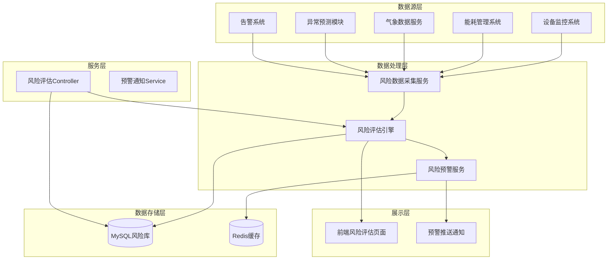
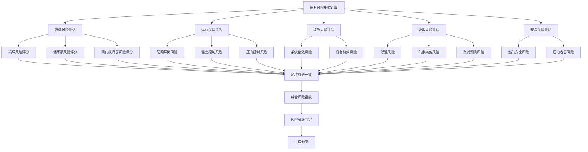
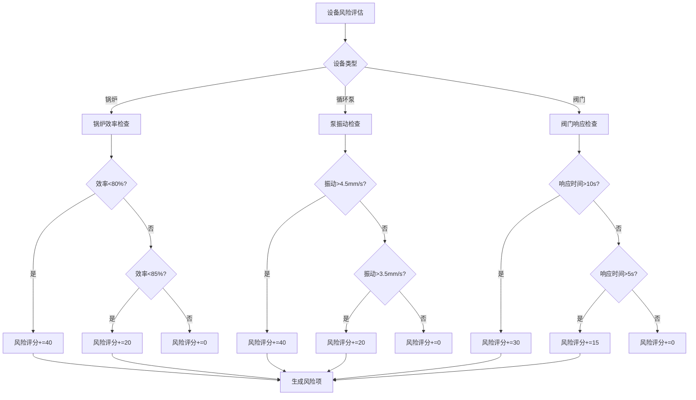

# 风险评估模块技术方案

需求名称：risk-assessment
更新日期：2026-03-16

## 1. 概述

本功能模块旨在为锅炉集中供热系统提供全面的风险评估服务，通过整合设备监控、能耗管理、气象数据、异常预测等多个数据源，采用多维度风险评估模型，综合分析设备风险、操作风险、能效风险、环境风险和安全风险，识别潜在风险并提供预防建议。

## 2. 架构设计

### 2.1 系统架构



### 2.2 风险评估模型



### 2.3 风险维度权重配置

| 风险维度 | 权重 | 说明 |
|---------|------|------|
| 设备风险 | 30% | 锅炉、泵、阀门等设备状态 |
| 运行风险 | 25% | 管网平衡、温度压力控制 |
| 能效风险 | 20% | 系统和设备能效水平 |
| 环境风险 | 10% | 气象条件对系统的影响 |
| 安全风险 | 15% | 燃气、压力容器安全 |

## 3. 组件与接口

### 3.1 核心类设计

```
后端模块:
- RiskAssessmentController     # REST API控制器
- RiskAssessmentService        # 风险评估核心业务逻辑
- EquipmentRiskEvaluator        # 设备风险评估器
- OperationRiskEvaluator       # 运行风险评估器
- EnergyRiskEvaluator          # 能效风险评估器
- EnvironmentRiskEvaluator     # 环境风险评估器
- SafetyRiskEvaluator          # 安全风险评估器
- RiskIndexCalculator          # 风险指数计算器
- RiskAlertService             # 风险预警服务
- RiskNotificationSender       # 预警通知发送器
- RiskReportGenerator          # 风险报告生成器

数据模型:
- RiskAssessment               # 风险评估记录
- RiskItem                     # 风险项
- RiskAlert                    # 风险预警
- RiskConfig                   # 风险配置
- RiskReport                   # 风险报告
```

### 3.2 核心接口

| 接口 | 方法 | 说明 |
|------|------|------|
| /api/risk/assessment | GET | 获取风险评估结果 |
| /api/risk/index | GET | 获取综合风险指数 |
| /api/risk/trend | GET | 获取风险趋势数据 |
| /api/risk/distribution | GET | 获取风险分布数据 |
| /api/risk/details | GET | 获取风险详情列表 |
| /api/risk/alert | GET | 获取风险预警列表 |
| /api/risk/alert/handle | POST | 处理风险预警 |
| /api/risk/config | GET/POST | 风险配置管理 |
| /api/risk/report | GET | 生成风险报告 |

## 4. 数据模型

### 4.1 风险评估记录表 (risk_assessment)

| 字段 | 类型 | 说明 |
|------|------|------|
| id | BIGINT | 主键 |
| assessment_time | DATETIME | 评估时间 |
| equipment_risk_score | DECIMAL | 设备风险评分(0-100) |
| operation_risk_score | DECIMAL | 运行风险评分(0-100) |
| energy_risk_score | DECIMAL | 能效风险评分(0-100) |
| environment_risk_score | DECIMAL | 环境风险评分(0-100) |
| safety_risk_score | DECIMAL | 安全风险评分(0-100) |
| composite_index | DECIMAL | 综合风险指数(0-100) |
| risk_level | VARCHAR | 风险等级(LOW/MEDIUM/HIGH) |
| warning_count | INT | 预警数量 |
| handled_count | INT | 已处理数量 |
| created_at | DATETIME | 创建时间 |

### 4.2 风险项表 (risk_item)

| 字段 | 类型 | 说明 |
|------|------|------|
| id | BIGINT | 主键 |
| assessment_id | BIGINT | 关联评估ID |
| risk_type | VARCHAR | 风险类型(EQUIPMENT/OPERATION/ENERGY/ENVIRONMENT/SAFETY) |
| risk_item | VARCHAR | 风险项名称 |
| risk_level | VARCHAR | 风险等级 |
| risk_score | INT | 风险评分(0-100) |
| risk_factors | VARCHAR | 风险因素描述 |
| suggestion | VARCHAR | 处理建议 |
| status | VARCHAR | 状态(PENDING/HANDLED) |
| handler | VARCHAR | 处理人 |
| handle_time | DATETIME | 处理时间 |
| handle_remark | VARCHAR | 处理备注 |
| created_at | DATETIME | 创建时间 |

### 4.3 风险预警表 (risk_alert)

| 字段 | 类型 | 说明 |
|------|------|------|
| id | BIGINT | 主键 |
| risk_item_id | BIGINT | 关联风险项ID |
| alert_level | VARCHAR | 预警级别(INFO/WARN/CRITICAL) |
| alert_message | VARCHAR | 预警消息 |
| alert_time | DATETIME | 预警时间 |
| acknowledged | BOOLEAN | 是否已确认 |
| acknowledged_by | VARCHAR | 确认人 |
| acknowledged_at | DATETIME | 确认时间 |

### 4.4 风险配置表 (risk_config)

| 字段 | 类型 | 说明 |
|------|------|------|
| id | BIGINT | 主键 |
| config_type | VARCHAR | 配置类型 |
| config_key | VARCHAR | 配置键 |
| config_value | VARCHAR | 配置值 |
| description | VARCHAR | 描述 |
| created_at | DATETIME | 创建时间 |
| updated_at | DATETIME | 更新时间 |

## 5. 风险评估算法

### 5.1 综合风险指数计算

```
CompositeIndex = Σ(RiskScore × Weight) / Σ(Weight)

其中:
- 设备风险权重 = 0.30
- 运行风险权重 = 0.25
- 能效风险权重 = 0.20
- 环境风险权重 = 0.10
- 安全风险权重 = 0.15
```

### 5.2 风险等级判定

| 综合风险指数 | 风险等级 | 颜色标识 |
|------------|---------|---------|
| 0-40 | 低风险(Low) | 绿色 |
| 41-70 | 中风险(Medium) | 橙色 |
| 71-100 | 高风险(High) | 红色 |

### 5.3 设备风险评分规则



## 6. 功能配置

### 6.1 风险阈值配置

支持通过管理界面对各类风险阈值进行配置：

| 配置项 | 默认值 | 说明 |
|-------|-------|------|
| 锅炉效率低阈值 | 80% | 低于此值生成高风险 |
| 锅炉效率中阈值 | 85% | 低于此值生成中风险 |
| 泵振动高阈值 | 4.5mm/s | 高于此值生成高风险 |
| 泵振动中阈值 | 3.5mm/s | 高于此值生成中风险 |
| 温度偏差阈值 | 5°C | 超过此值生成预警 |
| 压力上限 | 1.0MPa | 超过此值生成安全预警 |
| 压力下限 | 0.3MPa | 低于此值生成失压预警 |
| COP低阈值 | 2.5 | 低于此值生成能效风险 |

### 6.2 风险权重配置

支持自定义各风险维度的权重：

| 风险维度 | 默认权重 | 可调整范围 |
|---------|---------|-----------|
| 设备风险 | 30% | 10%-50% |
| 运行风险 | 25% | 10%-40% |
| 能效风险 | 20% | 10%-30% |
| 环境风险 | 10% | 5%-20% |
| 安全风险 | 15% | 10%-30% |

### 6.3 预警通知配置

| 通知方式 | 启用配置 | 说明 |
|---------|---------|------|
| 页面实时弹窗 | enabled | 高风险自动弹窗 |
| 站内消息 | enabled | 风险预警消息 |
| 微信通知 | enabled | 需要配置企业微信 |
| 短信通知 | enabled | 需要配置短信网关 |

## 7. 正确性属性

- **数据完整性**: 所有风险评估数据必须持久化存储，支持数据补采
- **评估准确性**: 风险识别准确率目标 > 90%
- **实时性**: 从数据采集到风险更新延迟 < 1分钟
- **预警及时性**: 高风险预警生成后5秒内推送
- **可追溯性**: 每条风险记录关联完整的评估依据

## 8. 错误处理

| 场景 | 处理策略 |
|------|---------|
| 数据采集失败 | 使用最近一次数据，标记数据状态，生成数据缺失提示 |
| 评估计算异常 | 降级为基础规则评估，告警评估服务异常 |
| 预警推送失败 | 持久化预警消息，定时重试推送 |
| 报告生成失败 | 返回错误信息，支持重新生成 |

## 9. 前端集成

### 9.1 页面结构

```
风险评估页面:
├── 顶部统计卡片
│   ├── 综合风险指数
│   ├── 风险等级
│   ├── 风险预警数量
│   └── 已处理数量
├── 图表区域
│   ├── 风险趋势折线图
│   └── 风险分布饼图
└── 详情区域
    ├── 风险筛选器
    └── 风险详情表格
```

### 9.2 API 调用

```javascript
// 获取风险评估数据
riskApi.getAssessment()

// 获取风险趋势
riskApi.getTrend({ range: 'week|month|year' })

// 获取风险分布
riskApi.getDistribution()

// 获取风险详情列表
riskApi.getDetails({ type: 'equipment|operation|energy|environment|safety' })

// 处理风险预警
riskApi.handleAlert({ id, remark })

// 获取风险配置
riskApi.getConfig()

// 更新风险配置
riskApi.updateConfig({ key, value })
```

## 10. 测试策略

- 单元测试: 风险评分算法、风险等级判定
- 集成测试: 数据流端到端、API接口
- 性能测试: 并发评估能力、响应时间
- 预警测试: 阈值触发、通知推送

## 11. 部署与运维

### 11.1 服务部署

- 后端服务：Spring Boot 应用，与现有系统集成部署
- 风险评估任务：使用 Spring Task 或 XXL-Job 定时调度
- 数据采集服务：与现有数据采集服务共用

### 11.2 监控指标

- 风险评估任务执行时间
- 风险识别数量/准确率
- 预警推送成功率
- 风险指数计算延迟

## 12. 与现有模块集成

### 12.1 与异常预测模块集成

- 接收异常预测模块的预警数据
- 将高风险异常纳入风险评估
- 共享设备健康度评估模型

### 12.2 与告警系统集成

- 复用告警通知渠道
- 告警记录关联风险项
- 共同维护告警处理流程

### 12.3 与气候补偿模块集成

- 获取补偿效果数据用于能效评估
- 结合气象预报进行环境风险评估

### 12.4 与水力仿真模块集成

- 获取管网平衡仿真结果
- 基于仿真数据进行运行风险评估
