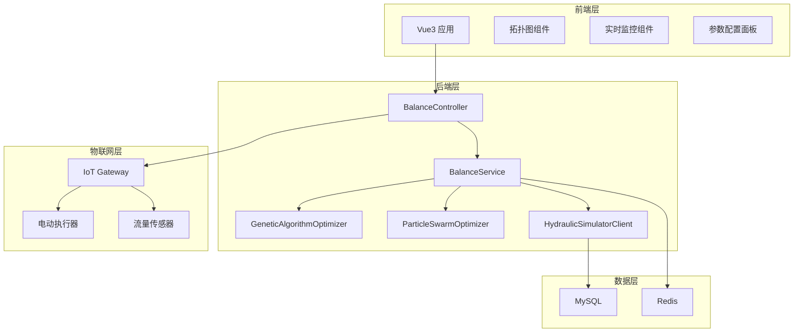
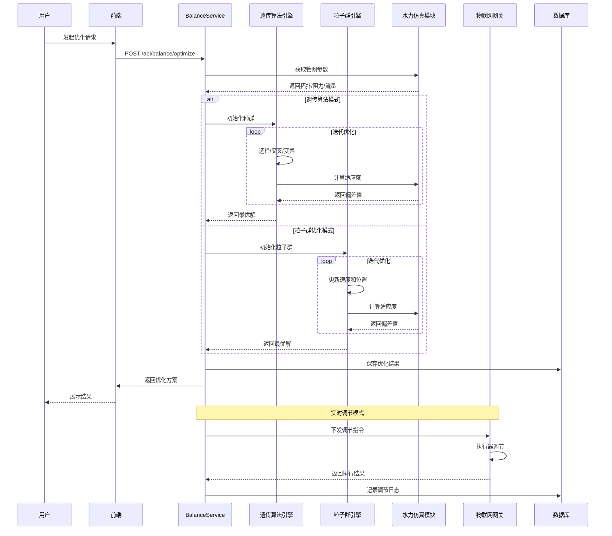

# 二网平衡功能模块技术设计

Feature Name: secondary-network-balancing
Updated: 2026-03-14

## Description

二网平衡功能模块通过智能优化算法实现二次管网水力平衡自动调节，解决供热管网远近端冷热不均的问题。该模块采用遗传算法（GA）和粒子群优化算法（PSO）作为核心优化引擎，结合水力仿真模块提供的管网参数，计算最优阀门开度方案。

### 核心能力

- 管网拓扑可视化：基于图论算法展示二次管网拓扑结构和实时状态
- 离线优化计算：基于历史数据和仿真模型进行预先计算，生成最优调节方案
- 实时动态调节：根据实时采集数据自动调整阀门开度，快速响应管网变化
- 效果评估分析：自动计算调节效果，生成评估报告和对比图表

### 技术选型理由

| 技术 | 选择理由 |
|------|----------|
| 遗传算法 | 全局搜索能力强，适用于多变量非线性优化问题 |
| 粒子群优化 | 收敛速度快，参数调节简单，适合连续函数优化 |
| Vue3+ECharts | 组件化开发，数据可视化能力强，适合工业监控场景 |
| Spring Boot | 企业级框架，与现有系统技术栈一致 |

## Architecture

### 系统架构图



### 模块交互图



## Components and Interfaces

### 前端组件

| 组件名 | 职责 | 位置 |
|--------|------|------|
| NetworkTopologyGraph | 管网拓扑图绘制和交互 | frontend/src/views/balance/ |
| ValveControlPanel | 阀门状态展示和控制面板 | frontend/src/views/balance/ |
| OptimizationConfig | 优化参数配置组件 | frontend/src/views/balance/ |
| RealTimeMonitor | 实时数据监控组件 | frontend/src/views/balance/ |
| EffectChart | 效果评估图表组件 | frontend/src/views/balance/ |
| HistoryTable | 调节历史记录表格 | frontend/src/views/balance/ |

### 后端服务类

| 类名 | 职责 | 主要方法 |
|------|------|----------|
| BalanceController | REST API入口 | optimize, regulate, getTopology, getHistory |
| BalanceService | 业务逻辑编排 | startOptimization, executeRegulation, getTopologyData |
| GeneticAlgorithmOptimizer | 遗传算法实现 | initialize, selection, crossover, mutation, evaluate |
| ParticleSwarmOptimizer | 粒子群优化实现 | initialize, updateVelocity, updatePosition, evaluate |
| HydraulicSimulatorClient | 水力仿真模块集成 | getTopology, getResistanceCoeff, getNodeDemands |
| ValveControlClient | 阀门控制指令下发 | sendCommand, getStatus |
| BalanceRecordMapper | 调节记录数据访问 | insert, selectByNetworkId, selectByTimeRange |

### 数据接口

#### 内部服务接口

```java
// 水力仿真模块接口
public interface HydraulicSimulatorClient {
    NetworkTopology getTopology(String networkId);
    Map<String, Double> getResistanceCoefficients(String networkId);
    Map<String, Double> getNodeDesignDemands(String networkId);
    SimulationResult calculate(SimulationParams params);
}

// 物联网网关接口
public interface ValveControlClient {
    CommandResult sendValveCommand(String valveId, double position);
    ValveStatus getValveStatus(String valveId);
    List<ValveStatus> getAllValveStatus(String networkId);
}
```

#### 对外REST接口

| 接口路径 | 方法 | 说明 |
|----------|------|------|
| /api/balance/topology | GET | 获取管网拓扑数据 |
| /api/balance/optimize | POST | 发起优化计算 |
| /api/balance/optimize/result/{taskId} | GET | 获取优化结果 |
| /api/balance/regulate | POST | 执行阀门调节 |
| /api/balance/real-time/start | POST | 启动实时调节 |
| /api/balance/real-time/stop | POST | 停止实时调节 |
| /api/balance/history | GET | 查询调节历史 |
| /api/balance/config | GET/PUT | 获取/保存优化参数 |
| /api/balance/effect/{recordId} | GET | 获取调节效果评估 |

## Data Models

### 实体类

```java
// 管网拓扑节点
public class NetworkNode {
    private String nodeId;
    private String nodeName;
    private NodeType type; // STATION, VALVE, USER
    private Double positionX;
    private Double positionY;
    private String parentNodeId;
}

// 管网拓扑边（管段）
public class NetworkEdge {
    private String edgeId;
    private String sourceNodeId;
    private String targetNodeId;
    private Double length;
    private Double diameter;
    private Double roughness;
    private Double currentFlow;
    private Double designFlow;
}

// 阀门状态
public class ValveStatus {
    private String valveId;
    private String valveName;
    private Double currentOpening; // 0-100%
    private Double targetOpening;
    private ValveState state; // OPEN, CLOSED, ADJUSTING, FAULT
    private Long lastUpdateTime;
}

// 优化任务
public class OptimizationTask {
    private String taskId;
    private String networkId;
    private OptimizationType type; // GENETIC_ALGORITHM, PARTICLE_SWARM
    private TaskStatus status; // PENDING, RUNNING, COMPLETED, FAILED
    private Integer iterations;
    private Double bestFitness;
    private Date startTime;
    private Date endTime;
    private List<ValvePosition> optimalPositions;
}

// 阀门位置方案
public class ValvePosition {
    private String valveId;
    private Double currentOpening;
    private Double optimalOpening;
    private Double expectedFlow;
    private Double flowDeviation; // 百分比
}

// 调节记录
public class RegulationRecord {
    private Long recordId;
    private String networkId;
    private String optimizationType;
    private Date regulationTime;
    private Integer valveCount;
    private Double avgDeviationBefore;
    private Double avgDeviationAfter;
    private Double improvementRate;
    private String status;
    private List<ValvePosition> details;
}
```

### DTO

```java
// 优化请求DTO
public class OptimizeRequestDTO {
    private String networkId;
    private String algorithmType; // GA, PSO
    private OptimizeMode mode; // OFFLINE, REAL_TIME
    private AlgorithmParams params;
}

// 算法参数DTO
public class AlgorithmParams {
    // 遗传算法参数
    private Integer populationSize; // 默认50
    private Integer maxIterations; // 默认200
    private Double crossoverRate; // 默认0.8
    private Double mutationRate; // 默认0.05
    private Double eliteRate; // 默认0.1
    
    // 粒子群优化参数
    private Integer particleCount; // 默认30
    private Double inertiaWeight; // 默认0.7
    private Double cognitiveCoefficient; // 默认1.5
    private Double socialCoefficient; // 默认1.5
}

// 实时调节配置DTO
public class RealTimeConfigDTO {
    private String networkId;
    private Integer dataRefreshInterval; // 秒，默认60
    private Double deviationThreshold; // 偏差阈值，默认15%
    private Integer maxAdjustAttempts; // 最大调节次数，默认3
    private Integer adjustInterval; // 调节间隔秒，默认300
}

// 效果评估DTO
public class EffectEvaluationDTO {
    private Long recordId;
    private Double avgDeviationBefore;
    private Double avgDeviationAfter;
    private Double improvementRate;
    private Integer totalBranches;
    private Integer qualifiedBranches;
    private List<BranchEvaluation> branchEvaluations;
}

// 支路评估
public class BranchEvaluation {
    private String branchId;
    private String valveId;
    private Double deviationBefore;
    private Double deviationAfter;
    private Boolean isQualified; // 偏差<15%为达标
}
```

## Correctness Properties

### 不变式

1. **阀门开度约束**: 任意时刻阀门开度必须满足 `0 <= opening <= 100`
2. **流量偏差计算**: 流量偏差必须按照公式 `deviation = |currentFlow - designFlow| / designFlow * 100%` 计算
3. **优化收敛条件**: 遗传算法和粒子群优化在连续30次迭代最优解无改善时终止
4. **实时调节频率**: 实时调节模式下两次调节指令间隔不小于5分钟

### 约束条件

1. **管网参数有效性**: 调用水力仿真模块获取的参数必须完整，缺失字段使用默认值填充并记录警告日志
2. **算法参数范围**: 
   - 种群/粒子数量: [10, 200]
   - 迭代次数: [50, 1000]
   - 概率参数: [0, 1]
3. **超时控制**: 
   - 离线优化计算超时: 300秒
   - 单次调节指令响应超时: 30秒
   - 实时数据接收超时: 10秒

### 质量属性

- **性能**: 离线优化计算单次不超过5分钟，实时调节响应延迟不超过10秒
- **可用性**: 实时调节模式支持断线自动重连
- **可维护性**: 优化算法模块化设计，支持新增算法插件式集成

## Error Handling

### 异常类型

| 异常类 | 触发条件 | 处理策略 |
|--------|----------|----------|
| NetworkNotFoundException | 管网ID不存在 | 返回404错误，提示检查管网ID |
| HydraulicDataException | 水力仿真数据获取失败 | 使用默认值，继续计算并记录警告 |
| OptimizationTimeoutException | 优化计算超时 | 中断计算，返回部分结果，提示调整参数 |
| OptimizationNonConvergenceException | 优化无法收敛 | 返回错误，建议检查管网参数 |
| ValveControlException | 阀门控制指令失败 | 重试3次，失败后生成告警 |
| RealTimeConnectionException | 实时数据连接断开 | 自动重连5次，失败后告警 |

### 错误响应格式

```json
{
  "code": 500,
  "message": "优化计算超时，请增加迭代次数或调整管网参数",
  "data": {
    "errorType": "OPTIMIZATION_TIMEOUT",
    "partialResult": {
      "iterations": 150,
      "bestFitness": 0.15,
      "optimalPositions": []
    },
    "suggestion": "建议将迭代次数增加至300后重试"
  },
  "timestamp": 1704067200000
}
```

### 告警规则

| 告警级别 | 触发条件 |
|----------|----------|
| INFO | 流量偏差10%-15% |
| WARNING | 流量偏差15%-20% |
| ERROR | 流量偏差>20%或调节失败 |

## Test Strategy

### 单元测试

- 遗传算法核心方法测试：选择、交叉、变异、适应度计算
- 粒子群优化核心方法测试：速度更新、位置更新、全局最优更新
- 数据模型序列化/反序列化测试

### 集成测试

- 与水力仿真模块集成测试：参数获取、仿真计算调用
- 与物联网网关集成测试：指令下发、状态回读
- API接口功能测试：各接口请求响应验证

### 性能测试

- 优化算法收敛速度测试：不同规模管网下的迭代次数
- 并发优化任务测试：多管网同时优化场景
- 实时调节响应延迟测试：数据采集到指令下发的端到端延迟

### 效果验证测试

- 仿真环境模拟测试：已知最优解的管网模型验证算法准确性
- 历史数据回测：使用历史调节数据验证改善率计算准确性

## References

[^1]: (Document) - 锅炉集中供热智慧管理系统架构设计
[^2]: (Document) - 接口定义规范
