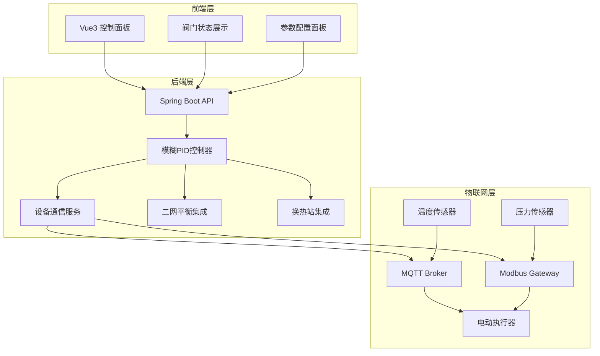
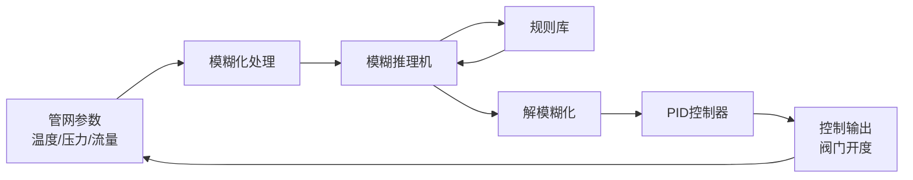
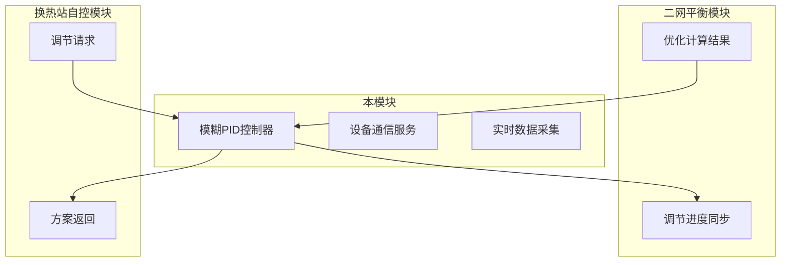

# 智能电动调节

Feature Name: smart-electric-regulation
Updated: 2026-03-14

## Description

智能电动调节功能模块采用模糊PID控制算法，实现对电动执行器的智能调节。该模块根据管网实际运行参数（温度、压力、流量）自动计算并调整阀门开度，解决传统PID控制响应慢、超调大的问题。模块支持与物联网设备通过MQTT和Modbus协议通信，可与二网平衡模块和换热站自控模块无缝集成。

## Architecture

### 系统架构图



### 模糊PID控制原理图



### 模块集成关系图



## Components and Interfaces

### 前端组件

| 组件名 | 职责 | 接口 |
|--------|------|------|
| ValveControlPanel | 阀门控制主面板 | 展示阀门列表、状态、快捷操作 |
| ValveDetailDialog | 阀门详情弹窗 | 显示单阀门实时曲线、历史记录 |
| FuzzyPIDConfig | 模糊PID参数配置 | Kp/Ki/Kd、模糊因子、规则配置 |
| ControlTrendChart | 控制趋势图表 | ECharts实时曲线展示 |
| DeviceStatusPanel | 设备状态面板 | 显示设备在线状态、通信状态 |

### 后端服务类

| 类名 | 职责 | 主要方法 |
|------|------|----------|
| FuzzyPIDController | 模糊PID控制算法实现 | calculate(error), fuzzyInference(), defuzzification() |
| DeviceCommunicationService | 设备通信管理 | connect(), sendCommand(), receiveData() |
| MqttDeviceClient | MQTT协议设备通信 | publish(), subscribe(), handleMessage() |
| ModbusDeviceClient | Modbus协议设备通信 | readHoldingRegisters(), writeSingleRegister() |
| ValveControlService | 阀门控制业务逻辑 | executeRegulation(), syncStatus() |
| BalanceIntegrationService | 二网平衡模块集成 | receiveOptimizeResult(), syncProgress() |
| HeatStationIntegrationService | 换热站模块集成 | receiveRequest(), returnScheme() |
| ControlDataCollector | 控制数据采集 | collect(), validate(), cache() |

### 数据采集接口

| 接口名 | 路径 | 方法 | 说明 |
|--------|------|------|------|
| 获取阀门列表 | /api/valve/list | GET | 获取所有已配置阀门 |
| 获取阀门状态 | /api/valve/{id}/status | GET | 获取单个阀门实时状态 |
| 下发控制指令 | /api/valve/{id}/control | POST | 下发阀门开度指令 |
| 配置模糊PID参数 | /api/valve/config/pid | POST | 配置控制器参数 |
| 获取控制趋势 | /api/valve/{id}/trend | GET | 获取控制趋势数据 |

### 模块集成接口

| 接口名 | 路径 | 方法 | 说明 |
|--------|------|------|------|
| 接收优化结果 | /api/integration/balance/result | POST | 二网平衡模块调用 |
| 同步调节进度 | /api/integration/balance/progress | POST | 同步调节进度 |
| 接收调节请求 | /api/integration/station/request | POST | 换热站模块调用 |
| 返回调节方案 | /api/integration/station/response | POST | 返回计算方案 |

## Data Models

### 阀门实体

```java
public class ValveEntity {
    private Long id;
    private String name;
    private String deviceId;
    private String protocol;        // MQTT/MODBUS_RTU/MODBUS_TCP
    private Integer currentOpening; // 当前开度 0-100
    private Integer targetOpening;  // 目标开度 0-100
    private String status;          // IDLE/RUNNING/ERROR
    private Long lastUpdateTime;
    private String location;
    private String networkId;       // 所属管网ID
}
```

### 模糊PID参数配置

```java
public class FuzzyPIDConfig {
    private Double kp;              // 比例系数 0.1-10
    private Double ki;              // 积分系数 0.01-1
    private Double kd;              // 微分系数 0.1-5
    private Double fuzzificationFactor;  // 模糊化因子
    private String defuzzificationMethod; // 解模糊方法 CENTER_OF_GRAVITY/MEAN_OF_MAX
    private List<FuzzyRule> rules;  // 模糊规则列表
}
```

### 模糊规则

```java
public class FuzzyRule {
    private String condition;       // IF error IS negative_big AND delta_error IS zero
    private String conclusion;      // THEN output IS positive_medium
    private Double weight;          // 规则权重 0-1
}
```

### 管网参数数据

```java
public class NetworkParameters {
    private Long valveId;
    private Double temperature;      // 温度 °C
    private Double pressure;        // 压力 MPa
    private Double flow;            // 流量 m³/h
    private Long timestamp;
    private Boolean isValid;        // 数据有效性
}
```

### 控制指令

```java
public class ControlCommand {
    private Long valveId;
    private Integer targetOpening;  // 目标开度 0-100
    private Long sendTime;
    private Integer timeout;        // 超时时间 秒
    private Integer retryCount;     // 重试次数
}
```

### 控制结果

```java
public class ControlResult {
    private Long valveId;
    private Integer actualOpening;  // 实际开度
    private Long responseTime;     // 响应时间 ms
    private Double overshoot;       // 超调量 %
    private Double steadyStateError; // 稳态误差 %
    private Boolean success;
    private String errorMessage;
}
```

## Correctness Properties

### 控制正确性

1. 控制输出必须在0-100%范围内
2. 单次调节幅度不超过20%，防止管网冲击
3. 控制响应时间小于100ms
4. 有效数据采集间隔为5秒

### 数据一致性

1. 阀门状态在数据库和缓存中保持一致
2. 控制指令下发后必须等待响应确认
3. 调节进度实时同步给集成模块
4. 历史记录保存至少365天

### 通信可靠性

1. MQTT连接心跳间隔30秒
2. Modbus轮询周期可配置默认1秒
3. 通信失败自动重连最多5次
4. 所有通信记录日志保存

### 安全性

1. 控制指令包含时间戳防重放
2. 关键操作需要操作日志记录
3. 设备通信使用认证机制

## Error Handling

### 设备通信异常

| 异常场景 | 处理策略 | 告警级别 |
|----------|----------|----------|
| MQTT连接断开 | 自动重连间隔5-10-30秒 | WARN |
| Modbus响应超时 | 重试3次后标记设备离线 | ERROR |
| 指令执行失败 | 记录日志并返回失败原因 | ERROR |
| 数据采集异常 | 使用最近有效值填充 | WARN |

### 控制算法异常

| 异常场景 | 处理策略 | 告警级别 |
|----------|----------|----------|
| 参数输入异常 | 使用默认值并告警 | WARN |
| 模糊推理超时 | 降级到普通PID | WARN |
| 规则库加载失败 | 使用默认规则 | ERROR |
| 自学习失败 | 回退到原有参数 | WARN |

### 模块集成异常

| 异常场景 | 处理策略 | 告警级别 |
|----------|----------|----------|
| 二网平衡数据接收失败 | 缓存请求待重试 | WARN |
| 换热站请求处理超时 | 返回超时错误 | ERROR |
| 集成通信中断 | 维持本地控制 | WARN |

## Test Strategy

### 单元测试

- 模糊PID控制器算法测试：验证控制输出正确性
- 模糊化/解模糊化测试：验证模糊处理正确性
- 设备通信模拟测试：验证协议解析正确性
- 数据校验测试：验证异常数据过滤正确性

### 集成测试

- 与物联网网关集成测试：验证指令下发和数据采集
- 与二网平衡模块集成测试：验证数据交互正确性
- 与换热站模块集成测试：验证协同控制正确性

### 性能测试

- 控制响应时间测试：验证100ms响应要求
- 并发控制测试：验证多阀门同时控制
- 数据采集负载测试：验证大规模数据处理

### 仿真测试

- 使用历史数据回放测试控制效果
- 对比模糊PID与传统PID控制效果
- 极端工况测试（参数突变、设备故障）

## References

- [^1]: (Architecture) - 系统架构设计 .monkeycode/docs/ARCHITECTURE.md
- [^2]: (Secondary Network Balancing) - 二网平衡模块需求 .monkeycode/specs/secondary-network-balancing/requirements.md
- [^3]: (Heat Station Auto-control) - 换热站自控模块 .monkeycode/specs/heat-station-autocontrol/requirements.md
- [^4]: (Website) - Fuzzy PID Controller Basics https://www.sciencedirect.com/topics/engineering/fuzzy-pid-controller
- [^5]: (Website) - MQTT Protocol Specification https://mqtt.org/mqtt-specification/
- [^6]: (Website) - Modbus Protocol Specification https://www.modbus.org/specs.php
