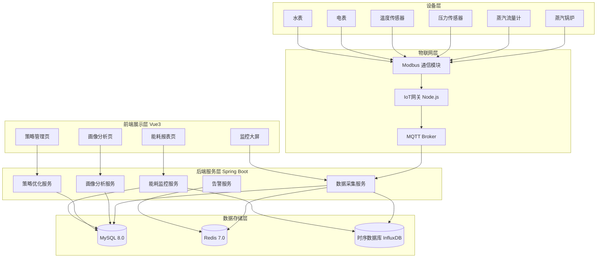
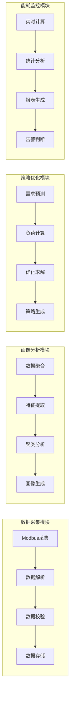
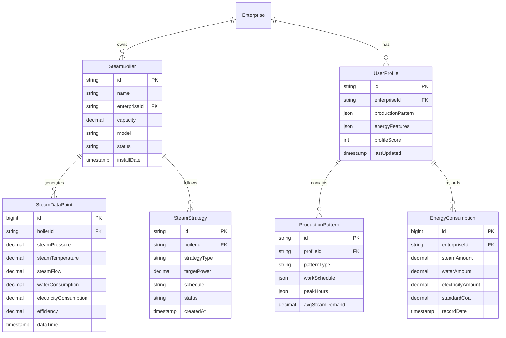
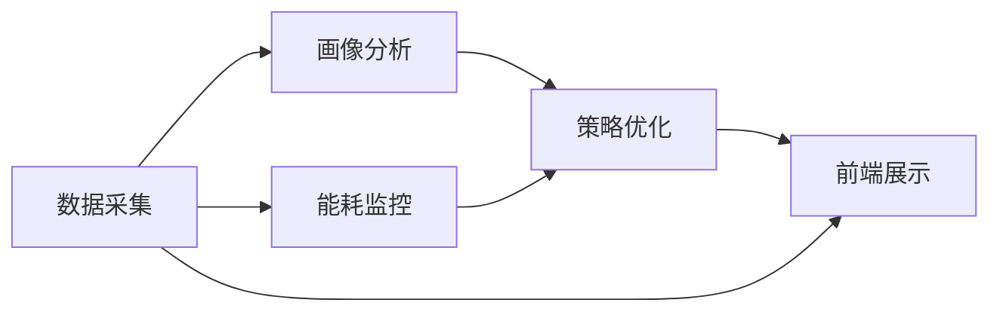

# 蒸汽管理系统技术设计方案

需求名称：steam-management
更新日期：2026-03-16

## 1. 概述

蒸汽管理系统旨在实现工业蒸汽锅炉的智能化管理，通过采集用户生产数据、生成行为画像、智能生成运行策略，实现蒸汽系统的节能降耗和高效运行。系统采用前后端分离架构，遵循锅炉集中供热智慧管理系统的整体技术选型。

### 1.1 业务目标

1. **数据采集与画像**：采集用户生产数据，生成用户行为画像，包括生产规律、水电耗等
2. **运行策略优化**：根据用户画像，生成蒸汽锅炉的运行策略（运行功率、启停等）
3. **能耗监控管理**：实现蒸汽系统的全面能耗监控与管理

### 1.2 非功能目标

- **实时性**：关键参数采集延迟不超过10秒
- **可靠性**：系统可用性不低于99.9%
- **可扩展性**：支持至少100台锅炉设备接入
- **易用性**：提供直观的可视化界面

## 2. 架构设计

### 2.1 系统架构



### 2.2 技术选型

| 层级 | 技术 | 说明 |
|------|------|------|
| 前端 | Vue3 + TypeScript + Element Plus + ECharts | 与现有系统保持一致 |
| 后端 | Spring Boot 3.2 + MyBatis-Plus | 企业级稳定架构 |
| 缓存 | Redis 7.0 | 实时数据缓存 |
| 时序数据 | InfluxDB | 适合时序数据存储 |
| 消息队列 | MQTT | 物联网数据采集 |
| 工业协议 | Modbus RTU/TCP | 设备对接 |

### 2.3 模块设计



## 3. 组件与接口

### 3.1 核心服务

| 服务 | 职责 | 核心类 |
|------|------|--------|
| DataCollectorService | 设备数据采集与处理 | ModbusCollector、DataParser |
| ProfileAnalysisService | 用户行为画像分析 | FeatureExtractor、ProfileGenerator |
| StrategyOptimizationService | 运行策略优化 | LoadPredictor、Optimizer |
| EnergyMonitorService | 能耗监控统计 | EnergyCalculator、ReportGenerator |
| AlertService | 告警管理 | AlertChecker、NotificationSender |

### 3.2 API 接口

#### 3.2.1 设备数据接口

```
GET /api/steam/devices
获取锅炉设备列表

GET /api/steam/devices/{id}/realtime
获取设备实时数据

GET /api/steam/devices/{id}/history
获取设备历史数据
参数: startTime, endTime, interval
```

#### 3.2.2 画像分析接口

```
GET /api/steam/profile/{enterpriseId}
获取企业用户画像

GET /api/steam/profile/{enterpriseId}/production-pattern
获取生产规律分析

GET /api/steam/profile/{enterpriseId}/energy-consumption
获取能耗统计
```

#### 3.2.3 策略管理接口

```
GET /api/steam/strategy/{boilerId}
获取锅炉运行策略

POST /api/steam/strategy/{boilerId}
更新运行策略

GET /api/steam/strategy/optimization/{enterpriseId}
获取优化建议
```

#### 3.2.4 能耗监控接口

```
GET /api/steam/energy/realtime
获取实时能耗

GET /api/steam/energy/report/daily
获取日能耗报表

GET /api/steam/energy/report/monthly
获取月能耗报表

GET /api/steam/energy/compare
能耗对比分析
```

### 3.3 消息主题

| 主题 | 说明 | 载荷格式 |
|------|------|----------|
| steam/device/{deviceId}/data | 设备上报数据 | JSON |
| steam/device/{deviceId}/status | 设备状态变更 | JSON |
| steam/alert/{level} | 告警通知 | JSON |

## 4. 数据模型

### 4.1 核心实体



### 4.2 数据表设计

```sql
-- 蒸汽锅炉设备表
CREATE TABLE steam_boiler (
    id VARCHAR(32) PRIMARY KEY,
    name VARCHAR(100) NOT NULL,
    enterprise_id VARCHAR(32) NOT NULL,
    capacity DECIMAL(10,2) COMMENT '额定蒸发量(吨/小时)',
    model VARCHAR(100),
    status VARCHAR(20) DEFAULT 'offline',
    install_date DATE,
    created_at TIMESTAMP DEFAULT CURRENT_TIMESTAMP,
    updated_at TIMESTAMP DEFAULT CURRENT_TIMESTAMP ON UPDATE CURRENT_TIMESTAMP
);

-- 蒸汽数据点表（时序数据）
CREATE TABLE steam_data_point (
    id BIGINT PRIMARY KEY AUTO_INCREMENT,
    boiler_id VARCHAR(32) NOT NULL,
    steam_pressure DECIMAL(10,2) COMMENT '蒸汽压力(MPa)',
    steam_temperature DECIMAL(10,2) COMMENT '蒸汽温度(°C)',
    steam_flow DECIMAL(10,2) COMMENT '蒸汽流量(吨/小时)',
    water_consumption DECIMAL(10,2) COMMENT '用水量(吨)',
    electricity_consumption DECIMAL(10,2) COMMENT '用电量(kWh)',
    efficiency DECIMAL(5,2) COMMENT '效率(%)',
    data_time TIMESTAMP NOT NULL,
    created_at TIMESTAMP DEFAULT CURRENT_TIMESTAMP,
    INDEX idx_boiler_time (boiler_id, data_time)
);

-- 用户画像表
CREATE TABLE user_profile (
    id VARCHAR(32) PRIMARY KEY,
    enterprise_id VARCHAR(32) NOT NULL UNIQUE,
    production_pattern JSON COMMENT '生产规律特征',
    energy_features JSON COMMENT '能耗特征',
    profile_score INT DEFAULT 0,
    last_updated TIMESTAMP DEFAULT CURRENT_TIMESTAMP ON UPDATE CURRENT_TIMESTAMP
);

-- 能耗记录表
CREATE TABLE energy_consumption (
    id BIGINT PRIMARY KEY AUTO_INCREMENT,
    enterprise_id VARCHAR(32) NOT NULL,
    steam_amount DECIMAL(10,2) COMMENT '蒸汽用量(吨)',
    water_amount DECIMAL(10,2) COMMENT '用水量(吨)',
    electricity_amount DECIMAL(10,2) COMMENT '用电量(kWh)',
    standard_coal DECIMAL(10,2) COMMENT '标煤(吨)',
    record_date DATE NOT NULL,
    created_at TIMESTAMP DEFAULT CURRENT_TIMESTAMP,
    UNIQUE KEY uk_enterprise_date (enterprise_id, record_date)
);

-- 锅炉运行策略表
CREATE TABLE steam_strategy (
    id VARCHAR(32) PRIMARY KEY,
    boiler_id VARCHAR(32) NOT NULL,
    strategy_type VARCHAR(20) COMMENT '策略类型: power/schedule/optimize',
    target_power DECIMAL(10,2) COMMENT '目标功率',
    schedule JSON COMMENT '运行计划',
    status VARCHAR(20) DEFAULT 'draft',
    created_at TIMESTAMP DEFAULT CURRENT_TIMESTAMP,
    updated_at TIMESTAMP DEFAULT CURRENT_TIMESTAMP ON UPDATE CURRENT_TIMESTAMP
);
```

## 5. 正确性属性

### 5.1 数据正确性

| 属性 | 描述 | 验证方式 |
|------|------|----------|
| 数据完整性 | 采集数据无缺失 | 定时检查数据连续性 |
| 数值合理性 | 数据在合理范围内 | 阈值校验 |
| 时序一致性 | 数据时间戳递增 | 排序验证 |
| 计算准确性 | 能耗计算准确 | 公式复核 |

### 5.2 策略正确性

| 属性 | 描述 | 验证方式 |
|------|------|----------|
| 安全性 | 策略不超过设备能力 | 边界检查 |
| 可行性 | 策略可被执行 | 模拟执行 |
| 优化性 | 策略优于基准 | 对比分析 |

## 6. 错误处理

### 6.1 错误分类

| 错误类型 | 处理策略 | 告警级别 |
|----------|----------|----------|
| 设备离线 | 标记设备状态，缓存最后数据 | 警告 |
| 数据异常 | 标记异常数据，触发数据校验 | 信息 |
| 采集超时 | 重试3次，失败则告警 | 警告 |
| 策略计算失败 | 使用默认策略 | 错误 |
| 存储失败 | 写入失败队列，定期重试 | 错误 |

### 6.2 告警规则

```java
// 告警规则示例
public class AlertRules {
    // 压力异常告警
    public boolean checkPressureAlert(SteamDataPoint data) {
        return data.getSteamPressure() > data.getBoiler().getMaxPressure() * 1.1
            || data.getSteamPressure() < data.getBoiler().getMinPressure() * 0.9;
    }
    
    // 能耗异常告警
    public boolean checkEnergyAnomaly(EnergyConsumption current, EnergyConsumption average) {
        return Math.abs(current.getSteamAmount() - average.getSteamAmount()) 
            / average.getSteamAmount() > 0.3;
    }
    
    // 设备离线告警
    public boolean checkDeviceOffline(SteamBoiler boiler) {
        return "offline".equals(boiler.getStatus()) 
            && Duration.between(boiler.getLastOnline(), Now()).toHours() > 1;
    }
}
```

## 7. 测试策略

### 7.1 单元测试

- 数据采集模块：Modbus协议解析、数据校验
- 画像分析模块：特征提取、聚类算法
- 策略优化模块：优化算法、策略生成
- 能耗计算模块：能耗统计、报表生成

### 7.2 集成测试

- MQTT消息收发的完整流程
- 后端API与数据库的交互
- 前端与后端的接口对接

### 7.3 性能测试

- 100台设备数据采集并发测试
- 大数据量查询性能测试
- 实时数据推送延迟测试

### 7.4 验收标准

| 指标 | 目标值 |
|------|--------|
| 数据采集成功率 | ≥99.5% |
| 实时数据延迟 | ≤10秒 |
| 策略计算时间 | ≤30秒 |
| 系统响应时间 | ≤2秒 |
| 并发支持 | ≥100设备 |

## 8. 实施计划

### 8.1 阶段划分

1. **第一阶段**：基础数据采集与存储（2周）
2. **第二阶段**：画像分析功能开发（3周）
3. **第三阶段**：策略优化引擎开发（3周）
4. **第四阶段**：能耗监控与报表开发（2周）
5. **第五阶段**：系统集成与优化（2周）

### 8.2 依赖关系


