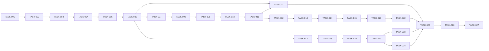

# 蒸汽管理系统开发任务列表

需求名称：steam-management
更新日期：2026-03-16

## 开发阶段

### 阶段一：基础数据采集与存储（2周）

| 任务ID | 任务描述 | 预估工时 | 状态 |
|--------|----------|----------|------|
| TASK-001 | 创建数据库表（steam_boiler, steam_data_point等） | 2天 | pending |
| TASK-002 | 开发后端实体类和Mapper | 2天 | pending |
| TASK-003 | 开发IoT网关Modbus采集模块 | 3天 | pending |
| TASK-004 | 开发MQTT数据接收服务 | 2天 | pending |
| TASK-005 | 开发数据存储服务（MySQL + InfluxDB） | 2天 | pending |
| TASK-006 | 开发设备管理API | 1天 | pending |

### 阶段二：画像分析功能开发（3周）

| 任务ID | 任务描述 | 预估工时 | 状态 |
|--------|----------|----------|------|
| TASK-007 | 开发特征提取服务 | 3天 | pending |
| TASK-008 | 开发聚类分析算法 | 3天 | pending |
| TASK-009 | 开发画像生成服务 | 3天 | pending |
| TASK-010 | 开发生产规律分析 | 3天 | pending |
| TASK-011 | 开发画像查询API | 2天 | pending |

### 阶段三：策略优化引擎开发（3周）

| 任务ID | 任务描述 | 预估工时 | 状态 |
|--------|----------|----------|------|
| TASK-012 | 开发负荷预测服务 | 3天 | pending |
| TASK-013 | 开发运行功率优化算法 | 3天 | pending |
| TASK-014 | 开发启停调度算法 | 3天 | pending |
| TASK-015 | 开发多锅炉协同优化 | 2天 | pending |
| TASK-016 | 开发策略管理API | 2天 | pending |

### 阶段四：能耗监控与报表开发（2周）

| 任务ID | 任务描述 | 预估工时 | 状态 |
|--------|----------|----------|------|
| TASK-017 | 开发实时能耗计算服务 | 2天 | pending |
| TASK-018 | 开发能耗统计报表服务 | 2天 | pending |
| TASK-019 | 开发告警服务 | 2天 | pending |
| TASK-020 | 开发能耗查询API | 1天 | pending |

### 阶段五：前端开发（3周）

| 任务ID | 任务描述 | 预估工时 | 状态 |
|--------|----------|----------|------|
| TASK-021 | 开发监控大屏页面 | 3天 | pending |
| TASK-022 | 开发画像分析页面 | 3天 | pending |
| TASK-023 | 开发策略管理页面 | 2天 | pending |
| TASK-024 | 开发能耗报表页面 | 2天 | pending |

### 阶段六：系统集成与优化（2周）

| 任务ID | 任务描述 | 预估工时 | 状态 |
|--------|----------|----------|------|
| TASK-025 | 系统集成测试 | 1周 | pending |
| TASK-026 | 性能优化 | 3天 | pending |
| TASK-027 | 用户验收测试 | 4天 | pending |

## 任务依赖关系

